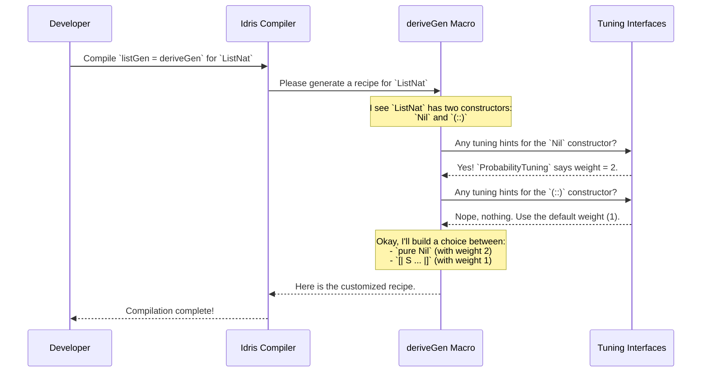

# Chapter 3: Generator Tuning

In [Chapter 2: `deriveGen` (Automatic Generator Derivation)](02_derivegen___automatic_generator_derivation__.md), we discovered the magic of `deriveGen`, our "auto-chef" that automatically creates generator recipes for our data types. This is incredibly convenient, saving us from writing a lot of repetitive code.

But what if the auto-chef's default recipe isn't quite right? What if it's a little too fond of making small lists, when you really want to test big ones? Or what if it gets confused about the right order to generate a complex, dependent data structure?

This is where Generator Tuning comes in. Think of these as the **dials and knobs** on the auto-chef machine. They let you tweak and guide the automatic generation process without having to write the whole recipe from scratch.

## Adjusting Ingredient Proportions with `ProbabilityTuning`

Let's imagine `deriveGen` is making recipes for our `ListNat` type.

```idris
data ListNat : Type where
  Nil  : ListNat
  (::) : Nat -> ListNat -> ListNat
```

By default, the auto-chef is fair and balanced. When it needs to create a `ListNat`, it gives the `Nil` constructor and the `(::)` constructor an equal 50/50 chance.

This sounds good, but what does it mean in practice? It means there's a 50% chance the list generation stops at every single step! As a result, you'll end up with a *lot* of very short lists (`Nil` or `1 :: Nil`) and very few long lists. This isn't great if you want to test how your code handles longer lists.

We need a way to tell the auto-chef, "Hey, I'd prefer it if you chose the `(::)` constructor more often." We can do this with `ProbabilityTuning`.

### How to Use `ProbabilityTuning`

`ProbabilityTuning` is an `interface` that lets you assign a "weight" to a data constructor. A higher weight means it gets picked more often.

Let's tell `deriveGen` to make `Nil` twice as likely as the default.

```idris
%language ElabReflection
import Deriving.DepTyCheck.Gen

-- The ProbabilityTuning interface for the 'Nil' constructor
ProbabilityTuning `{CheckDistribution.Nil}.dataCon where
  isConstructor = itIsConstructor
  tuneWeight = const 2
```
Let's break this down:
*   `ProbabilityTuning` is the name of the interface we're implementing.
*   `{CheckDistribution.Nil}.dataCon`: This is a "type-safe" way to refer to the `Nil` constructor. It ensures you don't make a typo in the constructor name.
*   `isConstructor = itIsConstructor`: This is a required magic line that confirms to the compiler that `Nil` is, in fact, a constructor.
*   `tuneWeight = const 2`: This is the important part! We're telling `DepTyCheck` to give this constructor a weight of `2`. The default weight is `1`.

We've told the system that `Nil` has a weight of 2, while `(::)` still has the default weight of 1. This means `Nil` will now be chosen roughly 2/3 of the time, and `(::)` only 1/3 of the time, leading to even *shorter* lists on average.

To get the longer lists we wanted, we would tune the `(::)` constructor instead!
```idris
-- Tune the 'Cons' (::) constructor to have a weight of 4
ProbabilityTuning `{Prelude.List.(::)}.dataCon where
  isConstructor = itIsConstructor
  tuneWeight = const 4 -- Make 'Cons' 4 times more likely
```
Now, the `(::)` constructor has a weight of 4 and `Nil` has a weight of 1. The generator is much more likely to keep adding elements, giving us the longer lists we need for better testing!

## Specifying the Cooking Order with `GenOrderTuning`

Sometimes the auto-chef gets confused about the right *order* to add ingredients, especially with dependent types.

Consider a data type where the type of one field depends on the value of another.
```idris
-- A simplified example
data Task : Nat -> Type where
  MkTask : (item : String) -> (proof : length item = n) -> Task n
```
To generate a `Task n`, `deriveGen` needs to create a `String` called `item` and a `proof` that its length is `n`. The problem is, it can't create the `proof` until it knows the length of the `item`!

If it tries to generate `proof` first, it will fail. `deriveGen` is smart, but sometimes with very complex types, we need to give it a hint: "Please generate the `item` field first!"

This is exactly what `GenOrderTuning` is for.

### How to Use `GenOrderTuning`

`GenOrderTuning` is another interface that lets you specify which arguments of a constructor should be generated first.

```idris
import Deriving.DepTyCheck.Gen

-- ... Task data definition ...

GenOrderTuning `{MyModule.MkTask}.dataCon where
  isConstructor = itIsConstructor
  deriveFirst _ _ = [`{item}] -- Note the name literal `{item}`
```
*   `GenOrderTuning ...`: We're implementing the order-tuning interface for our `MkTask` constructor.
*   `deriveFirst _ _ = [`{item}]`: This is the instruction. We're returning a list of constructor arguments that must be generated first. Here, we say "`item` comes first!". The `{item}` syntax is a "name literal," which is a safe way to refer to the argument by its name.

With this hint, `deriveGen` now knows the correct plan:
1.  Generate a value for `item` first.
2.  Now that `item` exists, its length is known.
3.  With the length known, it can now successfully generate the `proof`.

This "dial" is essential for guiding `deriveGen` through the tricky landscape of dependent types. It lets the auto-chef succeed where it might otherwise get stuck.

## How Tuning Works Under the Hood

You might be wondering: how does `deriveGen` know about these `Tuning` implementations? It's not magic, it's a clever use of Idris's features.

When you compile code with `foo = deriveGen`, the `deriveGen` macro runs. Before it starts building the generator recipe, it does a quick search.



The `deriveGen` macro actively looks for any implementations of `GenOrderTuning` or `ProbabilityTuning` that apply to the constructors of the type it's working on. If it finds one, it reads the "dials" (`tuneWeight` or `deriveFirst`) and adjusts its recipe-generation plan accordingly.

This all happens at **compile time**. The final generated code has the tuning "baked in".

The interfaces themselves are defined in `src/Deriving/DepTyCheck/Gen/Tuning.idr`. You can see their simple structure there.

```idris
-- A simplified view of the ProbabilityTuning interface
namespace Probability
  public export
  interface ProbabilityTuning (n : Name) where
    isConstructor : ...
    -- Takes the default weight (1) and returns a new weight.
    tuneWeight : Nat1 -> Nat1
```
`deriveGen` uses the compiler's ability to find implementations of this interface to discover your customizations.

## Conclusion

You've now learned how to become the master of your auto-chef! Let's recap:
*   `deriveGen` is powerful, but sometimes its default recipes need tweaking.
*   **`ProbabilityTuning`** acts like a "proportion dial", letting you control how often each constructor is chosen by assigning it a weight. This is great for generating more interesting or rare test cases.
*   **`GenOrderTuning`** acts as a "procedural hint", letting you specify the correct order to generate a constructor's arguments. This is crucial for complex dependent types.

By combining automatic derivation with fine-grained tuning, you get the best of both worlds: fast, boilerplate-free generation with the power to guide the process when you need it.

But how do we know if our tuned generators are actually producing a good *distribution* of test data? Are we really testing all the cases we think we are? The next chapter will show us how to answer that question.

Next up: [**Model Coverage Tracking**](04_model_coverage_tracking_.md)

---

Generated by [AI Codebase Knowledge Builder](https://github.com/The-Pocket/Tutorial-Codebase-Knowledge)