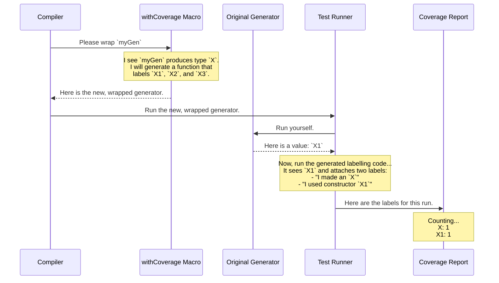

# Chapter 4: Model Coverage Tracking

In [Chapter 3: Generator Tuning](03_generator_tuning_.md), we learned how to "tune" our auto-generated recipes, giving us fine-grained control over the kinds of data `deriveGen` produces. We can make our generator prefer longer lists or help it navigate complex dependent types.

But this leads to a new question: how do we know if our generators—whether hand-written or tuned—are doing a good job? Are we actually generating all the different kinds of data we think we are? If we have a `Tree` data type with `Leaf` and `Node` constructors, are our tests creating both, or are we only ever testing with `Leaf`s?

To answer this, `DepTyCheck` provides a tool that's like "code coverage," but for your data types. It's called **Model Coverage Tracking**.

## What is Model Coverage?

Model Coverage is a feature that watches the data created by your generators during a test run. It keeps a tally of every data type and every constructor that gets used.

At the end of your tests, it produces a simple report that tells you things like:
*   "You created 100 `Tree`s."
*   "The `Leaf` constructor was used 40 times."
*   "The `Node` constructor was used 60 times."
*   "Warning! You have another data type, `Maybe`, but its `Nothing` constructor was never generated at all!"

This report is incredibly valuable. It gives you confidence that your property-based tests are exploring all the nooks and crannies of your data structures, ensuring no part of your data "model" is left untested.

## Turning On Coverage with `withCoverage`

How do you tell `DepTyCheck` to start tracking this information? You use a simple wrapper called `withCoverage`.

Let's imagine we have a simple data type `X`.

```idris
data X = X1 | X2 Nat | X3 String
```

Now, let's write a generator for `X`. We'll *intentionally* forget to include the `X2` constructor to see what the coverage report tells us.

```idris
genXIncomplete : Fuel -> Gen NonEmpty X
genXIncomplete fl = oneOf [ pure X1, [| X3 "hello" |] ]
```

To enable coverage tracking for this generator, you just wrap the expression with `withCoverage`:

```idris
import Test.DepTyCheck.Gen.Coverage

genXWithCoverage : Fuel -> Gen NonEmpty X
genXWithCoverage fl = withCoverage $ oneOf
  [ pure X1
  , [| X3 "hello" |]
  ]
```
That's it! Now, whenever `genXWithCoverage` is run, it will not only produce a value (`X1` or `X3 "hello"`) but also "tag" that value with a label saying which constructor was used.

## Generating a Coverage Report

Wrapping your generator is the first step. The second step is to run the generator many times and collect all those tags to produce a report.

Here's the full workflow in a `main` function:

```idris
main : IO ()
main = do
  -- 1. Prepare a blank "report card" for genXWithCoverage
  let ci = initCoverageInfo genXWithCoverage

  -- 2. Generate 100 random values
  let vs = unGenTryND 100 someStdGen $ genXWithCoverage (limit 10)

  -- 3. Collect all the coverage tags from the run
  let mc = concatMap fst vs

  -- 4. Fill in the report card with the collected tags
  let finalCi = registerCoverage mc ci

  -- 5. Print the final report!
  putStrLn $ show finalCi
```

Let's break that down piece by piece.

1.  **`initCoverageInfo genXWithCoverage`**: This creates a blank "report card," which we call `ci` (for Coverage Info). It inspects the `genXWithCoverage` generator, sees that it produces type `X`, and creates an empty report listing `X` and all its constructors: `X1`, `X2`, and `X3`.
2.  **`unGenTryND 100 ...`**: This runs our generator 100 times. Crucially, it returns a list of pairs. Each pair contains `(coverage_tags, generated_value)`.
3.  **`concatMap fst vs`**: We only care about the coverage tags, so we pull out the first element (`fst`) of each pair and combine them into one big list called `mc` (for Model Coverage).
4.  **`registerCoverage mc ci`**: This function takes the big list of tags (`mc`) and uses them to fill in the blank report card (`ci`). It goes through each tag and increments the count for the corresponding constructor.
5.  **`putStrLn $ show finalCi`**: Finally, we print the filled-in report.

### The Output

When you run this program, you'll see a report that looks something like this (simplified for clarity):

```
X covered partially (100 times)
  - X1: covered (50 times)
  - X2: not covered
  - X3: covered (50 times)
```

This report tells us exactly what we wanted to know!
*   The `X` type was "covered partially" because not all of its constructors were used.
*   `X1` and `X3` were successfully generated.
*   **`X2: not covered`** — this is the red flag! Our generator has a blind spot.

Thanks to this report, we can go back and fix our generator to include `X2`, ensuring our tests are more thorough.

## How it Works Under the Hood

The `withCoverage` wrapper seems simple, but it's a clever macro that works its magic at compile time.

Here's what happens when the compiler sees `withCoverage $ myGen`:



1.  **At Compile Time**: The `withCoverage` macro is executed. It looks at the type your generator produces (in our case, `X`).
2.  **Code Generation**: It automatically generates a small helper function. This function's job is to take a value of type `X` and, based on which constructor it is (`X1`, `X2`, or `X3`), return a special "label" string.
3.  **Wrapping**: It creates a new generator that first runs your original generator, then pipes the result through this new labelling function. The `label` function, defined in `src/Test/DepTyCheck/Gen/Coverage.idr`, attaches these labels to the value.
4.  **At Runtime**: When you run the tests, `unGenTryND` executes this wrapped generator. After a value is produced, the labels are collected.
5.  **Reporting**: The `registerCoverage` function, also in `src/Test/DepTyCheck/Gen/Coverage.idr`, is just a data-processing function. It knows how to parse the label strings (like `"Main.X1 (user-defined)"`) and update the counts in the `CoverageGenInfo` data structure.

The core data structure for the collected tags is `ModelCoverage`, which is just a map from labels to their counts.

```idris
-- From src/Test/DepTyCheck/Gen/Coverage.idr
record ModelCoverage where
  constructor MkModelCoverage
  unModelCoverage : SortedMap Label Nat -- A map from a label to its count
```
This simple structure is what allows `DepTyCheck` to collect results from thousands of generated values and summarize them into one readable report.

## Conclusion

You've just learned how to get critical feedback on the quality of your test data generation. Let's recap:

*   **Model Coverage** is a report that shows which parts of your data types (constructors) were generated during testing.
*   It helps you find **blind spots** in your generators, ensuring your tests are thorough.
*   You enable it by wrapping a generator expression with **`withCoverage`**.
*   The workflow involves **initializing** a report, **running** the generator, **registering** the results, and **printing** the final report.

With `deriveGen` creating generators for you, `Tuning` to guide them, and `ModelCoverage` to check their work, you have a powerful suite of tools.

So far, we've used `deriveGen` as a bit of a black box. It follows a default strategy for creating generators. But what if you wanted to change that fundamental strategy? What if, for example, you wanted all derived generators to *never* produce empty lists? For that, you need to dive deeper into the core of the derivation mechanism.

Next up: [**Derivation Strategy Interfaces**](05_derivation_strategy_interfaces_.md)

---

Generated by [AI Codebase Knowledge Builder](https://github.com/The-Pocket/Tutorial-Codebase-Knowledge)