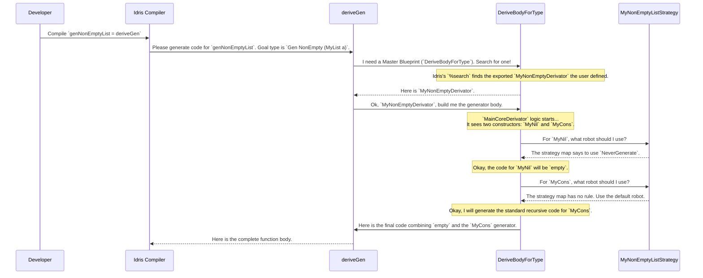

# Chapter 5: Derivation Strategy Interfaces

In [Chapter 4: Model Coverage Tracking](04_model_coverage_tracking_.md), we learned how to check if our generators are producing a good variety of test data. This is great for spotting holes in our testing. But what if `deriveGen`'s fundamental approach to building a generator isn't what we need? What if we want to create a generator that *never* produces empty lists, for a custom non-empty list type?

Standard `deriveGen` might fail here because it sees the `Nil` constructor and assumes the generator could be empty. We can't just tune the probability of `Nil` to zero; we need to change the core derivation logic itself.

Welcome to the world of Derivation Strategy Interfaces. These are the "plugin sockets" for `deriveGen`, allowing you to completely customize the automatic derivation process.

## The Factory Assembly Line

Think of `deriveGen` as a car factory's automated assembly line. By default, it has a standard set of robots and a standard blueprint for building a car (our `Gen` recipe). This works great for most models.

But what if you want to build a special "off-road" model that never uses standard street tires? You need a way to tell the assembly line, "For this model, use a different robot at the wheel-fitting station."

Derivation Strategy Interfaces let you do exactly that. They are the sockets that allow you to swap out specific robots on the assembly line, or even change the entire master blueprint.

There are two main interfaces to know:
1.  **`DeriveBodyForType`**: This is the "Master Blueprint" socket. It lets you change the *overall* assembly strategy for an entire data type. Do you want to handle `Fuel` differently? Do you want to combine constructors in a unique way? This is the interface for you.
2.  **`DeriveBodyRhsForCon`**: This is the "Specific Robot" socket. It lets you provide a custom robot for assembling just one part of the car—a single data constructor. This gives you fine-grained control over how specific parts of your data type are generated.

## Use Case: A Generator for Non-Empty Lists

Let's define our own simple list type.

```idris
data MyList a = MyNil | MyCons a (MyList a)
```

If we use `deriveGen` naively, it creates a generator that might produce `MyNil`:

```idris
-- This creates a Gen MaybeEmpty (MyList a), because MyNil is a possibility.
genMyList : {auto genA : ...} => Fuel -> Gen MaybeEmpty (MyList a)
genMyList = deriveGen
```

But what if we want to guarantee that our generator *only* produces non-empty lists? We need a `Gen NonEmpty (MyList a)`. The default `deriveGen` can't produce this because `MyNil` gets in the way.

We need a custom strategy: one that completely ignores the `MyNil` constructor. Let's build one!

### Step 1: Design a Custom "Robot" with `DeriveBodyRhsForCon`

First, we'll design a new robot for the `MyNil` station. This robot's job is simple: do nothing. In `DepTyCheck`, "doing nothing" means creating a generator that can never produce a value, called `empty`.

We create this robot by implementing the `DeriveBodyRhsForCon` interface.

```idris
import Deriving.DepTyCheck.Gen

%language ElabReflection

-- A strategy for a constructor that says "never generate me".
[NeverGenerate] DeriveBodyRhsForCon where
  consGenExpr _ _ _ _ = pure `(empty)
```

Let's unpack this:
*   `[NeverGenerate] DeriveBodyRhsForCon where`: We're defining a new, named implementation of the `DeriveBodyRhsForCon` interface. This is our custom robot blueprint.
*   `consGenExpr ... = pure \`(empty)`: The `consGenExpr` method is the core of this interface. It must return a piece of code that represents the generator for a constructor. Here, we're simply returning the code for the `empty` generator.

This `NeverGenerate` robot can be plugged in to handle any constructor we want to ignore.

### Step 2: Create a Custom Assembly Line with `DeriveBodyForType`

Now we have a custom robot, but we need an assembly line that knows when to use it. `DepTyCheck`'s default assembly line, `MainCoreDerivator`, is incredibly flexible. It can be configured to use different robots for different constructors.

We'll define a new "Master Blueprint" (`DeriveBodyForType`) that tells the `MainCoreDerivator`: "When you see the `MyNil` constructor, use our `NeverGenerate` robot. For everything else, do what you normally do."

```idris
-- A special strategy for MyList that ignores MyNil
[MyNonEmptyListStrategy]
DeriveBodyRhsForCon `{MyModule.MyNil}.dataCon where
  consGen = NeverGenerate

-- Our final, complete derivation strategy
MyNonEmptyDerivator : DeriveBodyForType
MyNonEmptyDerivator = MainCoreDerivator @{MyNonEmptyListStrategy}
```

This looks a bit magical, so let's break it down:
1.  `DeriveBodyRhsForCon `{MyModule.MyNil}.dataCon where ...`: This is a special syntax. We are creating a new "strategy map" named `MyNonEmptyListStrategy`. This map associates specific constructors with specific robots (`DeriveBodyRhsForCon` implementations).
2.  `consGen = NeverGenerate`: Inside the map, we're creating one rule: for the `MyNil` constructor, use the `NeverGenerate` robot we defined earlier.
3.  `MyNonEmptyDerivator = MainCoreDerivator @{...}`: We create our final `DeriveBodyForType` blueprint. We're telling the standard `MainCoreDerivator` to run, but with our custom strategy map (`MyNonEmptyListStrategy`) plugged in.

### Step 3: Use the Custom Strategy

Finally, we tell `deriveGen` to use our new `MyNonEmptyDerivator` blueprint instead of the default one. We do this by exporting our implementation, which `%search` will find.

```idris
-- Export our custom derivator so deriveGen can find it.
export
implementation DeriveBodyForType for MyList where
  derivator = MyNonEmptyDerivator

-- Now, deriveGen will use our custom strategy for MyList!
genNonEmptyList : {auto genA : ...} => Fuel -> Gen NonEmpty (MyList a)
genNonEmptyList = deriveGen
```
Because our custom strategy *never* generates `MyNil`, `deriveGen` can correctly deduce that the resulting generator is `NonEmpty`, successfully creating the generator we wanted!

## How It Works Under the Hood

This seems very powerful. Let's look inside the factory.

When the compiler sees `genNonEmptyList = deriveGen`, the `deriveGen` macro starts its work.



1.  **`%search` for a strategy:** `deriveGen`'s first job is to find a `DeriveBodyForType` implementation. It uses Idris's powerful `%search` mechanism, which is like a type-directed search engine for implementations. It finds the `MyNonEmptyDerivator` we exported.
2.  **Running the strategy:** It calls the `canonicBody` method on `MyNonEmptyDerivator`. Since ours is based on `MainCoreDerivator`, this default logic kicks in.
3.  **Consulting the "robot map":** The `MainCoreDerivator` iterates through all constructors of `MyList`. For each one (`MyNil`, `MyCons`), it checks the provided strategy map (`MyNonEmptyListStrategy`).
4.  **Calling the robots:**
    *   For `MyNil`, it finds a rule and calls `consGenExpr` on our `NeverGenerate` robot, which returns the Idris code for `empty`.
    *   For `MyCons`, it finds no rule, so it calls its internal, default `DeriveBodyRhsForCon` robot, which knows how to handle recursion and `Fuel`.
5.  **Assembling the final code:** It combines the code from both constructors using `oneOf` or `frequency`, wraps it in fuel-handling logic, and returns the complete function body to the compiler.

The interfaces themselves are defined in the `DepTyCheck` source code. Here are simplified versions:

**File:** `src/Deriving/DepTyCheck/Gen/ForOneType/Interface.idr`
```idris
-- The "Master Blueprint" interface
interface DeriveBodyForType where
  canonicBody : ... => GenSignature -> Name -> m (List Clause)
```
The key is `canonicBody`, which must return a list of a function's `Clause`s—the complete implementation.

**File:** `src/Deriving/DepTyCheck/Gen/ForOneTypeConRhs/Interface.idr`
```idris
-- The "Specific Robot" interface
interface DeriveBodyRhsForCon where
  consGenExpr : ... => GenSignature -> Con -> ... -> m TTImp
```
The key here is `consGenExpr`, which returns the code (`TTImp`) for generating just one constructor's right-hand-side.

## Conclusion

You've now peeked behind the curtain of `deriveGen` and seen how its core machinery works. You have the power to fundamentally alter its behavior.

*   Derivation Strategy Interfaces are the "plugin sockets" for `deriveGen`.
*   **`DeriveBodyForType`** acts as the **master blueprint** for how to derive a generator for an entire type.
*   **`DeriveBodyRhsForCon`** acts as a **specific robot** for generating a single data constructor.
*   By combining these, you can create highly customized derivation strategies to handle complex requirements that go beyond simple tuning.

We've seen that these strategies operate on data constructors. But how does `deriveGen` get such detailed information about a constructor in the first place—its name, its arguments, and their types? For that, it uses another powerful tool.

Next up: [**`analyseDeepConsApp` (Deep Constructor Analysis)**](06__analysedeepconsapp___deep_constructor_analysis__.md)

---

Generated by [AI Codebase Knowledge Builder](https://github.com/The-Pocket/Tutorial-Codebase-Knowledge)