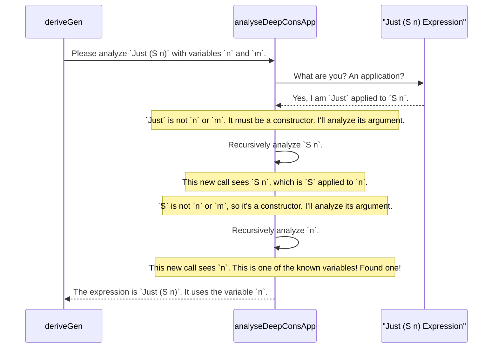

# Chapter 6: `analyseDeepConsApp` (Deep Constructor Analysis)

In [Chapter 5: Derivation Strategy Interfaces](05_derivation_strategy_interfaces_.md), we saw how to plug in custom blueprints to fundamentally change how `deriveGen` builds a generator. We essentially told the "generator factory" *how* to assemble the final product.

This raises an interesting question: how does the factory know anything about the parts it's working with in the first place? When `deriveGen` looks at a dependently-typed constructor like `(::) : a -> Vect n a -> Vect (S n) a`, how does it understand that `(S n)` in the return type is related to the `n` in the arguments?

To do this, it needs a special tool—a kind of internal X-ray machine that can scan a type and reveal its internal structure. This tool is called `analyseDeepConsApp`.

## The Food Analyst's Dilemma

Imagine you are a food analyst trying to reverse-engineer a complex sauce. Your job is to taste the sauce and figure out its base ingredients. You might taste it and say, "I detect tomato, which has been puréed, and also a hint of basil."

`analyseDeepConsApp` is `deriveGen`'s food analyst. It "tastes" a type expression (like `Vect (S n) a`) and figures out which of the available "base ingredients" (the constructor arguments `n` and `a`) were used to make it.

This analysis is absolutely critical for the derivation engine to understand dependencies in your types. Without it, `deriveGen` would be completely lost when trying to generate data for types like `Vect`. It wouldn't know that the value it generates for `n` constrains the shape of the final `Vect`.

## What is Deep Constructor Analysis?

`analyseDeepConsApp` is a specialized internal function that answers a very specific question:

> "Is this type expression just a data constructor (or a chain of them) applied to some of my known variables?"

Let's look at a simple example. Suppose `deriveGen` is analyzing a constructor that returns a `Maybe (Pair a b)`. The known variables (the "base ingredients") are `a` and `b`.

*   **Input Expression:** `Maybe (Pair a b)`
*   **Known Variables:** `a`, `b`

`analyseDeepConsApp` scans this expression and reports back:
1.  **"Yes, this is a deep constructor application."** The outermost constructor is `Maybe`, which is applied to `Pair a b`. The `Pair` constructor is, in turn, applied to `a` and `b`.
2.  **"The variables used were `a` and `b`."** It identified which of the known variables appeared in the expression.
3.  **"Here is a template for the structure:"** It also provides a kind of template of the expression with placeholders for the variables, like `Maybe (Pair {placeholder_0} {placeholder_1})`.

This information tells `deriveGen` exactly how the constructor's arguments (`a` and `b`) are used to build the final return type.

## How `deriveGen` Uses This Analysis

Let's go back to our `Vect` example. The `(::)` constructor has this signature:
```idris
(::) : a -> Vect n a -> Vect (S n) a
```
The "known variables" for `deriveGen` are the constructor's arguments: `a` and `n`. (The recursive `Vect n a` argument is handled separately). The return type is `Vect (S n) a`.

When `deriveGen` is trying to figure out how to create a generator for `(::)`, it needs to check that the randomly generated values will satisfy the return type. To do this, it uses `analyseDeepConsApp` on parts of the return type.

It calls `analyseDeepConsApp` on `S n` with known variables `[a, n]`:
*   **Input:** `S n`
*   **Analysis:** "This is the constructor `S` applied to the known variable `n`."

It calls `analyseDeepConsApp` on `a`:
*   **Input:** `a`
*   **Analysis:** "This is just the known variable `a` itself."

Thanks to this analysis, `deriveGen` now understands the structure of its goal. It knows that to produce a `Vect (S n) a`, the first parameter it generates must be of type `S n`, and `n` must match the `n` from its input. This is how it correctly generates code that satisfies the GADT's constraints.

## How `analyseDeepConsApp` Works Under the Hood

The `analyseDeepConsApp` function is a recursive process. It works by trying to "peel back" one layer of a type expression at a time.

Let's trace its execution with a simple diagram. Imagine `deriveGen` asking it to analyze the expression `Just (S n)` with known variables `[n, m]`.



1.  **Start:** It receives the expression `Just (S n)`. It sees this is an application of a name (`Just`) to an argument (`S n`).
2.  **Check the Name:** Is `Just` one of the known variables (`n` or `m`)? No. Is it a known data constructor? Yes.
3.  **Recurse:** Since it's a constructor, `analyseDeepConsApp` calls itself on the constructor's argument, `S n`.
4.  **Repeat:** The new call sees `S` applied to `n`. Is `S` a known variable? No. Is it a constructor? Yes. It recurses again on `n`.
5.  **Base Case:** The new call sees `n`. Is `n` a known variable? Yes! This is a base case. It records that it found `n` and returns.
6.  **Combine Results:** As the recursive calls return, the results are assembled. The final report states that the structure is `Just (S {placeholder})` and the variable found was `n`. If it had encountered something that wasn't a known variable or a constructor (like a function call), it would have stopped and reported failure.

### A Peek at the Code

The core `analyseDeepConsApp` function lives in `src/Deriving/DepTyCheck/Util/DeepConsApp.idr`. Its signature, simplified, looks like this:

```idris
-- From: src/Deriving/DepTyCheck/Util/DeepConsApp.idr

analyseDeepConsApp : (freeNames : SortedSet Name) ->
                     (analysedExpr : TTImp) ->
                     m (DeepConsAnalysisRes ...)
```
*   `freeNames`: The set of "known variables" (the base ingredients).
*   `analysedExpr`: The type expression to X-ray (the sauce). `TTImp` is the internal representation of an Idris expression.
*   `DeepConsAnalysisRes`: The result, which contains the list of found variables and the "template" function.

We can see where this is used inside the derivation logic for constructors.

```idris
-- From: src/Deriving/DepTyCheck/Gen/ForOneTypeCon/Impl.idr

-- Inside the function that derives a generator for one constructor...
canonicConsBody : ... => GenSignature -> ... -> Con -> m (List Clause)
canonicConsBody sig name con = do
  -- ... setup ...

  -- For each part of the constructor's return type...
  let argExpr = conRetTypeArg idx

  -- ...run the analysis!
  let (ei, fns) = runWriter $ runEitherT $
    analyseDeepConsApp True con.argNames argExpr
```
This snippet shows the heart of the process. For a given constructor `con`, it takes its argument names (`con.argNames`) as the `freeNames` and runs `analyseDeepConsApp` on pieces of its return type (`argExpr`). This tells the deriver exactly how its own arguments are used to form its final, dependent return type.

## Conclusion

You've just looked into one of the most important internal tools in the `DepTyCheck` derivation engine. Let's summarize what we learned:

*   `analyseDeepConsApp` is an internal "X-ray machine" or "food analyst" used by `deriveGen`.
*   Its job is to scan a type expression and determine if it's built from **nested data constructors** applied to a set of **known variables**.
*   It returns **which variables were used** and **the structure** of the expression.
*   This is absolutely essential for `deriveGen` to understand dependencies in types like `Vect n a` and `Fin n`, allowing it to generate correct code for GADTs.

This analysis is a key step in a larger process. After `analyseDeepConsApp` does its job, `deriveGen` collects all the information it has learned about a function it's trying to build. This collection of information is stored in a tidy data structure.

Next up: [**`GenSignature` (Generator Signature)**](07__gensignature___generator_signature__.md)

---

Generated by [AI Codebase Knowledge Builder](https://github.com/The-Pocket/Tutorial-Codebase-Knowledge)