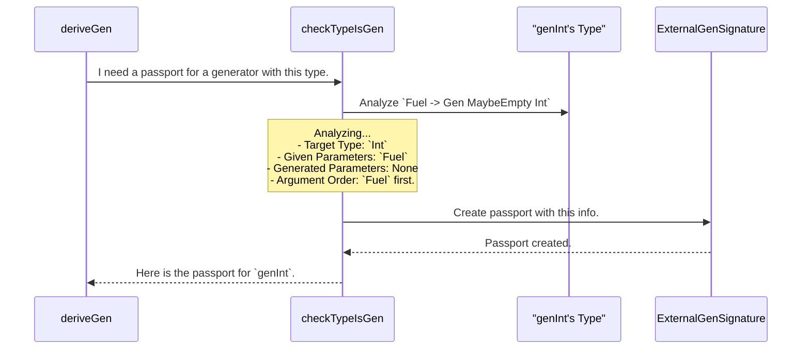

# Chapter 7: `GenSignature` (Generator Signature)

In the [previous chapter](06__analysedeepconsapp___deep_constructor_analysis__.md), we saw how `deriveGen` uses an internal "X-ray machine," [`analyseDeepConsApp`](06__analysedeepconsapp___deep_constructor_analysis__.md), to scan the structure of our types. This analysis gives `deriveGen` a huge amount of raw data about constructors, arguments, and dependencies.

But where does all that information go? How does `deriveGen` keep track of everything it learns? It can't just keep it all jotted down on temporary scraps of paper. It needs a standardized, official document.

This is where the `GenSignature` comes in. It's the internal "passport" for a generator, a neat and tidy data structure that holds all the essential information about it.

## The Generator's Passport

Imagine you're at an airport. To board a flight, you need a passport. The passport instantly tells the airline staff who you are, where you're from, and other key details. You don't have to explain your life story every time; the passport summarizes it all.

A `GenSignature` is exactly like that for a [`Gen`](01__gen___test_data_generator__.md). When [`deriveGen`](02__derivegen___automatic_generator_derivation__.md) needs to use another generator (either one it derived itself or one you provided), it doesn't need to re-analyze it from scratch every time. It just looks at its `GenSignature` passport.

This passport answers crucial questions at a glance:
*   **What type of data do you produce?** (e.g., `String`, `Vect n a`)
*   **What information do I need to give you?** (e.g., a `Fuel` value, a parameter `n` for `Vect`)
*   **What information will you figure out on your own?** (e.g., the value `v` for a dependent pair `(v ** P v)`)

The entire derivation engine uses these passports to understand dependencies, check for correctness, and figure out how to call other generators.

## What's Inside a `GenSignature`?

Let's look at a typical scenario. We're deriving a generator for a `Vect n Int`, and we've told `deriveGen` to use a specific `genInt` that we provide.

```idris
-- A generator we provide for the vector's elements
genInt : Fuel -> Gen MaybeEmpty Int
genInt = ...

-- We want to derive a generator for a Vect of a given length `n`.
genVectOfN : {auto genInt : Fuel -> Gen MaybeEmpty Int} ->
             (n : Nat) -> Fuel -> Gen MaybeEmpty (Vect n Int)
genVectOfN {genInt} = deriveGen
```

When `deriveGen` processes this, it creates two important passports:

1.  A passport for `genInt` (the one we provided).
2.  A passport for `genVectOfN` (the one it's trying to build).

### External vs. Internal Passports

`DepTyCheck` actually uses two kinds of passports: a detailed one for outsiders and a simpler one for internal use.

**1. `ExternalGenSignature`:** This is for generators provided from "outside" the current task, like our `genInt`. It's highly detailed and includes information that's important to a human developer, such as:
*   The exact order of arguments.
*   Whether arguments are explicit (`(n : Nat)`) or implicit (`{n : Nat}`).

**2. `GenSignature`:** This is the simplified, internal version. Once `deriveGen` has understood an external generator, it converts its passport into this simpler form for its own use. It mainly cares about what the target type is and which parameters are "given" vs. "generated".

## How `deriveGen` Creates a Passport

A `GenSignature` isn't something you typically write by hand. It's automatically created by a "passport control officer" function inside `DepTyCheck` called `checkTypeIsGen`.

Let's see this process in action. When `deriveGen` starts working on `genVectOfN`, it sees that it relies on an external generator, `genInt`. It needs a passport for `genInt`.



1.  **Request:** `deriveGen` sees the `auto genInt` argument and asks `checkTypeIsGen` to create a passport for it.
2.  **Analysis:** The `checkTypeIsGen` function inspects the type signature `Fuel -> Gen MaybeEmpty Int`. It identifies the target type (`Int`), the input parameters (`Fuel`), and the lack of any dependent generated parameters.
3.  **Creation:** It bundles all this information into a brand new `ExternalGenSignature` data structure.
4.  **Return:** It hands this completed passport back to `deriveGen`.

Now, `deriveGen` has a standardized record telling it everything it needs to know to correctly call `genInt`. It does this for *every* generator it needs to interact with, creating a web of self-describing components.

## A Look at the Passport Itself (The Code)

The definitions for these "passports" live in `src/Deriving/DepTyCheck/Gen/Signature.idr`. Let's look at a simplified version of what they contain.

First, the basic internal passport, `GenSignature`:

```idris
-- From: src/Deriving/DepTyCheck/Gen/Signature.idr

public export
record GenSignature where
  constructor MkGenSignature
  targetType  : TypeInfo -- What type does it make? (e.g., Int, Vect)
  givenParams : SortedSet (Fin targetType.args.length)
  -- Which of the target's type arguments are GIVEN by the caller?
```
This is the core. It's a record with two key fields:
*   `targetType`: Information about the type being generated.
*   `givenParams`: A set of indices telling us which of the `targetType`'s arguments are provided by the user (like the `n` in `genVectOfN`). The engine infers that any other arguments must be generated randomly.

Next, the more detailed passport for external generators, `ExternalGenSignature`:

```idris
-- From: src/Deriving/DepTyCheck/Gen/Signature.idr

public export
record ExternalGenSignature where
  constructor MkExternalGenSignature
  targetType  : TypeInfo
  givenParams : SortedMap (Fin ...) (ArgExplicitness, Name)
  givensOrder : Vect givenParams.size (Fin givenParams.size)
  -- A permutation describing the original order of given arguments.
```
This looks similar, but with some crucial additions:
*   `givenParams` is now a map that also stores the **explicitness** (`ExplicitArg` or `ImplicitArg`) and **name** of each given parameter.
*   `givensOrder`: A vector that records the original order of arguments written by the user. This is how `deriveGen` knows how to call a function like `foo : (a : A) -> (b : B) -> ...` correctly, passing `a` first and `b` second.

The function `checkTypeIsGen` in `src/Deriving/DepTyCheck/Gen.idr` is the diligent officer responsible for parsing a type expression and filling out these records. It's a complex function that performs many checks to ensure the generator signature is valid.

## Conclusion

You've just learned about the central data structure that holds the `DepTyCheck` derivation engine together.

*   `GenSignature` is the internal "passport" for a generator.
*   It contains all the key metadata: the **target type**, **user-provided parameters**, and **parameters to be generated**.
*   The derivation engine uses these passports to understand dependencies and correctly call other generators.
*   `ExternalGenSignature` is a more detailed version for user-provided generators, capturing details like argument order and explicitness.

With this passport system, `deriveGen` can manage a complex network of interdependent generators, each with a clear and unambiguous description of its capabilities and requirements.

Now that we have a solid understanding of the deep internals of `DepTyCheck`'s derivation, let's zoom back out. How do you take all these data types, properties, and generators and structure them into a coherent, testable project?

Next up: [**Package and Test Management**](08_package_and_test_management_.md)

---

Generated by [AI Codebase Knowledge Builder](https://github.com/The-Pocket/Tutorial-Codebase-Knowledge)