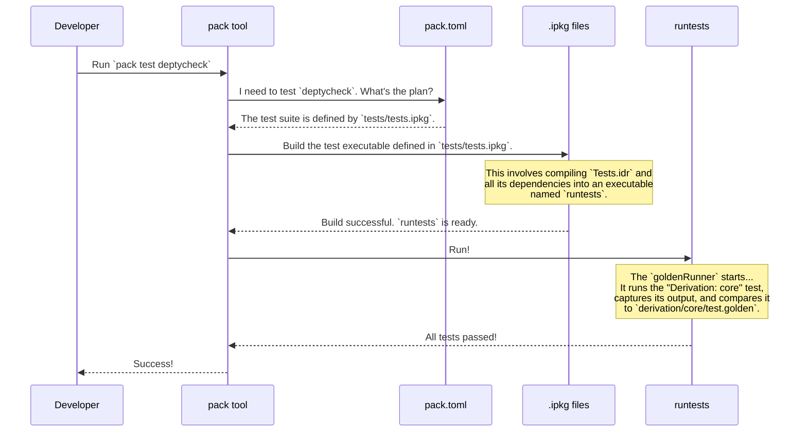

# Chapter 8: Package and Test Management

Congratulations on making it to the final chapter! In [Chapter 7: `GenSignature` (Generator Signature)](07__gensignature___generator_signature__.md), we took a deep dive into the internal "passports" that `DepTyCheck` uses to manage its complex derivation engine. We've explored everything from the high-level concept of a [Gen](01__gen___test_data_generator__.md) to the nitty-gritty details of the compiler magic.

Now, let's zoom all the way out. We've seen all the individual parts of the `DepTyCheck` machine. But how is the whole factory assembled? How do we build the library, run the dozens of example projects, and execute the extensive test suite?

This chapter is about the project's supply chain and assembly line. We'll explore how `DepTyCheck` uses standard Idris 2 tooling to manage its code, dependencies, and quality control.

## The Problem: Taming a Complex Project

`DepTyCheck` isn't just a single library file. It's a collection of many interconnected parts:
*   The core `DepTyCheck` library itself.
*   A suite of example projects that demonstrate its features.
*   An extensive test suite that ensures everything works correctly.

Trying to build all of this by hand would be a nightmare. We need a system that understands how all these pieces fit together. This is where the Idris 2 package manager, `pack`, comes in.

Let's look at the three key configuration files that run the `DepTyCheck` world.

### 1. The Component Blueprint: `deptycheck.ipkg`

Every major component in the Idris ecosystem, whether it's a library or an application, has an `.ipkg` file. Think of it as the **blueprint for a single part**. It tells the Idris compiler what's inside and what it needs to be built.

Here's a simplified version of `DepTyCheck`'s main blueprint, `deptycheck.ipkg`:

```
package deptycheck

sourcedir = "src"
version = 0.0.251013

modules = Deriving.DepTyCheck.Gen
        , Test.DepTyCheck.Gen
        -- ... and many more modules

depends = ansi
        , elab-util-extra
        , random-pure
        -- ... and other dependencies
```

*   `package deptycheck`: Gives the package a name.
*   `sourcedir = "src"`: Tells the compiler to look for source code in the `src/` directory.
*   `modules = ...`: This is a list of all the modules that make up this library.
*   `depends = ...`: This lists other libraries that `DepTyCheck` needs to function. The compiler will make sure these are available before trying to build.

Every sub-project, like the examples and the tests, also has its own `.ipkg` file.

### 2. The Master Plan: `pack.toml`

If `.ipkg` files are blueprints for individual parts, `pack.toml` is the **master assembly plan for the whole factory**. It tells the `pack` tool how to find all the different components (the library, the examples, the tests) and how they relate to each other.

Let's look at a few snippets from `DepTyCheck`'s `pack.toml`:

```toml
# Defines the main DepTyCheck library itself
[custom.all.deptycheck]
type = "local"
path = "."
ipkg = "deptycheck.ipkg"
test = "tests/tests.ipkg"
```

This block defines the `deptycheck` component.
*   `type = "local"` and `path = "."` say that the source code is right here, in the main project directory.
*   `ipkg = "deptycheck.ipkg"` points to the blueprint file we just saw.
*   `test = "tests/tests.ipkg"` is special! It tells `pack`: "The test suite for *this* component is defined by `tests/tests.ipkg`."

Now let's look at an example project:

```toml
# Defines one of the example projects
[custom.all.uniq-list]
type = "local"
path = "examples/uniq-list"
ipkg = "uniq-list.ipkg"
test = "tests/tests.ipkg"
```

This looks very similar! It defines another component, `uniq-list`, found in the `examples/uniq-list/` folder. It has its own blueprint (`uniq-list.ipkg`) and even its own mini test suite.

The `pack.toml` file is a giant list of these definitions, orchestrating the entire multi-part project from one central location.

### 3. Quality Control: The `Tests.idr` and Golden Testing

So we have blueprints and a master plan. How do we ensure the final product is flawless? `DepTyCheck` uses a testing strategy called **Golden Testing**.

Imagine you're baking a cake, and you have a photograph of the "perfect" cake. After you bake your own, you compare it to the photo. If it matches exactly, you succeeded! If there's a single sprinkle out of place, you failed.

Golden testing works the same way for code, especially for code that generates things (like macros!).
1.  Run the test, which prints some output to the screen.
2.  Save this "perfect" output to a file, usually called `test.golden`.
3.  From now on, the test runner will automatically run the code and compare its output to the contents of `test.golden`. If they differ in any way, the test fails.

This is perfect for `DepTyCheck`, because much of its testing involves checking that the macros like `deriveGen` produce the correct code or correct diagnostic messages.

The main entry point for the test suite is `tests/Tests.idr`.

```idris
module Tests

import Test.Golden.RunnerHelper

main : IO ()
main = goldenRunner $
  [ "The `Gen` monad" `atDir` "lib/gen-monad"
  , "Model coverage" `atDir` "lib/coverage"
  , "Derivation: core" `atDir` "derivation/core"
  , -- ... many more test cases
  ]
```

*   `main = goldenRunner [...]`: The main function uses a helper, `goldenRunner`, to run all the tests.
*   `"The \`Gen\` monad" \`atDir\` "lib/gen-monad"`: This line defines a single test case. It says: "There's a test named 'The `Gen` monad', and its files are located in the `tests/lib/gen-monad` directory." The test runner will go to that directory, run the test, and compare the output to a `.golden` file it finds there.

## The Full Workflow: Building and Testing

Let's see how all these pieces work together when a developer wants to run the tests.



1.  **Command:** The developer runs `pack test deptycheck` in their terminal.
2.  **Master Plan:** The `pack` tool reads `pack.toml` to find the `deptycheck` definition and sees that its test suite is `tests/tests.ipkg`.
3.  **Build:** `pack` tells the Idris compiler to build the executable specified in `tests/tests.ipkg` (which is `runtests`, compiled from `Tests.idr`).
4.  **Execute:** `pack` runs the freshly built `runtests` executable.
5.  **Golden Testing:** The `goldenRunner` inside `runtests` takes over, methodically going through each test case, running it, and comparing the output to the corresponding `.golden` file.
6.  **Report:** The executable reports success or failure back to the developer.

This clean, automated process allows for confident development. Any change that unexpectedly alters the behavior of the library or its macros will cause a test to fail, immediately alerting the developer.

## Conclusion

And there you have it! You've journeyed from the most basic user-facing concept, the [Gen](01__gen___test_data_generator__.md), all the way down into the deepest compiler internals with [Derivation Strategy Interfaces](05_derivation_strategy_interfaces_.md), and now back out to the high-level structure of the project itself.

Let's recap what we learned in this final chapter:
*   The `DepTyCheck` project is managed using standard Idris 2 tooling.
*   `.ipkg` files act as **blueprints** for individual components (the library, examples).
*   `pack.toml` is the **master plan** that orchestrates how all these components are built and tested together.
*   The test suite uses **golden testing** to lock in the behavior of the library, especially its code-generating macros, ensuring stability and preventing regressions.

We hope this tutorial has given you a solid understanding of not just how to use `DepTyCheck`, but also how its powerful features are designed and built. The world of property-based testing with dependent types is rich and rewarding, and you are now well-equipped to explore it.

Happy testing

---

Generated by [AI Codebase Knowledge Builder](https://github.com/The-Pocket/Tutorial-Codebase-Knowledge)