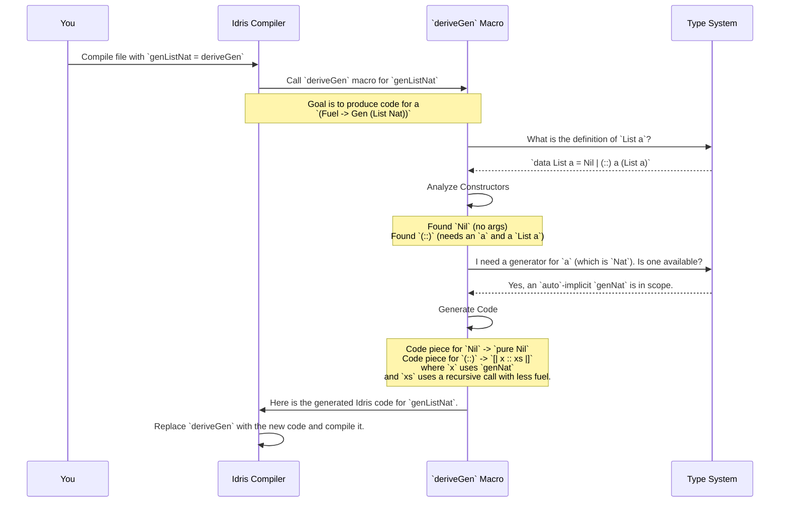

# Chapter 2: Automatic Generator Derivation (`deriveGen`)

In [Chapter 1: Test Value Generator (`Gen`)](01_test_value_generator___gen___.md), we learned how to write recipes (`Gen`) for generating random test data. We saw how to create generators for simple values, combine them for complex types, and even write "dependent" recipes for powerful types like `Fin n`.

Writing these generators manually gives you a lot of control, but let's be honest: for every `data` type you create, writing a corresponding generator can feel like a chore.

What if you had a magic wand that you could wave at your data type, and a perfect generator recipe would just appear?

That's exactly what `deriveGen` is.

## The Problem: So Much Boilerplate

Imagine you have a simple recursive data type for natural numbers:

```idris
data Nat = Z | S Nat
```

If we wanted to write a generator for `Nat` by hand, it might look something like this. The logic gets a bit tricky because we have to prevent it from generating `S (S (S (S ...)))` forever.

```idris
-- A manually written generator for Nat
genNatManual : (maxDepth : Nat) -> Gen1 Nat
genNatManual Z = [| Z |]
genNatManual (S k) = oneOf
  [ [| Z |]
  , [| S (genNatManual k) |]
  ]
```
This isn't *too* bad for `Nat`, but what about a list? Or a tree? Or a complex dependent type with multiple constructors? The manual work adds up quickly and can be a source of bugs itself.

## The Solution: `deriveGen`, The Magic Wand

`deriveGen` is a special tool in `DepTyCheck` called a **macro**. You can think of it as a code-writing robot. At compile time, it looks at your data type's definition and automatically writes the generator code for you.

Here's how you use it to generate `Nat` values:

```idris
%language ElabReflection

import Deriving.DepTyCheck.Gen

genNat : Fuel -> Gen MaybeEmpty Nat
genNat = deriveGen
```

That's it! Let's break this down:

1.  `%language ElabReflection`: This is a special command for the Idris compiler. It's like flipping a switch to allow "magic" like `deriveGen` to work. You'll usually put this at the top of your file.
2.  `genNat : Fuel -> Gen MaybeEmpty Nat`: This is the type signature. It says we want to define a function `genNat` that takes a `Fuel` value and returns a generator for `Nat`.
3.  `genNat = deriveGen`: This is the magic. You're telling the compiler: "You see that type signature? Please write the body of this function for me."

The compiler sees `deriveGen`, inspects the `data Nat = Z | S Nat` definition, and generates code that is roughly equivalent to our manual version.

### What is `Fuel`?

You might be wondering about the `Fuel` argument. This is `DepTyCheck`'s secret to handling recursive types safely.

**Analogy:** Imagine asking an artist to draw a fractal. A fractal can be infinitely detailed. If you don't give them a limit, they might draw forever! `Fuel` is like giving the artist a limited supply of ink.

When `deriveGen` creates a generator for a recursive type like `Nat`, it generates code that "spends" a little bit of fuel for each recursive step. When the `S` constructor is chosen, it calls `genNat` again, but with less fuel. Once the fuel runs out, it can no longer pick the recursive `S` constructor, which guarantees that the generation process will eventually stop.

This is also why the return type is `Gen MaybeEmpty`. If `genNat` is called with no fuel, it can't generate an `S` value. And if the only non-recursive constructor (`Z` in this case) isn't picked, it might not produce a value at all.

## Deriving Generators for More Complex Types

`deriveGen` is smart. It knows how to handle data types that contain other types. Let's try it with `List`. A list can contain values of any type `a`.

```idris
data List a = Nil | (::) a (List a)
```
To generate a `List Nat`, `deriveGen` needs two things:
1.  The definition of `List`.
2.  A way to generate the `Nat` values *inside* the list.

We can provide the `Nat` generator as an `auto`-implicit argument. This is like telling `deriveGen`, "Hey, while you're working, if you ever need a `Nat`, use this `genNat` recipe I already have."

```idris
%language ElabReflection

import Deriving.DepTyCheck.Gen

-- First, we need a generator for the elements.
genNat : Fuel -> Gen MaybeEmpty Nat
genNat = deriveGen

-- Now, we derive the list generator.
genListNat : (Fuel -> Gen MaybeEmpty Nat) => Fuel -> Gen MaybeEmpty (List Nat)
genListNat = deriveGen
```

Look at the signature for `genListNat`!
` (Fuel -> Gen MaybeEmpty Nat) => ... `

This part tells Idris that `genListNat` requires a `Nat` generator to be available. When `deriveGen` builds the `List` generator, it will see the `(::)` constructor, notice it needs a `Nat`, and automatically plug in the `genNat` we defined.

This is incredibly powerful! You can build up a library of generators for basic types and then `deriveGen` will automatically compose them to build generators for your most complex application types.

## Under the Hood: How the Magic Happens

`deriveGen` isn't a normal Idris function that runs when you execute your program. It's a **macro** that runs at **compile-time**.

Here’s a step-by-step look at what happens when the compiler sees `genListNat = deriveGen`:



The macro uses a feature called **Elaborator Reflection**. This allows `deriveGen` to inspect type definitions, constructors, and arguments—all the information the compiler has—and then programmatically build a new piece of code (`TTImp`, the internal representation of Idris code).

The core logic that performs this analysis lives in a function you'll explore later:

```idris
-- From: src/Deriving/DepTyCheck/Gen.idr

-- A simplified view of the main entry point
deriveGenExpr : ... -> Elab TTImp
deriveGenExpr signature = do
  -- Step 1: Analyze the signature you provided.
  (sig, externals, ...) <- checkTypeIsGen DerivationTask signature

  -- Step 2: Call the core derivation logic for that type.
  (callExpr, locals) <- runCanonic ... (callMainDerivedGen sig ...)

  -- Step 3: Wrap it all up and return the final code.
  pure ...
```

This `deriveGenExpr` function acts as the manager.
1. It first calls another function to perform [Generator Signature Analysis](03_generator_signature_analysis_.md) to understand what you're asking it to derive.
2. Then, it uses a [Derivation Orchestrator](04_derivation_orchestrator_.md) to manage the overall process.
3. The actual code-writing for each constructor is handled by a [Single-Type Derivation Core (`DeriveBodyForType`)](05_single_type_derivation_core___derivebodyfortype___.md).

You don't need to understand the details of these right now, but it's good to know that the "magic" is just a series of well-defined, albeit complex, steps.

## Conclusion

You've now seen the most powerful productivity feature in `DepTyCheck`. You've learned:
*   That writing generators by hand can be tedious and error-prone.
*   `deriveGen` is a compile-time macro that **automatically writes generator code** for you based on a data type's definition.
*   It uses a `Fuel` system to safely handle **recursive data types** without getting into infinite loops.
*   It can automatically use **other generators** you provide via `auto`-implicit arguments (`=>`) to handle complex, nested types.

With `deriveGen`, you can get test data generation for your entire application's data model with just a few lines of code.

We've mentioned that `deriveGen` starts by reading and understanding the type signature you provide for your generator. But what exactly is it looking for? How does it know which parts of your type will be generated and which are given? We'll explore that in the next chapter on [Generator Signature Analysis](03_generator_signature_analysis_.md).

---

Generated by [AI Codebase Knowledge Builder](https://github.com/The-Pocket/Tutorial-Codebase-Knowledge)