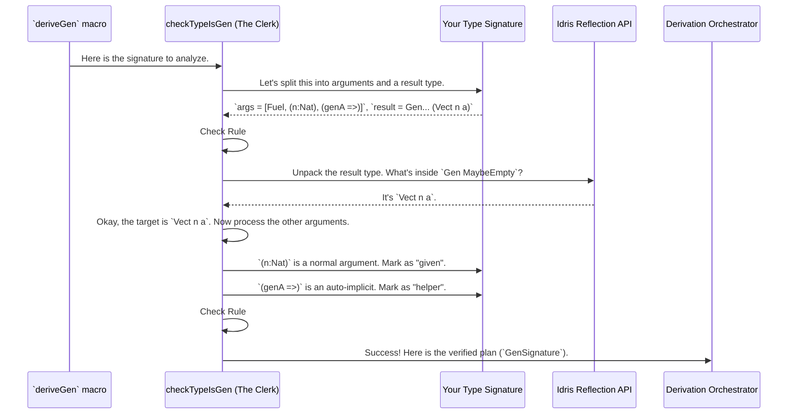

# Chapter 3: Generator Signature Analysis

In the [last chapter](02_automatic_generator_derivation___derivegen___.md), we waved the magic wand of `deriveGen` to automatically create generator recipes for our data types. It felt almost psychic—it just looked at a type signature and knew what to do.

But how did it "know"? How does it understand this complex instruction?

```idris
-- A generator for `Vect n a`
-- given a size `n` and a generator for `a`'s
genVect : (n : Nat) -> (Fuel -> Gen MaybeEmpty a) => Fuel -> Gen MaybeEmpty (Vect n a)
genVect = deriveGen
```

How does `deriveGen` figure out that `n` is an input you'll provide, that `(Fuel -> Gen MaybeEmpty a)` is a helper recipe, and that `Vect n a` is the thing it's supposed to create?

This is the job of a component we'll call the **Generator Signature Analysis**.

## The Intake Clerk for `deriveGen`

Think of `deriveGen` as a large, busy office that fulfills requests to build generator recipes. Before any complex work can begin, every request must first pass through a meticulous **intake clerk**. This clerk's job is to read your request form—your generator's type signature—and make sure it's perfectly clear, complete, and follows all the rules.

This "intake clerk" is the Generator Signature Analysis. Its job is to:
1.  **Parse** the signature to understand what you want.
2.  **Separate** the different parts of your request.
3.  **Validate** that your request is valid.
4.  **Package** the information into a standardized format for the rest of the `deriveGen` machinery.

Let's follow the clerk as it processes our `genVect` request.

## Parsing the Request Form (The Type Signature)

The clerk looks at your type signature and methodically sorts every piece of information into a specific box.

```idris
-- genVect : (n : Nat) -> (Fuel -> Gen MaybeEmpty a) => Fuel -> Gen MaybeEmpty (Vect n a)
```

Here's how it sees this signature:

### 1. The Fuel Supply: The First Argument

The first thing the clerk checks is the `Fuel` parameter.

```idris
Fuel -> ...
```

It knows this is special. This isn't data for the `Vect` itself; it's the "ink" or "energy" supply for handling recursion, as we saw in Chapter 2.

**Rule:** The first argument *must* be `Fuel`.

### 2. The "Givens": What You Provide

Next, the clerk looks for all the plain arguments you, the user, will provide when you call the generator function. These are your "givens".

```idris
-- The clerk identifies this part as a "given"
(n : Nat) -> ..
```

It sees `(n : Nat)` and thinks, "Okay, the user promises to give me a `Nat` value named `n` every time they ask for a `Vect`."

### 3. The "Helpers": External Generators

Then, the clerk spots the `=>` symbol. This signifies a "helper" or an "auto-implicit" argument.

```idris
-- The clerk identifies this as a "helper"
(Fuel -> Gen MaybeEmpty a) => ...
```

It recognizes this is not a simple value like `n`, but another generator recipe. It thinks, "Aha! To build the final `Vect`, a generator for its elements (`a`) will be needed. The user is providing that recipe right here."

### 4. The Goal: What to Generate

Finally, the clerk looks at the return type to see what the ultimate goal is.

```idris
-- The clerk identifies this as the "goal"
... -> Gen MaybeEmpty (Vect n a)
```

It unwraps the `Gen MaybeEmpty` part and finds `Vect n a`. "The final product," the clerk concludes, "is a random value of type `Vect n a`."

It also looks at parameters *inside* the target type that weren't "given." For example, if the signature was `Gen (n ** Vect n a)`, the clerk would identify `n` as a parameter to be *generated*, not given.

## The Validation Checklist

A good clerk doesn't just sort information; they also check it against a strict set of rules. The Signature Analysis runs numerous checks, including:

*   ✅ **The Fuel Rule**: Is the first parameter of type `Fuel`?
*   ✅ **The Result Rule**: Does the function return a `Gen MaybeEmpty ...`?
*   ✅ **No Duplicate Names**: Are all parameter names (`n`, `a`, etc.) unique? You can't have two different inputs both named `n`.
*   ✅ **All Givens Are Used**: If you provide `(n : Nat)` as a "given", the name `n` must actually appear in the target type (`Vect n a`). It's an error to provide an argument that doesn't get used.
*   ✅ **No Funny Business**: Arguments must be simple variables, not complex expressions.

If any of these checks fail, the clerk rejects your request form (the compiler gives you an error) with a helpful message telling you what to fix.

## Packaging the Result: The `GenSignature`

Once the signature is parsed and validated, the clerk's final job is to organize all this information into a standardized record. This prevents the rest of the machinery from having to parse the raw signature over and over again.

This standardized package is called a `GenSignature` (and related types like `ExternalGenSignature`). You can think of it as a clean, digital file containing:

*   **Target Type:** `Vect`
*   **Target Arguments:** `n`, `a`
*   **Givens:** `n` (a `Nat`)
*   **Generated Parameters:** (None in this example, but would list them here).
*   **External Helpers:** A generator for `a`.

This `GenSignature` record is the official, verified work order that gets passed on to the [Derivation Orchestrator](04_derivation_orchestrator_.md) to begin the actual work of building the generator.

## Under the Hood: A Look at `checkTypeIsGen`

The "intake clerk" we've been talking about is a real function in the `DepTyCheck` source code. It's called `checkTypeIsGen`, and it lives in `src/Deriving/DepTyCheck/Gen.idr`.

When the compiler sees `deriveGen`, it calls `checkTypeIsGen` and hands it the type signature you wrote. Here's a simplified sequence of what happens:



Let's peek at some tiny snippets from `checkTypeIsGen` to see how this is done in code.

#### Checking the Fuel Argument

This code checks that the signature has arguments and that the first one is of type `Fuel`. It's a bit dense, but you can see the logic.

```idris
-- File: src/Deriving/DepTyCheck/Gen.idr

checkTypeIsGen : ... -> TTImp -> Elab ...
checkTypeIsGen ... sig = do

  -- treat the given type as a function type
  let (sigArgs, sigResult) = unPi sig

  -- check that there are at least some parameters
  let (firstArg::sigArgs) = sigArgs
    | [] => failAt ... "No arguments..., at least a fuel argument must be present"

  -- check the type of the fuel argument
  unless !(firstArgTypeName `isSameTypeAs` `{Data.Fuel.Fuel}) $
    failAt ... "The first argument must be of type `Fuel`"

  -- ... more checks ...
```
This is the implementation of our "The Fuel Rule". It splits the signature, gets the first argument, and fails if it isn't `Fuel`.

#### Separating "Givens" from "Helpers"

This part of the code iterates through your function arguments and sorts them. `Left` values are "givens" and `Right` values are "helpers" (`=>` args).

```idris
-- File: src/Deriving/DepTyCheck/Gen.idr

-- ... inside checkTypeIsGen ...

(givenParams, autoImplArgs, ...) <- map partitionEithersPos $ for sigArgs $ \case
  -- It's an explicit argument with a name. This is a "given".
  MkArg MW ExplicitArg (Just $ UN name) type => pure $ Left ...

  -- It's an auto-implicit argument. This is a "helper".
  MkArg MW AutoImplicit _                type => pure $ Right type

  -- Anything else is an error.
  _ => failAt ... "Unsupported argument type..."
```
This is how the clerk sorts the arguments into the "Givens" and "Helpers" boxes. It uses pattern matching on the internal structure of the arguments to tell them apart.

## Conclusion

The Generator Signature Analysis is the unsung hero that makes `deriveGen` so intelligent and flexible. It's the meticulous clerk that translates your high-level request into a precise, validated, and structured plan.

You've learned that this "clerk":
*   **Parses** your generator's type signature.
*   **Separates** the fuel, "givens," "helpers," and the generation "goal."
*   **Validates** the signature against a strict set of rules.
*   **Packages** this verified information into a `GenSignature` record.

Now that we have this structured plan, what happens next? How does `DepTyCheck` take this plan and start coordinating the actual construction of the generator code? That's the job of the [Derivation Orchestrator](04_derivation_orchestrator_.md), which we'll explore in the next chapter.

---

Generated by [AI Codebase Knowledge Builder](https://github.com/The-Pocket/Tutorial-Codebase-Knowledge)