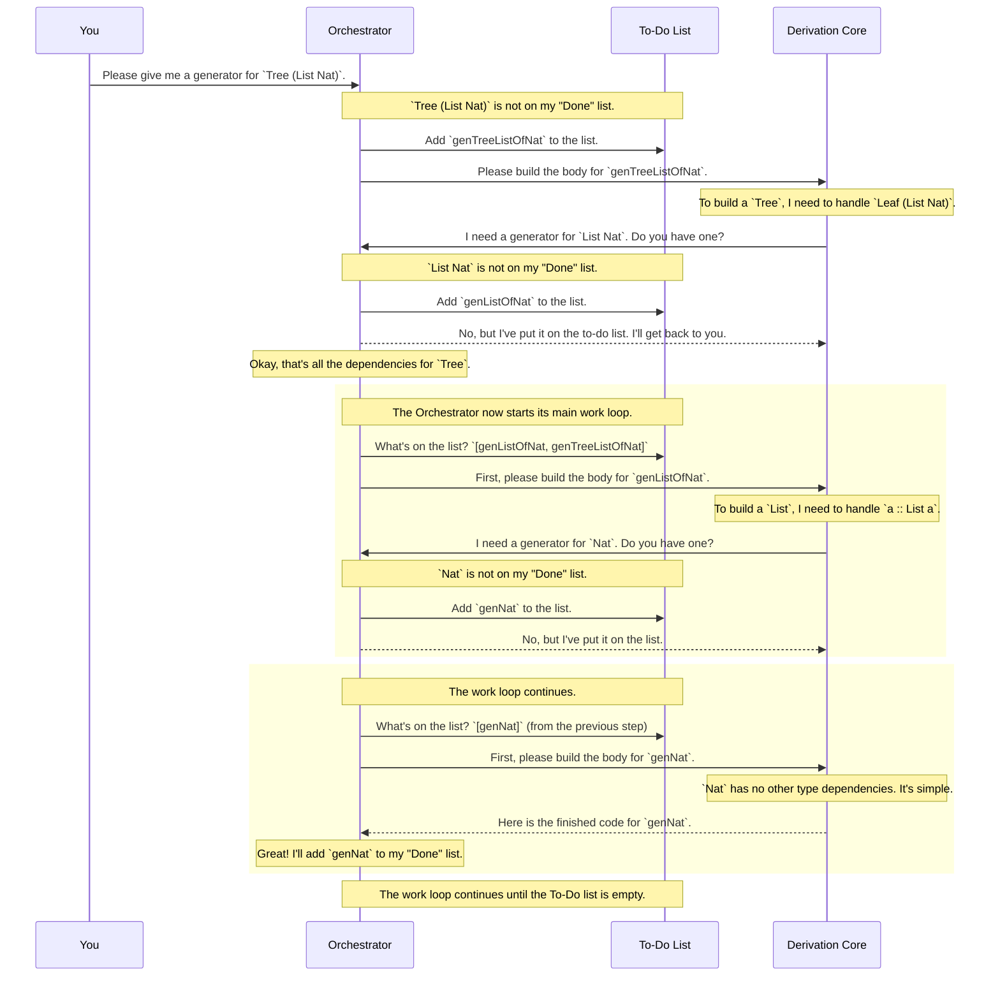

# Chapter 4: Derivation Orchestrator

In the [previous chapter on Generator Signature Analysis](03_generator_signature_analysis_.md), we met the "intake clerk" who reads our `deriveGen` request, validates it, and packages it into a tidy work order. This work order clearly states *what* we want to generate.

But what if the thing we want to generate is complicated? What if it depends on *other* things that also need generators?

Let's imagine we have these data types:

```idris
data List a = Nil | (::) a (List a)
data Tree a = Leaf a | Node (Tree a) (Tree a)
```

Now, suppose we ask `deriveGen` to create a generator for a `Tree (List Nat)`:

```idris
genTreeOfLists : Fuel -> Gen MaybeEmpty (Tree (List Nat))
genTreeOfLists = deriveGen
```

This one request sets off a chain reaction:
1.  To generate a `Tree (List Nat)`, we need a generator for `List Nat`.
2.  To generate a `List Nat`, we need a generator for `Nat`.
3.  To generate a `Nat`, we need... well, just a generator for `Nat`.

Someone needs to manage this complex project. Someone needs to identify all the sub-tasks, make a to-do list, and ensure everything is built in the right order. This manager is the **Derivation Orchestrator**.

## The Project Manager for `deriveGen`

Think of the Derivation Orchestrator as the **project manager** for building generators. When you submit a big request like `genTreeOfLists`, the orchestrator takes the initial work order and breaks it down into a complete project plan.

Its main responsibilities are:
1.  **Create a "To-Do List":** It maintains a list of all the generators that need to be built. It starts with your main request (`Tree (List Nat)`) and adds any newly discovered dependencies (`List Nat`, `Nat`) to this list.
2.  **Maintain a "Done List":** To avoid doing the same work twice, it keeps track of which generators have already been built or are currently in progress. If it's asked to build a `Nat` generator, and then later asked for it again, it says, "No problem, I already have that one."
3.  **Execute the Plan:** It goes through the to-do list, calling on specialists to handle the actual code generation for each individual type. Once all the pieces are built, it assembles them into the final, complete code.

## How the Orchestrator Works: A Walkthrough

Let's trace the orchestrator's steps as it handles our request for `genTreeOfLists`.

The process is a conversation between the **Orchestrator** and a specialist component called the [Single-Type Derivation Core (`DeriveBodyForType`)](05_single_type_derivation_core___derivebodyfortype___.md), which we'll call the **Derivation Core** for short. The core's job is to build a generator for *one* type, and it will ask the orchestrator if it needs helpers.


This back-and-forth process continues. The orchestrator works through its to-do list, which may grow as it discovers new dependencies. By tackling the simplest, most fundamental tasks first (like `genNat`), it ensures that by the time it gets to the complex tasks (like `genTreeListOfLists`), all the necessary helper generators have already been built.

## Under the Hood: The Work Loop

This entire orchestration process is managed by a set of functions in the file `src/Deriving/DepTyCheck/Gen/ForAllNeededTypes/Impl.idr`. The main "project manager" function is called `callGen`.

Let's look at a simplified version of `callGen`. When the Derivation Core asks for a generator, `callGen` decides what to do.

```idris
-- From: ForAllNeededTypes/Impl.idr

callGen : GenSignature -> ... -> m TTImp
callGen sig = do
  -- First, check the "Done list". Have we already derived this?
  let Nothing = SortedMap.lookup sig !get
    | Just name => pure (callTheAlreadyDerivedFunction name) -- Yes! Just use it.

  -- If not, it's a new task.
  let name = nameForGen sig      -- Give the new generator a unique internal name.
  modify $ insert sig name       -- Add it to the "Done list" so we don't repeat this.
  modify {s=List _} $ (::) (sig, name) -- Add it to the "To-Do list" of work.

  -- Return the code to call the function we are about to create.
  pure (callTheYetToBeDerivedFunction name)
```
This is the heart of dependency detection.
*   It first checks a `SortedMap` (our "Done List") to see if the generator is already available.
*   If not, it adds the new `GenSignature` to a `List` (our "To-Do List").
*   Crucially, it immediately returns a placeholder for the function call. It's like a project manager saying, "Don't worry, that function will exist by the time we compile. Just pretend you can call it."

So who actually does the work on the to-do list? A function called `deriveAll`.

```idris
-- From: ForAllNeededTypes/Impl.idr

deriveAll : m ()
deriveAll = do
  -- Get a snapshot of the current to-do list.
  toDerive <- get {stateType=List _}
  put {stateType=List _} [] -- Clear it for the next round.

  -- For each task, call the specialist to build the function body.
  for_ toDerive deriveOne

  -- If `deriveOne` added new tasks, run `deriveAll` again!
  when (not $ null toDerive) $ assert_total $ deriveAll
```
This is the orchestrator's main work loop.
1.  It grabs the list of tasks.
2.  It calls `deriveOne` for each task, which in turn calls the [Single-Type Derivation Core (`DeriveBodyForType`)](05_single_type_derivation_core___derivebodyfortype___.md).
3.  If the core discovers *new* dependencies during its work, those get added to the to-do list. The recursive call to `deriveAll` ensures the loop continues until every last dependency has been satisfied.

The final piece is `runCanonic`, which sets up the initial empty state (empty to-do and done lists) and kicks off the whole process.

## Conclusion

The Derivation Orchestrator is the clever project manager at the core of `deriveGen`. It transforms a single, simple request into a comprehensive, multi-step project.

You've learned that the orchestrator:
*   Acts as a **project manager**, identifying all dependent generators that need to be built.
*   Maintains a **to-do list** of generators to derive and a **done list** to avoid duplicate work.
*   Uses a **work loop** (`deriveAll`) to process the to-do list, discovering new dependencies along the way.
*   **Assembles** all the generated code pieces in the correct order.

Thanks to this orchestrator, you can ask `deriveGen` for a generator for your most complex type, and it will flawlessly figure out and build everything it needs along the way.

Now that we understand how the project is managed, it's time to meet the specialist who does the heavy lifting. In the next chapter, we will dive into the [Single-Type Derivation Core (`DeriveBodyForType`)](05_single_type_derivation_core___derivebodyfortype___.md), the component that actually writes the generator code for one specific data type.

---

Generated by [AI Codebase Knowledge Builder](https://github.com/The-Pocket/Tutorial-Codebase-Knowledge)