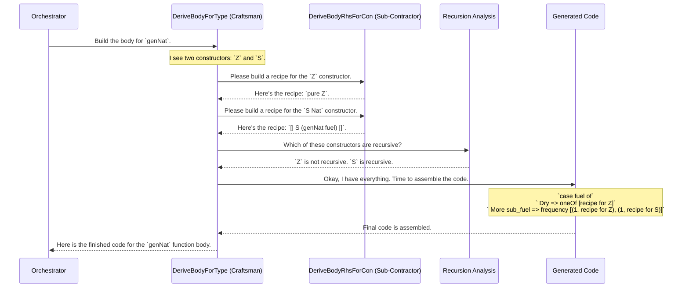

# Chapter 5: Single-Type Derivation Core (`DeriveBodyForType`)

In the [previous chapter](04_derivation_orchestrator_.md), we met the [Derivation Orchestrator](04_derivation_orchestrator_.md), the grand project manager of `deriveGen`. It takes our request, breaks it down into a to-do list of smaller tasks (like `genNat`, `genList`, `genTree`), and makes sure everything is built in the right order.

Now, it's time to meet the specialist that the orchestrator calls upon to handle one specific task from that list. If the orchestrator is the project manager, this component is the **master craftsman**, responsible for building the generator for *one single type*.

This craftsman is called `DeriveBodyForType`.

## The Specialist Craftsman

Imagine you're building a house. The project manager (the Orchestrator) gives a craftsman a blueprint and says, "Build me one door."

The craftsman doesn't worry about the roof or the windows. Their job is to focus solely on that door. To do this, they need to:
1.  Know the structure of a door (its constructors, like `DoorPanel`, `Knob`, `WindowPane`).
2.  Have a plan for assembling these parts.

`DeriveBodyForType` is this craftsman. It receives a 'blueprint'—the validated `GenSignature`—from the orchestrator. Its job is to generate the complete function body for a generator like `genNat`.

Let's use our familiar example:

```idris
data Nat = Z | S Nat

genNat : Fuel -> Gen MaybeEmpty Nat
genNat = deriveGen
```

The orchestrator has put `genNat` on its to-do list. It now calls `DeriveBodyForType` and says: "Please write the code for `genNat`."

## The Craftsman's Plan

`DeriveBodyForType` knows that a generator for a `data` type is fundamentally a choice between its constructors. For `Nat`, this means choosing between `Z` and `S Nat`.

However, it's not a simple choice. The `S` constructor is recursive, meaning it can lead to infinitely long chains (`S (S (S ...))`). To prevent this, the choice must depend on the `Fuel`.

The craftsman's high-level plan is to generate a function body that looks like this:

```idris
-- This is the code structure DeriveBodyForType aims to create.
genNat (fuel_arg : Fuel) =
  -- First, some helper generators, one for each constructor.
  let genZ   = ... -- A recipe for just 'Z'
      genSNa = ... -- A recipe for 'S Nat'
  in
  -- Then, a case expression that chooses based on fuel.
  case fuel_arg of
    Dry ->
      -- No fuel left! Only pick non-recursive options.
      oneOf [genZ]

    More sub_fuel ->
      -- We have fuel! Pick from all options, giving less fuel
      -- to the recursive ones.
      frequency [ (1, genZ), (1, genSNa) ]
```

This plan has two main steps:
1.  **Delegate the Details:** Create a small, dedicated generator for each constructor (`genZ`, `genSNa`).
2.  **Make the Fuel Decision:** Write the main `case` expression that chooses between these small generators based on the available `Fuel`.

## Step 1: Delegating to Sub-Contractors

A master craftsman doesn't make every screw and hinge themselves. They delegate that to other specialists. `DeriveBodyForType` does the same.

For each constructor (`Z` and `S`), it asks another specialist, the [Constructor-Specific Derivation (`DeriveBodyRhsForCon`)](06_constructor_specific_derivation___derivebodyrhsforcon___.md), to create a tiny generator recipe.

*   For `Z`, the recipe is simple: `pure Z`.
*   For `S Nat`, the recipe is recursive: `[| S (genNat sub_fuel) |]`.

We will explore this sub-contractor in detail in the next chapter. For now, just know that `DeriveBodyForType` receives these finished "parts" and is ready to assemble them.

## Step 2: The Crucial Fuel Decision

This is the core logic of `DeriveBodyForType`. It assembles the final function body, and the most important part is the `case` expression that inspects the `fuel` argument.

**Analogy: Building a Lego Tower**
Imagine `Fuel` is your patience for building a Lego tower (`Nat`).
*   `Z` is a small, flat base piece.
*   `S` is a standard block you stack on top.

**When `Fuel` is `Dry` (Patience has run out):**
You're tired. You're not going to stack another block. You will *only* choose the finishing piece, `Z`, to complete the tower. The generated code will use `oneOf` to pick from the list of non-recursive constructors.

**When `Fuel` is `More` (You have patience):**
You can keep building. You face a choice:
1.  Add a standard `S` block and continue building (a recursive step).
2.  Add the `Z` base piece and finish this particular tower (a non-recursive step).

The generated code will use `frequency` to make a weighted choice between *all* constructors. Recursive calls (like for `S`) will be passed a reduced amount of fuel (`sub_fuel`).

## Under the Hood: Building the Function Body

Let's trace how `DeriveBodyForType` builds the code for `genNat`.


This diagram shows `DeriveBodyForType` acting as an assembly-line manager. It gathers the parts from its sub-contractor, gets information from the analysis specialist, and then assembles the final product according to the fuel-based blueprint.

### A Glimpse at the Code

The logic for `DeriveBodyForType` lives in the interface's implementation, inside the `canonicBody` function in `src/Deriving/DepTyCheck/Gen/ForOneType/Impl.idr`.

First, it asks the [Constructor-Specific Derivation (`DeriveBodyRhsForCon`)](06_constructor_specific_derivation___derivebodyrhsforcon___.md) to generate the body for each constructor's mini-generator.

```idris
-- File: src/Deriving/DepTyCheck/Gen/ForOneType/Impl.idr

-- ... inside canonicBody ...

-- For each constructor in the signature...
consBodies <- for sig.targetType.cons $ \con =>
  -- ...derive the body for that constructor's generator.
  canonicConsBody sig (consGenName con) con
```
This `for` loop is `DeriveBodyForType` talking to its "sub-contractors". `canonicConsBody` is the function from the next chapter's specialist.

Next, it needs to know which constructors are recursive. It looks this up using a helper that performs [Recursion and Weight Analysis (`ConsRecs`)](07_recursion_and_weight_analysis___consrecs___.md).

```idris
-- File: src/Deriving/DepTyCheck/Gen/ForOneType/Impl.idr

let Just consRecs = lookupConsWithWeight sig
  | Nothing => fail "INTERNAL ERROR..."
```
This `consRecs` variable now holds the information about which constructors use fuel (are recursive) and which don't.

Finally, it generates the main `case` expression using a helper called `fuelDecisionExpr`.

```idris
let outmostRHS = fuelDecisionExpr fuelArg consRecs
```
This `fuelDecisionExpr` function is the one that builds the `case fuel of ...` block we saw earlier. It inspects the `consRecs` info:

```idris
-- A simplified view of fuelDecisionExpr
fuelDecisionExpr fuelArg consRecs =
  iCase (var fuelArg) ... [
    -- If fuel is Dry, call only the non-spending constructors.
    var `{Dry}` .=
      callOneOf ... (non-recursive constructors),

    -- If fuel is More, call all constructors with adjusted fuel.
    var `{More}` .$ bindVar subFuelArg .=
      callFrequency ... (all constructors)
  ]
```
This code directly implements the Lego tower analogy. It cleanly separates the logic for the `Dry` and `More` cases, ensuring that generation always terminates while still allowing for the creation of complex, recursive structures.

## Conclusion

The `DeriveBodyForType` is the heart of the code generation process for a single type. It's the master craftsman that takes a specific task from the orchestrator and executes it perfectly.

You've learned that `DeriveBodyForType`:
*   Is a specialist that generates the **entire function body** for one generator (e.g., `genNat`).
*   **Delegates** the creation of recipes for individual constructors (`Z`, `S`) to another specialist.
*   Its primary job is to generate the crucial **`case fuel of` expression**.
*   This expression intelligently chooses between **non-recursive constructors** when fuel is `Dry`, and a mix of **all constructors** when fuel is `More`.

This craftsman has done its job of assembling the door. But how were the individual parts—the door panel, the knob—actually made? In the next chapter, we'll meet the "sub-contractor" and see how it builds a generator for a single constructor in [Constructor-Specific Derivation (`DeriveBodyRhsForCon`)](06_constructor_specific_derivation___derivebodyrhsforcon___.md).

---

Generated by [AI Codebase Knowledge Builder](https://github.com/The-Pocket/Tutorial-Codebase-Knowledge)