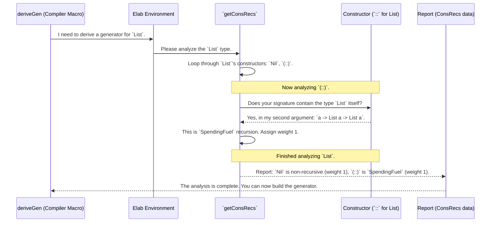

# Chapter 7: Recursion and Weight Analysis (`ConsRecs`)

In the [previous chapter](06_constructor_specific_derivation___derivebodyrhsforcon___.md), we saw how `deriveGen` builds a recipe for a single constructor, like `Z` or `S Nat`, by cleverly figuring out the right order to generate its arguments.

But this raises a crucial question. When generating a `Nat`, how does `deriveGen` decide *which* constructor to pick? If it chose `S` 50% of the time, we'd statistically generate huge numbers and often run out of fuel. If it only chose `Z`, we'd never get any other number. There needs to be a balance.

More importantly, how does `deriveGen` even know that `S` is the recursive constructor and `Z` is the "safe" base case? This is where the **`ConsRecs`** component comes in. It's the "safety inspector" for your data types.

## The Safety Inspector (`ConsRecs`)

Think of `ConsRecs` as a meticulous safety inspector who visits the "factory" where your data types are defined. Before `deriveGen` can start building generators, this inspector analyzes every single constructor and files a detailed report.

For a data type like `List a`:
```idris
data List a = Nil | (::) a (List a)
```
The inspector examines `Nil` and `(::)` and produces a report that answers two key questions for each:
1.  **Is this constructor recursive?** Does building a `List` with this constructor require building another `List` inside it?
2.  **What is its "weight"?** This is a number that represents its "cost" or "complexity." This weight will later influence how likely `deriveGen` is to pick this constructor.

Let's look at the inspector's report for `List a`:
*   **For `Nil`:** "Not recursive. A simple, safe constructor. Assigning a baseline weight of **1**."
*   **For `(::)`:** "This is recursive! It contains `List a` within it. This is a fuel-spending operation. Assigning a default weight of **1**."

This report is the crucial intelligence that `deriveGen` needs to build a smart, safe, and balanced generator.

## Weights and Probabilities

What does "weight" mean in practice? When the [`DeriveBodyForType`](05_single_type_derivation_core___derivebodyfortype___.md) component builds the final generator, it uses the weights to set up a lottery using the `frequency` function.

A weight of `1` is like giving that constructor one ticket in the lottery. A weight of `2` gives it two tickets, making it twice as likely to be chosen.

```idris
-- Conceptually, this is what the generated code does:
genList (More fuel) =
  frequency
    [ (1, genForNil)  -- `Nil` gets 1 ticket.
    , (1, genForCons) -- `(::)` gets 1 ticket.
    ]
```
With equal weights, `Nil` and `(::)` have a 50/50 chance of being picked *when there is fuel*. This simple weighting system is the key to controlling the size and shape of the data you generate. We'll see how to change these weights in the next chapter.

## Two Kinds of Recursion

The safety inspector is very clever. It recognizes that not all recursion is the same. It can distinguish between two fundamental types.

### 1. Simple `Fuel`-Spending Recursion

This is the most common kind. For a type like `List a`, the constructor `(::)` takes an `a` and a `List a`. The recursive part (`List a`) is of the *exact same type* as the result (`List a`).

```idris
-- The type of the recursive argument is the same as the type being built.
(::) : a -> List a -> List a
```
The inspector sees this and flags it as `SpendingFuel`. This tells `deriveGen` that every time it picks this constructor, it must spend a unit of `Fuel` to prevent an infinite loop.

### 2. Smart, `StructurallyDecreasing` Recursion

Now, let's look at a dependently-typed list, `Vect n a`.

```idris
data Vect : Nat -> Type -> Type where
  Nil : Vect Z a
  (::) : a -> Vect k a -> Vect (S k) a
```
Look closely at the `(::)` constructor. It takes a `Vect k a` as input and produces a `Vect (S k) a` as output. This is still recursion, but something amazing is happening. To build a vector of size `S k`, we need to build one of size `k`. The problem is getting *structurally smaller*.

**Analogy:** It's like a set of Russian nesting dolls. To make a big doll, you must first make a slightly smaller one to go inside. The process is guaranteed to stop when you get to the smallest doll.

The inspector is smart enough to detect this!
*   It analyzes the type arguments (`k` vs `S k`).
*   It sees that `k` is structurally smaller than `S k`.
*   It flags this constructor as `StructurallyDecreasing`.

This tells `deriveGen` that even though this constructor is recursive, it's *inherently safe*. It doesn't need to spend `Fuel` because the decreasing size of the type argument `k` already guarantees termination. Instead, the "weight" can be calculated based on the size of the structure itself.

This is a powerful optimization that allows `deriveGen` to generate values for complex dependent types very efficiently.

## Under the Hood: The Analysis Process

So how does the inspector (`ConsRecs`) perform this analysis? The process begins in the `getConsRecs` function in `src/Deriving/DepTyCheck/Gen/ConsRecs.idr`.



Let's look at the data structures that hold this report.

#### The Report Forms: `RecWeightInfo` and `ConWeightInfo`

The results of the inspection are stored in these records.

```idris
-- Simplified from ConsRecs.idr

-- Describes how a recursive constructor behaves.
data RecWeightInfo : Type where
  SpendingFuel : ... -> RecWeightInfo
  StructurallyDecreasing : ... -> RecWeightInfo

-- The final report for one constructor.
record ConWeightInfo where
  constructor MkConWeightInfo
  -- Either a weight for a NON-RECURSIVE constructor,
  -- or the kind of recursion for a RECURSIVE one.
  weight : Either Nat1 RecWeightInfo
```
*   `RecWeightInfo` is an `enum` that simply tags the type of recursion: normal `SpendingFuel` or smart `StructurallyDecreasing`.
*   `ConWeightInfo` stores the final verdict. It holds a `Left Nat1` if the constructor is not recursive, or a `Right RecWeightInfo` if it is.

#### The Decision Maker: `finCR`

The complex logic for distinguishing between the two recursion types happens in a helper function called `finCR`. We won't show the full code because it's very complex, but here is its strategy in plain English:

1.  **Assume the worst:** It starts by assuming the recursion is simple `SpendingFuel` recursion.
2.  **Look for evidence of improvement:** It then checks all the recursive arguments. For each one, it compares its type parameters to the final type's parameters. For `Vect`, it compares `k` (from the argument `Vect k a`) with `S k` (from the result `Vect (S k) a`).
3.  **Make a judgment:** If it finds even one recursive argument where a parameter is getting structurally smaller (like `k` is to `S k`), it changes its verdict to `StructurallyDecreasing`.
4.  **File the report:** If it finds no such evidence after checking all arguments, it sticks with its original `SpendingFuel` verdict.

This clever deduction allows `deriveGen` to produce highly optimized generators for a wide range of recursive types, all automatically.

## Conclusion

`ConsRecs` is the analytical brain of `deriveGen`. It's the safety inspector that meticulously analyzes your data types before a single line of generator code is written.

You've learned that `ConsRecs`:
*   **Identifies recursive constructors** by checking if a constructor's arguments refer back to the type being defined.
*   Assigns a **weight** to each constructor, which influences the probability of it being chosen during generation.
*   Can distinguish between simple **`SpendingFuel`** recursion and safer, more efficient **`StructurallyDecreasing`** recursion.
*   Provides this crucial report to other parts of `deriveGen` so they can build safe and balanced generators.

The default weights `ConsRecs` assigns are a great starting point, but what if you want to generate lists that are, on average, longer? Or have a tree with more branches? What if you want to fine-tune the lottery?

In the next chapter, we'll see exactly how to do that by manually adjusting these weights in [Derivation Tuning](08_derivation_tuning_.md).

---

Generated by [AI Codebase Knowledge Builder](https://github.com/The-Pocket/Tutorial-Codebase-Knowledge)