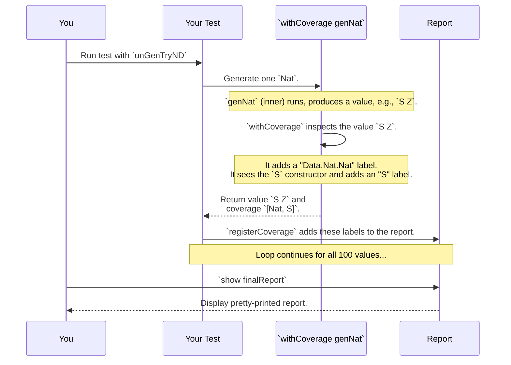

# Chapter 9: Test Coverage Analysis

In the previous chapter on [Derivation Tuning](08_derivation_tuning_.md), we learned how to grab the steering wheel and fine-tune `deriveGen` to produce specific kinds of data. We can now generate longer lists or solve tricky dependent type puzzles.

But this leads to an important question: how do we know if our generators are any good? We might *think* our tuned `List` generator creates long lists, but what if it's accidentally producing only empty `Nil` lists? How can we be sure we're generating all the interesting edge cases?

This is the job of **Test Coverage Analysis**. It's a quality inspector for your generators that gives you a detailed report on exactly what kinds of data are being created.

## The Quality Inspector for Your Generators

Imagine a factory building toy cars. A quality inspector doesn't just look at the final car; they watch the assembly line. They put a little checkmark next to "Red Paint" every time a red car is made, and a checkmark next to "Blue Paint" for a blue one. At the end of the day, they can look at their clipboard and say, "We made 1000 red cars but only 2 blue ones. We have a problem!"

Test Coverage Analysis in `DepTyCheck` works exactly like this. During a test run, it attaches "labels" to the parts of your data as they're being generated. Afterwards, it can produce a report showing:
*   **Hot Spots:** Parts of your data model that are generated frequently.
*   **Cold Spots:** Parts that are generated rarely, or not at all.

This allows you to see how well your generators are covering the possible shapes of your data, helping you find and fix blind spots in your testing.

## A Walkthrough: Inspecting a `Nat` Generator

Let's see the quality inspector in action. We'll analyze a simple `Nat` generator and see if it's doing a good job.

```idris
data Nat = Z | S Nat
```

### Step 1: Turn on Coverage with `withCoverage`

First, we need to tell `DepTyCheck` that we want to enable the labeling process for our `Nat` generator. We do this by wrapping our generator definition with the `withCoverage` macro.

```idris
import Test.DepTyCheck.Gen.Coverage

-- A standard derived generator, now with coverage enabled.
genNat : Fuel -> Gen MaybeEmpty Nat
genNat = withCoverage deriveGen
```

That's it! `withCoverage` is a macro that takes our `genNat` and enhances it with the ability to "label" every `Nat` it produces. When a `Z` is made, it will get a "Z" label. When an `S Nat` is made, it gets an "S" label.

### Step 2: Prepare the Report Card

Before the inspector can start making checkmarks, they need a blank report card. We can create this template automatically using another macro, `initCoverageInfo`.

```idris
-- Prepare an empty coverage report for the Nat type.
natCoverage : CoverageGenInfo genNat
natCoverage = %runElab initCoverageInfo genNat
```
This nifty macro looks at the `genNat` generator, figures out that it produces `Nat`s, and creates an empty report structure with entries for `Nat`, `Z`, and `S`, all with counts of 0.

### Step 3: Run the Generator and Collect Data

Now we run our generator many times to gather data. We'll use a helper function, `unGenTryND`, which generates `n` values and also returns the coverage labels for each one. We'll generate 100 `Nat`s.

```idris
import Data.List.Lazy

-- A seed for our random number generator.
testSeed : GenSeed
testSeed = mkSeed 42

-- Generate 100 Nats and collect the coverage data for each.
generatedData : LazyList (ModelCoverage, Nat)
generatedData = unGenTryND 100 testSeed genNat
```

`generatedData` is now a lazy list where each element is a pair: the `Nat` that was generated, and a `ModelCoverage` record containing all the labels for that one generation.

### Step 4: Fill the Report Card

We now take all the individual coverage records from `generatedData` and feed them into our main `natCoverage` report card.

```idris
-- Tally up all the coverage data into our report.
finalReport : CoverageGenInfo genNat
finalReport = foldl (\report, (coverage, _) => registerCoverage coverage report)
                  natCoverage
                  generatedData
```
This `foldl` loop iterates through our 100 generated `Nat`s and, for each one, uses `registerCoverage` to add its labels to the total tally in our report.

### Step 5: Read the Report!

Finally, we can print the report and see what we've found.

```idris
-- In the Idris REPL:
-- > putStrLn $ show {a=Colourful} finalReport
```

You'll see a colorful output like this:

```
Data.Nat.Nat covered fully (100 times)
  - Z: covered (51 times)
  - S: covered (49 times)
```

This is a great report! It tells us:
*   The `Nat` type was generated 100 times.
*   The `Z` constructor was chosen 51 times ("hot spot").
*   The `S` constructor was chosen 49 times ("hot spot").

Our default generator is well-balanced. But what if we saw this instead?

```
Data.Nat.Nat covered partially (100 times)
  - Z: covered (100 times)
  - S: not covered
```
This report shows a "cold spot"! Our generator *only ever created `Z`*. This would be a huge red flag, telling us that our tests are never running on any `Nat` other than zero. We could then use [Derivation Tuning](08_derivation_tuning_.md) to adjust the weights and fix the problem.

## Under the Hood: The Labeling and Reporting Process

How does this all work? It's a three-step dance between a macro, a special generator runner, and the reporting tools.



### The `withCoverage` Macro

The `withCoverage` macro is the magic ingredient. At compile-time, it takes your generator and wraps it. Here's a conceptual view of what it does:

```idris
-- Your code:
genNat = withCoverage deriveGen

-- What the macro generates (conceptually):
genNat = do
  -- First, run the original generator.
  val <- deriveGen

  -- Then, add a label for the type itself.
  label "Data.Nat.Nat" $ do
    -- Now, inspect the value to add a constructor label.
    let conLabel = case val of
                     Z   => "Z"
                     S _ => "S"

    -- Label with the constructor and return the final value.
    label conLabel (pure val)
```
This macro automatically generates the boilerplate for inspecting the generated value and adding the appropriate labels.

### The `unGenD` and `ModelCoverage` Runner

When you run a normal `Gen`, you get a value of type `a`. When you run it with a coverage-aware function like `unGenD` (used internally by `unGenTryND`), the `label` calls are intercepted.

The `label` function uses a `MonadWriter` interface, and `unGenD` provides an implementation that collects all the `Label` strings into a `ModelCoverage` record. This record is just a map from labels to their counts.

```idris
-- From: src/Test/DepTyCheck/Gen/Coverage.idr

-- A record that stores the raw label counts.
record ModelCoverage where
  constructor MkModelCoverage
  unModelCoverage : SortedMap Label Nat

-- This function runs a generator and uses a Writer to collect labels.
unGenD : ... -> Gen em a -> m (ModelCoverage, a)
unGenD = ... runWriterT . unGen ...
```

### The `CoverageGenInfo` Report

The `CoverageGenInfo` record, created by `initCoverageInfo`, is simply a structured container for the final report. It reflects on your data type to know all the possible types and constructors ahead of time. The `registerCoverage` function simply takes the raw `ModelCoverage` from a single run and uses the label strings to find and increment the correct counters in the `CoverageGenInfo` structure.

## Conclusion

Test Coverage Analysis is a powerful feedback tool that closes the loop on property-based testing. It gives you concrete evidence about how well your generators are performing, moving you from "I think my tests are good" to "I know my tests are covering these specific cases."

You've learned how to:
*   Enable coverage analysis for a generator using the `withCoverage` macro.
*   Set up, run, and tally a coverage report using `initCoverageInfo`, `unGenTryND`, and `registerCoverage`.
*   Interpret the report to find "hot spots" and "cold spots" in your generated data.
*   Use this information to improve your generators.

So far, we've explored every component of `DepTyCheck`, from generating values to analyzing them. In the final chapter, we'll see how to put all these pieces together to build a real [Test Suite](10_test_suite_.md) and write powerful, property-based tests for your Idris programs.

---

Generated by [AI Codebase Knowledge Builder](https://github.com/The-Pocket/Tutorial-Codebase-Knowledge)