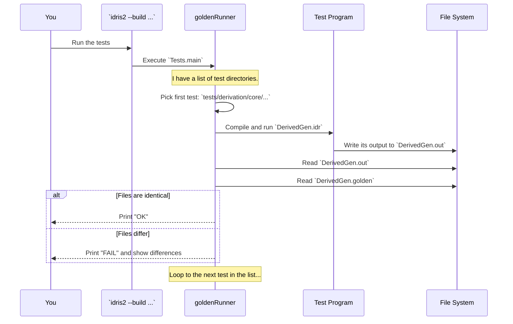

# Chapter 10: Test Suite

Congratulations on making it to the final chapter! You've journeyed through the core components of `DepTyCheck`, from the fundamental [Test Value Generator (`Gen`)](01_test_value_generator___gen___.md) to the powerful `deriveGen` machinery and even the quality checks provided by [Test Coverage Analysis](09_test_coverage_analysis_.md).

Now, for our last topic, let's step back and look at the big picture. How do we know that `DepTyCheck` *itself* works correctly? With all these complex moving parts—macros, type-level analysis, random generation—how do the developers ensure that a change to one component doesn't accidentally break another?

The answer is the project's own **Test Suite**. It's the comprehensive set of automated checks that acts as the guardian of the library's quality and stability.

## A Factory's Master Checklist

Think of the `DepTyCheck` library as a complex machine built in a factory. Before this machine can be shipped to users like you, it must pass a rigorous quality assurance process. The Test Suite is the master checklist for this process.

Inspectors go through every single feature on the list:
*   ✅ Does the `Gen` monad combine recipes correctly?
*   ✅ Does `deriveGen` work for simple Algebraic Data Types (ADTs)?
*   ✅ Does it work for complex Generalized ADTs (GADTs)?
*   ✅ Does [Derivation Tuning](08_derivation_tuning_.md) correctly adjust probabilities?
*   ✅ Does it still work for that tricky edge case we fixed last month?

The Test Suite automates this entire checklist. It is a vast collection of small programs, each one designed to exercise a specific feature of `DepTyCheck` and verify that it behaves exactly as expected.

## The "Golden File" Approach

Many of these tests use a simple but powerful strategy called **golden file testing**.

**Analogy:** Imagine you're taking a math quiz. You solve the problems and write your answers on a sheet of paper. To see if you're correct, you compare your answer sheet to the official answer key provided by the teacher. The teacher's answer key is the "golden file."

Here's how it works for `DepTyCheck`:
1.  A test program runs and generates some text output. For example, it might print the statistical distribution of a generator.
2.  This output is saved to a file, let's say `my_test.out`.
3.  The test runner then compares this new `my_test.out` file with a pre-existing, known-good version called `my_test.golden`.
4.  **If the files are identical**, the test passes. Hooray!
5.  **If the files are different**, the test fails. The test runner will show you the exact differences, highlighting any unexpected changes. This is crucial for catching "regressions"—bugs that reappear after being fixed.

This approach is perfect for verifying the output of `deriveGen` or the statistical properties of generators.

## A Tour of the Test Suite Structure

The entire test suite is orchestrated from a single entry point: `tests/Tests.idr`. Let's look at a simplified version of its `main` function.

```idris
-- File: tests/Tests.idr
module Tests

import Test.Golden.RunnerHelper

main : IO ()
main = goldenRunner $
  [ "The `Gen` monad" `atDir` "lib/gen-monad"
  , "Distribution of generators" `atDir` "lib/distribution"
  , "Derivation: core" `atDir` "derivation/core"
  , "Derivation: least effort (...) gadt" `atDir` "derivation/least-effort/run/gadt"
  , "Derivation: (...) regression" `atDir` "derivation/least-effort/run/regression"
  , "The library documentation" `atDir` "docs"
  ]
```
This file acts as the table of contents for all the tests.
*   `goldenRunner`: This is the main function from a helper library that knows how to run golden file tests.
*   `"The `Gen` monad" `atDir` "lib/gen-monad"`: This line defines a test group. It tells the runner, "The tests named 'The `Gen` monad' live in the `tests/lib/gen-monad` directory."

You can see how the tests are organized into a clear hierarchy. There are dedicated groups for the `Gen` monad, value distribution, and the derivation engine. The derivation tests are particularly extensive, with sub-groups for GADTs and a large collection of **regression tests**—tests added specifically to prevent old bugs from ever coming back.

## Anatomy of a Single Test

Let's zoom in and look at what a couple of these small test programs actually do.

### A Derivation Test
This test checks if `deriveGen` correctly handles a type that can never be created.

```idris
-- File: tests/derivation/core/norec nodep noext 004-neg/DerivedGen.idr
module DerivedGen

import RunDerivedGen

data X = MkX Bool Void

checkedGen : Fuel -> Gen MaybeEmpty X
checkedGen = deriveGen

main : IO ()
main = runGs [ G checkedGen ]
```
*   The data type `X` has a field of type `Void`. Since `Void` has no values, it's impossible to ever construct a value of type `X`.
*   The test still asks `deriveGen` to create a generator for it.
*   The `main` function runs this generator and prints out information about it.
*   The corresponding `.golden` file contains the expected output, which would confirm that the resulting generator is always `empty`. This proves that `deriveGen` is smart enough to handle uninhabited types.

### A Distribution Test
This test verifies that [Derivation Tuning](08_derivation_tuning_.md) works as expected.

```idris
-- File: tests/derivation/distribution/list-nat-tuned-004/CheckDistribution.idr
module CheckDistribution

import Deriving.DepTyCheck.Gen

-- A simple List of Nats
data ListNat : Type where
  Nil  : ListNat
  (::) : Nat -> ListNat -> ListNat

-- Tune the probability: make `Nil` twice as likely.
ProbabilityTuning `{CheckDistribution.Nil}.dataCon where
  tuneWeight = const 2

listNats : Fuel -> Gen MaybeEmpty ListNat
listNats = deriveGen

main : IO ()
main = do
  mainFor 5 -- Run the test for a certain depth.
```
*   This test defines a `ListNat` type and then uses `ProbabilityTuning` to make the `Nil` constructor twice as likely to be picked as the `(::)` constructor.
*   The `main` function then generates many `ListNat` values and prints a report on the observed distribution of list lengths.
*   The `.golden` file contains the precise, statistically expected output. If a future change breaks `ProbabilityTuning`, the output will change, the comparison will fail, and the developers will be immediately notified.

### Living Documentation
One of the most creative parts of the test suite is how it tests the documentation.

```idris
-- From `tests/Tests.idr`
"The library documentation" `atDir` "docs"
```
The file `tests/docs/readme/README.md` is a copy of the project's main `README.md` file. The test runner literally compiles this Markdown file as if it were an Idris program! This ensures that every single code example in the documentation is guaranteed to be correct and up-to-date. If a code snippet in the README becomes outdated, this test will fail.

## Under the Hood: The `goldenRunner` Helper

How does running a single `main` function orchestrate thousands of tests? It's managed by the `goldenRunner` and the `pack` build system.


The `goldenRunner` is a simple but powerful script. For each test directory, it compiles and runs the Idris file inside, captures its output, and compares it to the golden file. This systematic process is what makes the test suite so reliable.

## Conclusion

You have reached the end of our journey through `DepTyCheck`! You've seen how all the pieces fit together, and now you've seen how the library ensures its own quality through a comprehensive and clever `Test Suite`.

In this final chapter, you've learned that the test suite:
*   Is a **comprehensive set of automated checks** that guards the library's stability.
*   Uses a **"golden file" approach** to compare actual output against known-good results.
*   Is **highly organized** into hierarchical groups for testing every feature.
*   Includes a vast number of **regression tests** to prevent old bugs from returning.
*   Even acts as **living documentation**, ensuring that code examples in the README are always correct.

Thank you for joining us on this tour of `DepTyCheck`. We hope this tutorial has given you a solid foundation for understanding the library's design and a deeper appreciation for the power and elegance of property-based testing in the world of dependent types. Happy testing

---

Generated by [AI Codebase Knowledge Builder](https://github.com/The-Pocket/Tutorial-Codebase-Knowledge)