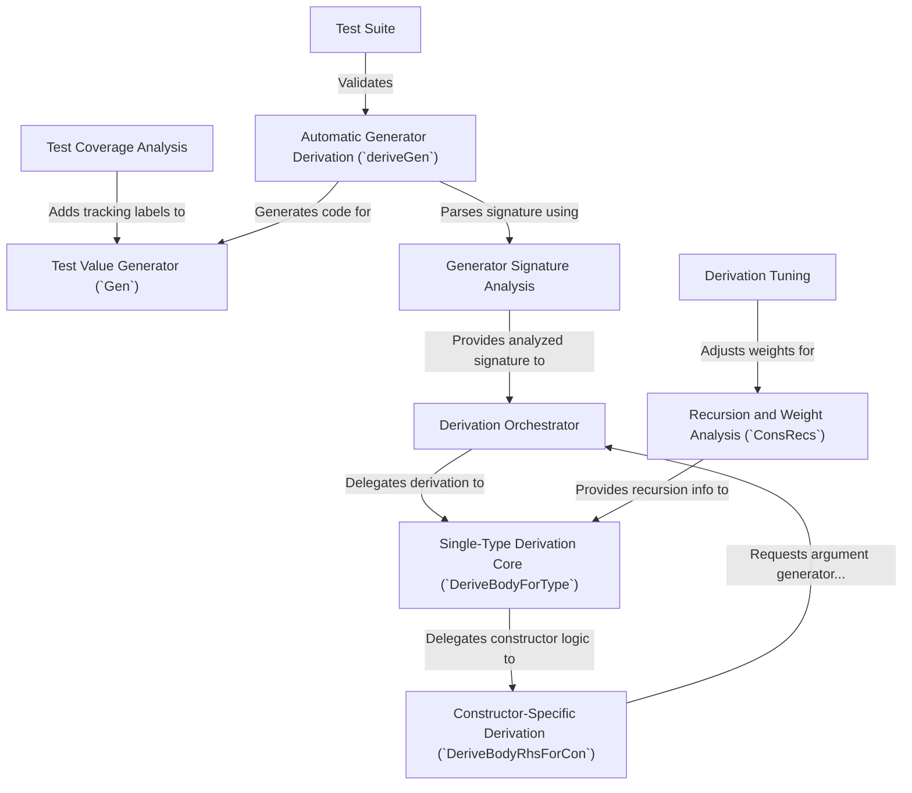

# Tutorial: DepTyCheck

`DepTyCheck` is a library for the Idris 2 language that helps with *property-based testing*, especially for programs using complex **dependent types**. Its main feature is the ability to **automatically generate random test data** for your custom data types. You simply point its magic wand, the `deriveGen` macro, at your type, and it writes the code to produce *valid, random examples*, even for recursive structures, which you can then use to test your functions.

**Source Repository:** [None](None)

## Chapters

1. [Test Value Generator (`Gen`)
](01_test_value_generator___gen___.md)
2. [Automatic Generator Derivation (`deriveGen`)
](02_automatic_generator_derivation___derivegen___.md)
3. [Generator Signature Analysis
](03_generator_signature_analysis_.md)
4. [Derivation Orchestrator
](04_derivation_orchestrator_.md)
5. [Single-Type Derivation Core (`DeriveBodyForType`)
](05_single_type_derivation_core___derivebodyfortype___.md)
6. [Constructor-Specific Derivation (`DeriveBodyRhsForCon`)
](06_constructor_specific_derivation___derivebodyrhsforcon___.md)
7. [Recursion and Weight Analysis (`ConsRecs`)
](07_recursion_and_weight_analysis___consrecs___.md)
8. [Derivation Tuning
](08_derivation_tuning_.md)
9. [Test Coverage Analysis
](09_test_coverage_analysis_.md)
10. [Test Suite
](10_test_suite_.md)

---

Generated by [AI Codebase Knowledge Builder](https://github.com/The-Pocket/Tutorial-Codebase-Knowledge)