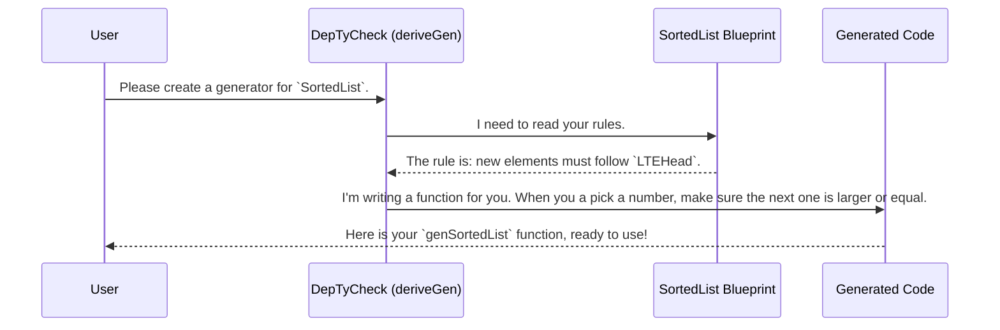

# Chapter 1: Example Data Structures

Welcome to the `DepTyCheck` tutorial! If you've ever worked with complex data and found it difficult to create good examples for testing, you're in the right place. `DepTyCheck` is a tool designed to help you automatically generate test data for even the most intricate data structures.

This first chapter is a tour of our "art gallery"—a collection of example data structures that show you what's possible. Think of it as a portfolio showcasing the kinds of complex blueprints `DepTyCheck` can work with.

### The Challenge: Blueprints with Rules

Imagine you're an architect. You could have a simple blueprint that says "this is a room." Or, you could have a much more detailed blueprint that says, "this is a room, and its walls must be exactly 10 feet tall, and this specific wall must be painted blue."

In programming, we have a similar concept called **dependent types**. A normal type might be `List Nat` (a list of numbers). A dependently-typed version could be `SortedList`—a list where the type itself guarantees that the numbers are in ascending order. The *type* depends on the *values* inside it.

This is incredibly powerful, but it creates a new problem: how do you create a valid `SortedList` for testing? You can't just pick random numbers; you have to follow the "sorted" rule. Doing this by hand is tedious and error-prone. This is where `DepTyCheck` comes in.

Let's look at a few examples from the `DepTyCheck` gallery to see how it handles these blueprints with rules.

### Example 1: The `SortedList`

A sorted list is a classic example. The rule is simple: each element must be less than or equal to the one that follows it.

Here’s what the blueprint for a `SortedList` looks like in Idris, the language `DepTyCheck` is built for.

```idris
data SortedList : Type where
  Nil  : SortedList
  (::) : (x : Nat) -> (xs : SortedList) -> LTEHead x xs => SortedList
```

Let's break that down:
*   `Nil`: An empty list. It's sorted by default.
*   `(::)`: This is how we add an element (`x`) to an existing `SortedList` (`xs`).
*   `LTEHead x xs =>`: This is the crucial part! It's a **proof** or a guarantee that `x` is "Less Than or Equal to the Head" of the list `xs`.

Without `DepTyCheck`, creating a sorted list of 5 random-but-sorted numbers would require custom logic. With `DepTyCheck`, we can ask it to automatically create a generator that understands and respects the `LTEHead` rule. We'll learn exactly how in [Chapter 2: Automatic Generator Derivation (`deriveGen`)](02_automatic_generator_derivation___derivegen__.md).

### Example 2: `UniqStrList` (A List of Unique Strings)

Here's another common need: a list where every element is unique.

**The Blueprint:**

```idris
data UniqStrList : Type where
  Nil  : UniqStrList
  (::) : (s : String) -> (ss : UniqStrList) -> s `NotIn` ss => UniqStrList
```

This looks very similar to our `SortedList`!
*   `Nil`: An empty list, which has no duplicates.
*   `s `NotIn` ss =>`: This is our rule. It's a guarantee that the string `s` is **not in** the rest of the list `ss`.

**The Challenge:** If you just generate 5 random strings, you might get `"apple"`, `"banana"`, `"apple"`, `"cherry"`, `"date"`. This is invalid! A generator needs to remember which strings it has already used.

`DepTyCheck` intelligently analyzes the `NotIn` constraint and produces a generator that does exactly that—it avoids picking duplicates.

### Example 3: `SortedBinTree` (A Sorted Binary Tree)

Let's look at something more complex. A sorted binary tree (or binary search tree) has a root value, a "left" branch, and a "right" branch.

The rules are:
1.  All values in the left branch must be *smaller* than the root.
2.  All values in the right branch must be *larger* than the root.
3.  This must be true for every node in the tree!

**The Blueprint:**

```idris
data SortedBinTree : Type where
  Empty : SortedBinTree
  Node  : (x : Nat) -> (l, r : SortedBinTree) -> 
          AllLT x l => AllGT x r => SortedBinTree
```

*   `Empty`: An empty tree.
*   `Node`: A node in the tree with a value `x`, a left tree `l` and a right tree `r`.
*   `AllLT x l =>`: A proof that "All values are Less Than `x` in the left tree `l`".
*   `AllGT x r =>`: A proof that "All values are Greater Than `x` in the right tree `r`".

Generating a valid tree like this by hand is a real headache. But for `DepTyCheck`, it's just another blueprint to read. It understands these nested rules and can generate valid, complex trees that you can use to test your functions.

### What's Happening Under the Hood?

You might be wondering, "How does it *know* what `NotIn` or `AllLT` means?" You can think of `DepTyCheck`'s core as a "blueprint analyzer." It reads your data type definitions and translates the constraints into a strategy for generating valid data.

Here's a simplified step-by-step:



This process of automatically creating a generator is called **derivation**. We'll explore it in detail in the next chapter.

### Exploring the Examples Yourself

All these examples and more live in the `examples/` directory of the `DepTyCheck` project. Each one is a small, self-contained project. You can build them to see `DepTyCheck` in action.

For example, to build the sorted list project, you can run this command from the root of the `DepTyCheck` repository:

```bash
pack build sorted-list-so-comp
```

This command will compile the `SortedList` code and—as part of the process—run `DepTyCheck` to automatically derive the generator.

**A quick heads-up:** The derivation process can sometimes take a few moments. The "blueprint analyzer" is doing a lot of complex thinking to build the right generator for you!

### Conclusion

In this chapter, we've taken a tour of the `DepTyCheck` example gallery. We've seen that dependent types allow us to create "blueprints with rules" for data like sorted lists, unique lists, and sorted trees. The key takeaway is that `DepTyCheck` shines at reading these blueprints and **automatically generating valid test data**, saving you from the tricky and error-prone task of doing it by hand.

But how does this automatic derivation actually work? Let's pull back the curtain and look at the magic wand itself.

Next up: [Chapter 2: Automatic Generator Derivation (`deriveGen`)](02_automatic_generator_derivation___derivegen__.md).

---

Generated by [AI Codebase Knowledge Builder](https://github.com/The-Pocket/Tutorial-Codebase-Knowledge)