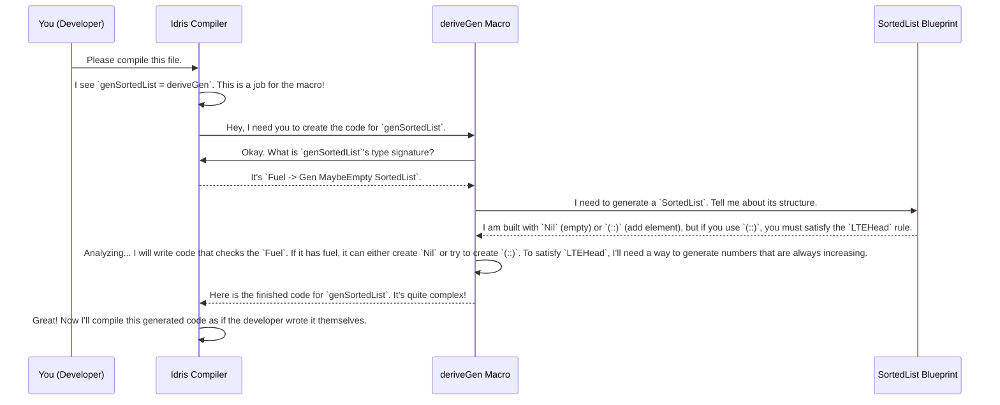

# Chapter 2: Automatic Generator Derivation (`deriveGen`)

In [Chapter 1: Example Data Structures](01_example_data_structures.md), we toured an "art gallery" of complex blueprints like `SortedList` and `SortedBinTree`. We saw that these blueprints have special rules baked into their types. The big question we left off with was: "How do we actually create data that follows these rules without a massive headache?"

This chapter introduces the answer: `DepTyCheck`'s magic wand, `deriveGen`.

### The Problem: Writing Recipes is Hard

Imagine you have the blueprint for a `SortedList`. If you had to write the recipe (the generator) for creating a 10-element sorted list by hand, what would you do?

You might try something like this:
1.  Pick a random number, say `5`.
2.  Pick another random number, but make sure it's greater than or equal to `5`. Let's say `12`.
3.  Pick another random number, but make sure it's greater than or equal to `12`.
4.  ...and so on.

This logic is doable for a `SortedList`, but it's custom work. For a `SortedBinTree` or a type with even more complex rules, writing this recipe becomes a difficult and error-prone puzzle. What if you could just show the blueprint to an expert builder and have them figure out the construction plan automatically?

That's exactly what `deriveGen` does.

### The Magic Wand: `deriveGen`

`deriveGen` is a powerful tool (a "macro") that lives inside `DepTyCheck`. Instead of you writing the complex generator code, you can ask the compiler to write it for you. It reads your data type's definition at compile-time, analyzes all its rules and constraints, and automatically produces a correct generator.

Let's see it in action with our `SortedList` example.

#### A Step-by-Step Guide

Here’s how you use `deriveGen` to create a generator for `SortedList`.

**Step 1: Have your data type ready.**
We'll use the same `SortedList` from the previous chapter.

```idris
data SortedList : Type where
  Nil  : SortedList
  (::) : (x : Nat) -> (xs : SortedList) -> LTEHead x xs => SortedList
```
This is our blueprint. The crucial rule is `LTEHead x xs`, which ensures the list stays sorted.

**Step 2: Tell the compiler you're using magic.**
`deriveGen` uses an advanced compiler feature called "Elaboration Reflection." To enable it, you just need to add this line at the top of your file. Think of it as flipping the "ON" switch for the magic wand.

```idris
%language ElabReflection
```

**Step 3: Define the generator's signature.**
This is the most important part from your side. You need to tell `DepTyCheck` what kind of generator you want.

```idris
genSortedList : Fuel -> Gen MaybeEmpty SortedList
```

Let's break this down:
*   `genSortedList`: This is the name of our new generator function.
*   `Fuel ->`: This is a "construction budget." For recursive data types like lists, we need a way to tell the generator when to stop. Otherwise, it might try to create an infinitely long list! `Fuel` is a simple countdown that prevents this.
*   `Gen MaybeEmpty SortedList`: This is the return type. It says, "The result will be a `Gen` (generator) that produces values of type `SortedList`. Oh, and it's `MaybeEmpty` because if the fuel runs out, it might not be able to produce a value." The `Gen` type itself is a rich concept we'll explore in [Chapter 3: The `Gen` Monad](03_the__gen__monad.md).

**Step 4: Invoke `deriveGen`!**
Now for the magic. Instead of writing a complicated function body, you just write `deriveGen`.

```idris
-- This is the full definition!
genSortedList : Fuel -> Gen MaybeEmpty SortedList
genSortedList = deriveGen
```

And that's it! When the compiler sees this, `deriveGen` gets to work, analyzes `SortedList`, and writes the full implementation for `genSortedList` behind the scenes. You've outsourced the hard work to the machine.

### Under the Hood: How Does the Magic Work?

`deriveGen` isn't *truly* magic; it's just very clever. It's a "macro" that runs during the compilation of your program. Here's a simplified look at what happens when the compiler encounters `genSortedList = deriveGen`.



The core of this process is made possible by **Elaboration Reflection**, which lets `deriveGen` inspect the definitions and types in your code. The logic for this resides in the `DepTyCheck` library itself. The entry point you use is a clean, simple macro:

```idris
-- From: src/Deriving/DepTyCheck/Gen.idr

||| The entry-point function of automatic derivation of Gen's.
export %macro
deriveGen : DeriveBodyForType => Elab a
deriveGen = do
  Just signature <- goal
     | Nothing => fail "The goal signature is not found..."
  -- ... more internal logic ...
```

*   `%macro`: This tag tells the compiler that `deriveGen` is special code that runs *during* compilation.
*   `goal`: The macro asks the compiler, "What is the goal I'm trying to achieve?" The compiler responds with the type signature you wrote (`Fuel -> Gen MaybeEmpty SortedList`).
*   `deriveGenExpr` (used internally): This is the engine that performs the deep analysis of the blueprint and generates the final code.

By looking at the "goal" signature, `deriveGen` knows exactly what type you want to generate (`SortedList`) and uses that as the starting point for its investigation. It then navigates through all the type definitions, constructors, and constraints to build a correct generation plan.

### From Simple Lists to Complex Trees

The real power of `deriveGen` is that this same, simple process works for much more complex types.

*   For `UniqStrList`, `deriveGen` analyzes the `NotIn` constraint and generates a strategy that avoids picking duplicate strings.
*   For `SortedBinTree`, it analyzes the `AllLT` and `AllGT` constraints and figures out how to generate numbers for the left and right subtrees that respect the ordering relative to the root node.

You don't need to change your workflow. You just provide the data type's blueprint, write the desired generator signature, and let `deriveGen` handle the rest. This automation becomes more and more valuable as your data types become more constrained and intricate. For more advanced cases, you can even fine-tune this process, which we will cover in [Chapter 6: Derivation Tuning](06_derivation_tuning.md).

### Conclusion

In this chapter, we've unveiled `DepTyCheck`'s "magic wand": `deriveGen`. We've learned that it's a powerful macro that saves us from writing complex and error-prone generator code by hand.

The key steps are simple:
1.  Define your data type.
2.  Write the generator's signature, including `Fuel`.
3.  Assign `deriveGen` as the implementation.

We also took a peek behind the curtain to see how `deriveGen` uses compiler features to analyze your type's blueprint and automatically write the code for you.

We've mentioned the `Gen` type a few times now. It's more than just a container; it's a powerful abstraction for building and combining generators. Let's dive into what it is and how you can work with it.

Next up: [Chapter 3: The `Gen` Monad](03_the__gen__monad.md).

---

Generated by [AI Codebase Knowledge Builder](https://github.com/The-Pocket/Tutorial-Codebase-Knowledge)