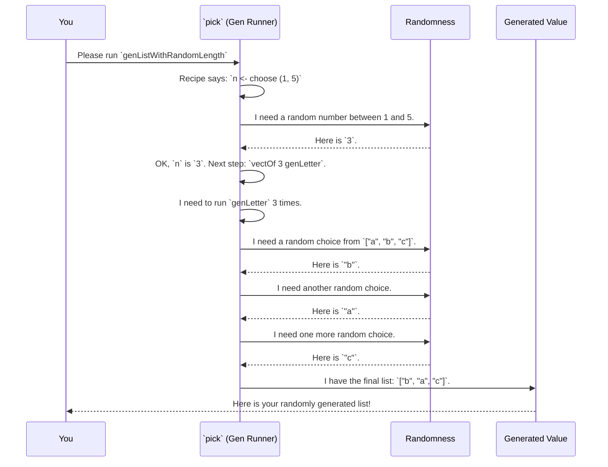

# Chapter 3: The `Gen` Monad

In [Chapter 2: Automatic Generator Derivation (`deriveGen`)](02_automatic_generator_derivation___derivegen__.md), we used the magic wand `deriveGen` to automatically create a test data generator. The signature for that generator looked something like this:

```idris
genSortedList : Fuel -> Gen MaybeEmpty SortedList
```

We focused on the `deriveGen` part, but now it's time to look at the other star of the show: `Gen`. What exactly *is* this `Gen` thing?

This chapter dives into the heart of `DepTyCheck`. `Gen` is the core data type that defines what a "generator" is. Think of it as a flexible recipe for creating random data.

### What is a `Gen`? A Recipe for Randomness

At its simplest, a `Gen a` is a recipe for producing random values of type `a`.

Let's start with the most basic recipes. `DepTyCheck` gives you a few ready-made ones:

*   **A recipe for a fixed value:** `pure`
    ```idris
    -- A recipe that *always* produces the number 42.
    genTheAnswer : Gen NonEmpty Nat
    genTheAnswer = pure 42
    ```
    This is like a recipe for a cake that says, "the cake is already baked and it's this one right here." Not random, but very useful as a building block.

*   **A recipe for choosing from a list:** `elements`
    ```idris
    -- A recipe to pick one string from the list, with equal probability.
    genFruit : Gen NonEmpty String
    genFruit = elements ["apple", "banana", "cherry"]
    ```
    This is a more typical random recipe. When you "run" it, you'll get one of the three fruits.

*   **A recipe for choosing from a range:** `choose`
    ```idris
    -- A recipe to pick a random number between 1 and 10 (inclusive).
    genSmallNumber : Gen NonEmpty Nat
    genSmallNumber = choose (1, 10)
    ```
    This is another common random recipe, useful for numbers.

### A Special Ingredient: Emptiness

You might have noticed that the `Gen` type has another piece: `Gen MaybeEmpty a` or `Gen NonEmpty a`. This is one of `DepTyCheck`'s superpowers, and it's essential for working with dependent types.

*   `Gen NonEmpty a`: A recipe that is **guaranteed** to produce a value. `elements ["a", "b"]` is non-empty.
*   `Gen MaybeEmpty a`: A recipe that **might fail** to produce a value.

Why would we ever want a recipe that fails? Consider a type like `Fin n`, which represents a number between `0` and `n-1`.

*   For `Fin 5`, we can generate `0, 1, 2, 3, 4`. This generator is `NonEmpty`.
*   For `Fin 0`, there are no possible values! The type is uninhabited.

Any recipe for producing a `Fin 0` *must* be able to fail. `DepTyCheck` represents this failure with a special generator called `empty`.

```idris
-- A generator for Fin n
genFin : (n : Nat) -> Gen MaybeEmpty (Fin n)
genFin Z     = empty -- If n is 0, no values exist. The recipe is empty.
genFin (S k) = ... -- Otherwise, generate a number from 0 to k.
```
This ability to represent "no possible value" is crucial for automatically generating data for complex dependent types, where some combinations of parameters lead to types that can't be created.

### Chaining Recipes: The Magic of Monads

Here’s where `Gen` gets really powerful. `Gen` is a **monad**, which is a fancy way of saying you can chain recipes together. The output of one recipe step can be used as an input to the next.

Let's go back to our central use case: **"first, generate a random number `n`, then generate a list of exactly `n` elements."**

You can't do this with a simple recipe. You need a two-step process. In Idris, the `do` block lets us write these steps in a clear, readable way.

```idris
-- A generator for strings, created by deriveGen or by hand.
genLetter : Gen NonEmpty String
genLetter = elements ["a", "b", "c"]

-- Our chained recipe!
genListWithRandomLength : Gen NonEmpty (List String)
genListWithRandomLength = do
  -- Step 1: Get a random length `n` between 1 and 5.
  n <- choose (1, 5)

  -- Step 2: Use `n` to create a list of `n` letters.
  vectOf n genLetter
```

Let's walk through this:
1.  `n <- choose (1, 5)`: "Run the `choose (1, 5)` recipe and call the result `n`."
2.  `vectOf n genLetter`: `vectOf` is a helper that runs a generator a specific number of times. "Run the `genLetter` recipe `n` times and collect the results in a list."
3.  The `do` block automatically packages this entire multi-step process into a single new `Gen`.

This ability to chain generation steps is the essence of the `Gen` monad. It allows you to build incredibly sophisticated generators from simple parts, describing dependencies between the different pieces of your data.

### Under the Hood: What's Really Happening?

When you write a `do` block, you aren't running the generator yet. You are just building a more complex recipe data structure. The actual generation happens later, when a function like `pick` or `unGen` is called.

Let's visualize the process of **running** `genListWithRandomLength`.



The `Gen` data type itself is defined as a plan of action. Let's look at a simplified version of its definition in `src/Test/DepTyCheck/Gen.idr`:

```idris
data Gen : Emptiness -> Type -> Type where
  -- A recipe for a single, known value.
  Pure : a -> Gen em a

  -- A recipe that needs a source of randomness.
  Raw : RawGen a -> Gen em a

  -- The key to chaining!
  Bind : RawGen c -> (c -> Gen biem a) -> Gen em a

  -- ... and other constructors like OneOf, Empty.
```

The most important constructor for our monadic example is `Bind`. When the compiler sees your `do` block, it translates it into nested `Bind` values.

Your code:
```idris
do
  n <- choose (1, 5)
  vectOf n genLetter
```

Is turned into something that looks like this (conceptually):
```idris
Bind (run_the_choose_generator) (\n => vectOf n genLetter)
```

The `Bind` constructor stores two things:
1.  A generator to run first (`run_the_choose_generator`).
2.  A function to call with the result of that first generator (`\n => ...`). This function produces the *next* generator in the chain.

The generator is just a data structure—a plan. The `pick` function is the executor that knows how to read this plan, get random numbers when needed, and follow the `Bind` steps to produce the final value.

### Conclusion

In this chapter, we've unpacked the `Gen` type, the fundamental building block of `DepTyCheck`.

*   We learned that a `Gen a` is a **recipe for producing random values** of type `a`.
*   We saw simple recipes like `pure` and `elements`, and the important concept of `MaybeEmpty` generators that can fail (like when generating a value for an uninhabited type).
*   Most importantly, we saw that `Gen` is a **monad**, which lets us chain recipes together. This allows us to create complex data where one part depends on another, like a list whose length is also randomly generated.

Now that we understand how generators are structured and composed, we can look at how `DepTyCheck` uses these building blocks to tackle more realistic, complex, and dependently-typed examples.

Next up: [Chapter 4: Primitive Imperative Language (PIL) Examples](04_primitive_imperative_language__pil__examples.md).

---

Generated by [AI Codebase Knowledge Builder](https://github.com/The-Pocket/Tutorial-Codebase-Knowledge)