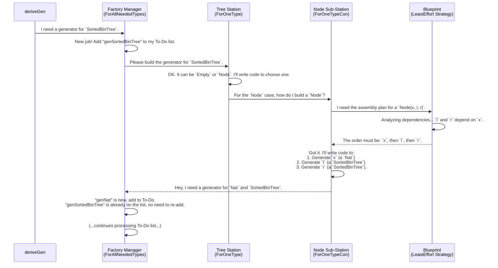

# Chapter 5: Derivation Core & Strategy

In [Chapter 4: Primitive Imperative Language (PIL) Examples](04_primitive_imperative_language__pil__examples.md), we witnessed something extraordinary: `deriveGen` automatically writing valid computer programs. We've treated `deriveGen` as a single, powerful magic wand. But how does it actually *think*? How does it break down a huge, complex task like "generate a valid program" into a series of smaller, manageable steps?

This chapter pulls back the curtain on the engine room of `DepTyCheck`. We'll explore the core components and the default strategy they use to build even the most complex generators.

### The Problem: How to Assemble a Puzzle

Imagine you have the blueprint for a `SortedBinTree`. The rule for a `Node x l r` is that everything in the left tree `l` must be smaller than the root `x`, and everything in the right tree `r` must be larger.

```idris
data SortedBinTree : Type where
  Empty : SortedBinTree
  Node  : (x : Nat) -> (l, r : SortedBinTree) -> 
          AllLT x l => AllGT x r => SortedBinTree
```

When building a `Node`, what should `deriveGen` do first?
-   Option A: Generate the left tree `l` first. But how does it know the upper bound for the values? It doesn't have `x` yet!
-   Option B: Generate the root value `x` first. Now it has a reference point! It can generate a left tree `l` with values less than `x`, and a right tree `r` with values greater than `x`.

Clearly, Option B is the only logical choice. The order of generation matters. `deriveGen` needs a strategy to figure out these dependencies automatically.

### The Assembly Line Analogy

Think of `deriveGen` as commissioning a factory to build a product (your generator). The factory has an assembly line with different stations, each with a specific job.

*   **`ForAllNeededTypes` (The Factory Manager):** The manager gets the main order (e.g., "Build a `SortedBinTree` generator"). It keeps a master list of all the parts and sub-assemblies required, like a `Nat` generator and a `SortedBinTree` generator. It ensures no work is duplicated.
*   **`ForOneType` (The Product Assembly Station):** A station dedicated to assembling one specific product, like `SortedBinTree`. It knows a `SortedBinTree` can be either `Empty` or a `Node`. It's responsible for deciding which version to build.
*   **`ForOneTypeCon` (The Component Sub-Station):** A sub-station that knows how to build just one component, like a `Node`. It needs to gather all the required parts (`x`, `l`, and `r`).
*   **`DeriveBodyRhsForCon`/`LeastEffort` (The Master Blueprint):** This is the instruction manual for the component sub-station. It defines the *strategy* for assembling the component. The default strategy, `LeastEffort`, tells the `Node` sub-station the correct order to gather its parts: "Get `x` first, then `l`, then `r`."

Let's see how these collaborators work together.

### The Core Components in Action

Here’s a step-by-step walkthrough of what happens "under the hood" when you ask `deriveGen` to build a generator for `SortedBinTree`.



This collaborative process breaks the complex task down into simple, repeatable steps. The "Factory Manager" (`ForAllNeededTypes`) is the overall orchestrator.

#### The Factory Manager (`ForAllNeededTypes`)

This component, found in `src/Deriving/DepTyCheck/Gen/ForAllNeededTypes/Impl.idr`, is the entry point for the whole derivation process. Its job is to manage a queue of generators that need to be built.

Its main logic can be simplified to this:
1.  Receive a request to get a generator for a `Type A`.
2.  Check its notebook: "Have I already built a generator for `Type A`?"
3.  If yes, return the existing one.
4.  If no, add "generate for `Type A`" to the to-do list, and start working on the list until it's empty.

This is implemented in `runCanonic`, which sets up the context for the whole derivation.

```idris
-- From: src/Deriving/DepTyCheck/Gen/ForAllNeededTypes/Impl.idr

-- `runCanonic` sets up the "notebook" (state, writer, etc.)
-- and then calls the main calculation.
export
runCanonic : ... -> (forall m. DerivationClosure m => m a) -> Elab (a, List Decl)
runCanonic exts calc = do
  -- ... setup state and context ...
  evalRWST ... calc
  -- ... return result and generated code ...
```

This prevents infinite loops in recursive data types and avoids re-deriving the same generator multiple times.

#### The Product Assembly Station (`ForOneType`)

This component, in `src/Deriving/DepTyCheck/Gen/ForOneType/Impl.idr`, is responsible for a single type. It gets the list of all available constructors (e.g., `Empty` and `Node`).

Its main job is to generate the top-level dispatch logic. For a recursive type, this usually means checking the `Fuel`.

```idris
-- A simplified view of code generated by `ForOneType` for SortedBinTree

genSortedBinTree : Fuel -> ...
genSortedBinTree fuel =
  case fuel of
    Dry      => -- Fuel is out! Must call a non-recursive constructor.
                genEmpty
    More f'  => -- Still have fuel. Can call any constructor.
                oneOf [genEmpty, genNode f']
```
It delegates the actual constructor-building logic to the `ForOneTypeCon` sub-stations.

#### The Blueprint: `LeastEffort` Strategy

This is the real brains of the operation. The `LeastEffort` strategy is an implementation of the `DeriveBodyRhsForCon` interface. Its goal is to find the most logical order to generate a constructor's arguments.

Its logic is implemented in `searchOrder` in `src/Deriving/DepTyCheck/Gen/ForOneTypeConRhs/Impl.idr`. You can think of its process like this:

1.  **Analyze Dependencies:** Look at all the arguments for a constructor (like `x`, `l`, `r` for `Node`). Figure out which arguments depend on others. For `Node`, `l` and `r` depend on `x`.
2.  **Assign Priorities:** Give a low "priority score" to arguments that many others depend on. Give a high score to arguments that depend on others.
3.  **Find the Starting Point:** Find the argument with the lowest priority score that has no un-generated dependencies. This is the one to generate first. For `Node`, this is `x`.
4.  **Recurse:** Mark `x` as "generated" and repeat the process. Now `l` and `r` have their dependencies met, so they can be generated.

```idris
-- From: src/Deriving/DepTyCheck/Gen/ForOneTypeConRhs/Impl.idr

-- This function implements the strategy to find the best generation order.
searchOrder : {con : _} ->
              (left : FinMap ... $ Determination con) -> -- Arguments left to generate
              List $ Fin con.args.length                  -- Returns an ordered list
searchOrder left = do
  -- 1. Find arguments with no dependencies from `left`.
  -- 2. Choose the best one based on priority.
  let Just (curr, _) = findFirstMax notDetermined
    | Nothing => []

  -- 3. Add it to our plan and remove it from the list of things to do.
  curr :: searchOrder (assert_smaller left next)
```
This simple but powerful "least effort" heuristic correctly solves the dependency puzzle for a vast range of data types, from `SortedList` to the complex `PIL` language from the last chapter.

### Why Is This a Pluggable Strategy?

You may have noticed we said `LeastEffort` *implements* the `DeriveBodyRhsForCon` interface.

```idris
-- From: src/Deriving/DepTyCheck/Gen/ForOneTypeConRhs/Interface.idr

public export
interface DeriveBodyRhsForCon where
  consGenExpr : ... -> m TTImp
```

This interface-based design is very clever. It means that `LeastEffort` is the *default* strategy, but it's not the only one possible. If you had a special case where you needed a different assembly plan, you could (in theory) provide a different implementation of this interface.

While `DepTyCheck` only comes with `LeastEffort` out of the box, this highlights a core design principle: the derivation process is not a rigid monolith, but a flexible, customizable system. We don't have to change the entire factory—just the blueprint at one station.

### Conclusion

In this chapter, we've demystified `deriveGen` by looking at its internal engine room. We've learned that it's not one giant piece of magic, but a collection of collaborating components:

*   **`ForAllNeededTypes`:** The factory manager that tracks all the generator jobs.
*   **`ForOneType`:** The assembly station that handles the constructors for a single type.
*   **`ForOneTypeCon`:** The sub-station that handles the arguments for a single constructor.
*   **`LeastEffort`:** The default strategy blueprint that intelligently orders generation steps based on dependencies.

Understanding this structure is key to understanding `DepTyCheck`'s power. It shows how a complex problem is solved by breaking it down and applying a smart default strategy.

But what if the default strategy isn't *quite* what you want? What if you want to influence how the generator is built, perhaps by telling it to pick numbers from a certain range or to prefer making smaller trees? That's where "tuning" comes in.

Next up: [Chapter 6: Derivation Tuning](06_derivation_tuning.md)

---

Generated by [AI Codebase Knowledge Builder](https://github.com/The-Pocket/Tutorial-Codebase-Knowledge)