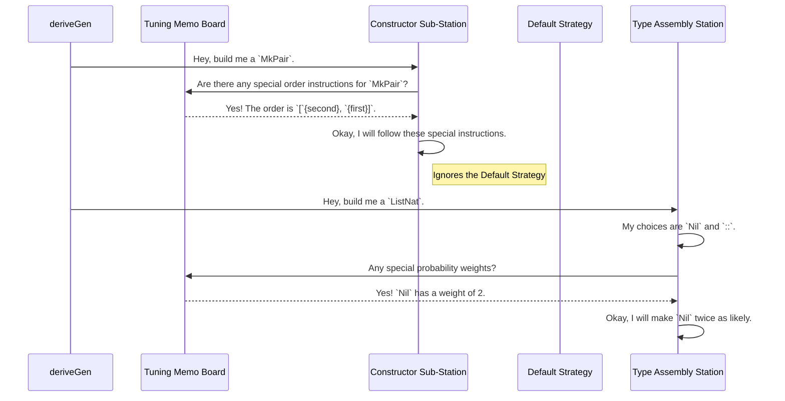

# Chapter 6: Derivation Tuning

In [Chapter 5: Derivation Core & Strategy](05_derivation_core___strategy.md), we explored the clever automatic strategy `deriveGen` uses to build generators. Its default `LeastEffort` strategy is like a smart factory manager who can figure out how to assemble complex products without any instructions.

But what if you, the developer, know something the factory manager doesn't? What if you want to give specific instructions, like "always add the frosting before the sprinkles," or "make twice as many chocolate cakes as vanilla ones"?

This chapter introduces **Derivation Tuning**, which gives you the knobs and dials to fine-tune `deriveGen`'s automatic process. You can guide the generation order and adjust the probability of different outcomes, giving you more control over your test data.

### The Problem: When Smart Defaults Aren't Enough

The default strategy `deriveGen` uses is excellent, but it can't read your mind. There are two main scenarios where you might want to intervene:

1.  **Guiding the Generation Order:** Sometimes, the automatic ordering isn't the most efficient, or you might want to force a specific order for testing purposes. For example, when building a `Node x l r` for a `SortedBinTree`, `deriveGen` correctly figures out to generate `x` first. But for other data types, the best order might be ambiguous, and you might have a preference.

2.  **Adjusting Generation Probabilities:** When a data type has multiple constructors (like a `List` which can be `Nil` or `::`), `deriveGen` tries to be fair and give each a reasonable chance. This often leads to generating deeply nested or large data structures. What if you want to test more small cases? You'd want to tell the generator, "pick the `Nil` (empty) case more often!"

`DepTyCheck` provides two special interfaces, `GenOrderTuning` and `ProbabilityTuning`, to solve exactly these problems.

### Tuning Knob #1: `GenOrderTuning` (The Order of Ingredients)

`GenOrderTuning` lets you override the default `LeastEffort` strategy and specify the exact order in which a constructor's arguments should be generated.

Let's look at a simple data type.

```idris
data Pair : Type where
  MkPair : (first : Nat) -> (second : Nat) -> Pair
```

`deriveGen` might decide to generate `first` and then `second`. But what if you want to force it to generate `second` first? You can do this with `GenOrderTuning`.

#### How to Use It

You provide an implementation of the `GenOrderTuning` interface for the specific constructor you want to tune.

```idris
GenOrderTuning "MkPair".dataCon where
  isConstructor = itIsConstructor
  deriveFirst _ _ = [`{second}, `{first}]
```

Let's break this down:
*   `GenOrderTuning "MkPair".dataCon`: We're telling `DepTyCheck` we want to provide special instructions for the `MkPair` constructor.
*   `isConstructor = itIsConstructor`: This is a magic macro. It's a safety check that ensures `MkPair` is a real constructor. If you misspell it, you'll get a compile-time error.
*   `deriveFirst _ _ = [`{second}, `{first}]`: This is the core instruction. We're providing a list of the argument names, in the order we want them to be generated. The `` `{...} `` syntax creates a "name literal." You can also use argument indices, like `[1, 0]`.

With this implementation in place, when `deriveGen` builds a generator for `Pair`, it will see your instructions and generate `second` before `first`.

### Tuning Knob #2: `ProbabilityTuning` (The Recipe's Ratios)

`ProbabilityTuning` lets you adjust the probability distribution, making some constructors more or less likely to be chosen during generation.

Consider our good old `ListNat`.

```idris
data ListNat : Type where
  Nil  : ListNat
  (::) : Nat -> ListNat -> ListNat
```

By default, when fuel is available, `deriveGen` might give `Nil` and `::` a roughly 50/50 chance. This means you'll often get longer lists. If you want to generate more empty or short lists, you can increase the "weight" of the `Nil` constructor.

#### How to Use It

Just like with order tuning, you provide an implementation for the constructor you want to influence.

```idris
ProbabilityTuning `{Nil}.dataCon where
  isConstructor = itIsConstructor
  tuneWeight = const 2
```

Let's break it down:
*   `ProbabilityTuning `{Nil}.dataCon`: We're creating a tuning rule for the `Nil` constructor.
*   `isConstructor = itIsConstructor`: Our same safety-check macro.
*   `tuneWeight = const 2`: This is the instruction. It tells `deriveGen` to give `Nil` a "weight" of 2. The default weight for all other constructors is 1.

This means that `Nil` is now **twice as likely** to be picked as any other constructor at the same level. This simple change will cause the generator to produce significantly more short lists, which can be very useful for testing edge cases.

### Under the Hood: The "Special Instructions" Memo

How does `deriveGen` incorporate your tuning instructions? Think of it like a factory process with a "special instructions" memo board.

Before a component station starts its work, it checks the memo board.
*   The `ForOneTypeCon` sub-station (which builds a single constructor) checks for any `GenOrderTuning` memos for its constructor. If it finds one, it follows that order instead of asking the `LeastEffort` strategy.
*   The `ForOneType` station (which chooses between constructors) checks for any `ProbabilityTuning` memos. If it finds any, it uses the weights to make a biased choice instead of a fair one.

This process can be visualized like this:



This is made possible because of Idris's interface system. The derivation core is programmed to look for implementations of `GenOrderTuning` and `ProbabilityTuning` and prioritize them over its default logic.

The interfaces themselves are defined in `src/Deriving/DepTyCheck/Gen/Tuning.idr`.

Here's the simplified blueprint for `GenOrderTuning`:

```idris
-- From: src/Deriving/DepTyCheck/Gen/Tuning.idr

public export
interface GenOrderTuning (0 n : Name) where
  isConstructor : ...
  deriveFirst : ... -> List $ ConArg ...
```

And for `ProbabilityTuning`:

```idris
-- From: src/Deriving/DepTyCheck/Gen/Tuning.idr

public export
interface ProbabilityTuning (0 n : Name) where
  isConstructor : ...
  tuneWeight : Nat1 -> Nat1
```

When you write `GenOrderTuning "MkPair".dataCon where ...`, you are creating a concrete implementation of this interface that the derivation process can find and use.

### Conclusion

In this chapter, we've learned how to move from being a user of `deriveGen`'s magic to being its director. Derivation Tuning provides two powerful knobs:

*   **`GenOrderTuning`:** To explicitly control the **order** in which a constructor's arguments are generated.
*   **`ProbabilityTuning`:** To adjust the **likelihood** of different constructors being chosen, helping you shape the distribution of your test data.

By using these simple interfaces, you can give `deriveGen` targeted instructions, refining its output to better suit your testing needs without having to write the entire generator from scratch. You get the best of both worlds: powerful automation and fine-grained control.

Now that we can generate and tune our test data, how do we know if our generators are actually *good*? Are they covering the interesting cases we want to test? The next chapter explores how to measure and ensure the quality of your generated data.

Next up: [Chapter 7: Model-Based Coverage](07_model_based_coverage.md).

---

Generated by [AI Codebase Knowledge Builder](https://github.com/The-Pocket/Tutorial-Codebase-Knowledge)