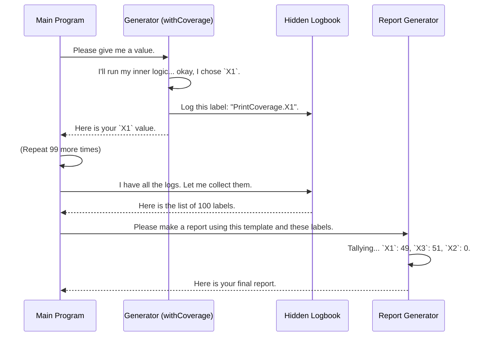

# Chapter 7: Model-Based Coverage

In [Chapter 6: Derivation Tuning](06_derivation_tuning.md), we learned how to become the director of our test data generation, fine-tuning the process to get the exact kinds of data we need. We've built our generators, and they're producing values.

But this leads to a new, crucial question: how good is our test data? Just because we're generating *valid* data doesn't mean we're generating *diverse* data. Are we thoroughly exploring all the nooks and crannies of our data structures, or are we stuck in one corner?

This chapter introduces `DepTyCheck`'s solution to this problem: **Model-Based Coverage**, a powerful quality assurance report for your test data.

### The Problem: Are We Only Making Red Sedans?

Imagine you're in charge of quality control for a massive car factory. You've set up automated machines to produce thousands of cars for testing. Your factory can produce sedans, trucks, and SUVs, in red, green, or blue.

At the end of the week, you look at your test fleet and see thousands of cars... but they are all red sedans. Your machines worked perfectly, but they completely ignored trucks and SUVs, and all other colors. Your testing isn't very useful because you have a massive blind spot!

The same problem exists with test data generation. You might have a data type like this:

```idris
data Vehicle = Sedan | Truck | SUV
```

And a generator that, through some quirk of its logic, almost always produces `Sedan`. If you use this data to test a function `calculate_toll(vehicle)`, you'll never know how it behaves for a `Truck` or an `SUV`.

Model-Based Coverage is the report that tells you exactly what your "factory" produced. It inspects a batch of generated data and tells you which parts of your data model (which types and which constructors) were actually created.

### Instrumenting Your Generator with `withCoverage`

To get a coverage report, you first need to "instrument" your generator. This is like adding a little counter to each machine on your factory's assembly line. In `DepTyCheck`, the main tool for this is the `withCoverage` wrapper.

Let's work with an example. We have a simple type `X` with three constructors.

```idris
data X = X1 | X2 Nat | X3 String
```

Now, let's write a generator for `X`. **Crucially, we'll deliberately forget to include `X2`** to simulate a real-world blind spot.

```idris
genX : Fuel -> Gen NonEmpty X
genX fl = oneOf
  [ pure X1
  , X3 <$> elements ["a", "b"]
  ]
```
This generator will only ever produce `X1` or `X3`. It will never produce `X2`. Without a coverage report, we might never notice this.

To enable tracking, we simply wrap our generator logic with `withCoverage`.

```idris
genX_covered : Fuel -> Gen NonEmpty X
genX_covered fl = withCoverage $ oneOf
  [ pure X1
  , X3 <$> elements ["a", "b"]
  ]
```
`withCoverage` doesn't change what the generator produces, but it adds invisible "labels" to each value, noting which constructor was used to create it. It's a `Gen` that produces the same values, but now it also carries around a log of how they were made.

### Running the Report

Now that our generator is instrumented, we can generate some data and create the report. This is a three-step process:

1.  **`initCoverageInfo`**: Create an empty "report template" for our generator. `DepTyCheck` inspects the generator's type (`... -> Gen ... X`) and automatically lists all the types and constructors it *could* possibly produce.
2.  **`unGenTryND`**: Run the generator many times (e.g., 100) to get a sample of data. This also collects all the "labels" that `withCoverage` attached.
3.  **`registerCoverage`**: Take the collected labels and fill in the empty report template with the counts.

Here’s what that looks like in a `main` function:

```idris
main : IO ()
main = do
  -- 1. Create the empty report template for our generator.
  let ci = initCoverageInfo genX_covered

  -- 2. Generate 100 values and collect their coverage labels.
  let vs = unGenTryND 100 someStdGen $ genX_covered (limit 10)
  let mc = concatMap fst vs -- fst gets the coverage part

  -- 3. Fill in the template with the counts.
  let finalReport = registerCoverage mc ci

  -- 4. Print the final report!
  putStrLn $ show finalReport
```

When you run this program, you'll get a beautifully formatted report like this:

```
PrintCoverage.X covered partially (100 times)
  - X1: covered (49 times)
  - X2: not covered
  - X3: covered (51 times)
```

The report immediately tells us what we need to know:
*   We generated 100 total values of type `X`.
*   We successfully created `X1` and `X3`.
*   We have a glaring blind spot: `X2` was **not covered** at all!

Now we know our generator is incomplete, and we can go back and fix it to ensure our tests are more thorough.

### Coverage for `deriveGen`

What if you're using the magic of `deriveGen` from [Chapter 2: Automatic Generator Derivation (`deriveGen`)](02_automatic_generator_derivation___derivegen__.md)? Good news! `deriveGen` is smart enough to automatically instrument the generator for you. There's no need to manually add `withCoverage`.

If you have a derived generator:

```idris
data Y = Y1 | Y2 X | Y3 X X

genY : Fuel -> Gen MaybeEmpty Y
genY = deriveGen
```

You can use the exact same reporting logic. `DepTyCheck` will create a report not just for `Y`'s constructors, but for all the "involved types," including `X` and even primitive types like `String` that are used inside.

Running the report for `genY` might give you output like this:

```
PrintCoverage.Y covered fully (100 times)
  - Y1: covered (35 times)
  - Y2: covered (30 times)
  - Y3: covered (35 times)

PrintCoverage.X covered fully (135 times)
  - X1: covered (40 times)
  - X2: covered (50 times)
  - X3: covered (45 times)

Prelude.String.String mentioned (45 times)
  - no constructors
```
This comprehensive report shows that our derived `genY` generator is doing a great job of exploring all the constructors for both `Y` and its dependency `X`.

### Under the Hood: The Label Maker

How does this process work internally? It's a clever combination of macros and a `Writer` monad.



Let's look at the key pieces from `src/Test/DepTyCheck/Gen/Coverage.idr`.

**1. `ModelCoverage` (The Logbook)**

The logbook itself is a very simple data structure. It's essentially just a map from a label (a name) to a count.

```idris
-- From: src/Test/DepTyCheck/Gen/Coverage.idr
record ModelCoverage where
  constructor MkModelCoverage
  unModelCoverage : SortedMap Label Nat
```

**2. `withCoverage` (The Macro Label Maker)**

`withCoverage` is a powerful macro that rewrites your generator code at compile-time. When it sees `withCoverage $ pure X1`, it essentially transforms it into something like this:

```idris
-- Conceptual transformation
do
  let val = X1
  tell (label_for_X1) -- Makes a note in the hidden logbook
  pure val           -- Returns the original value
```
It cleverly injects the `tell` action (from the `Writer` monad) to record which constructor was used, without you having to manage the logbook yourself.

**3. `initCoverageInfo` (The Macro Template Maker)**

`initCoverageInfo` is another macro. It uses compiler reflection to analyze your generator's type signature.

```idris
-- From: src/Test/DepTyCheck/Gen/Coverage.idr
export %macro
initCoverageInfo : (0 x : g) -> Elab $ CoverageGenInfo x
initCoverageInfo _ = genTypeName g >>= coverageGenInfo
```
It finds the return type (e.g., `Y`), then finds all the types involved in `Y`'s definition (like `X`), and builds the initial `CoverageGenInfo` record with all constructor counts set to `0`. This creates the perfect empty template to be filled in later.

### Conclusion

In this chapter, we've added a crucial tool to our testing toolbox: **Model-Based Coverage**. We've learned that it acts as a quality assurance report for our test data, helping us find blind spots in our generators.

The key takeaways are:
*   Model-Based Coverage tells you **which constructors of your data types were actually generated**.
*   You can instrument manual generators using the `withCoverage` wrapper.
*   Generators created with `deriveGen` are **automatically instrumented**.
*   The reporting process involves three steps: `initCoverageInfo` to create a template, `unGenTryND` to generate data and collect logs, and `registerCoverage` to fill in the report.

This coverage report gives us confidence that our property-based tests are exploring a diverse and representative set of inputs. But what if we want to get even more specific? What if we want to know not just *if* a constructor was used, but *how* it was used? The next chapters will dive into even more detailed forms of analysis.

Next up: [Chapter 8: Generator Signature Analysis](08_generator_signature_analysis.md).

---

Generated by [AI Codebase Knowledge Builder](https://github.com/The-Pocket/Tutorial-Codebase-Knowledge)