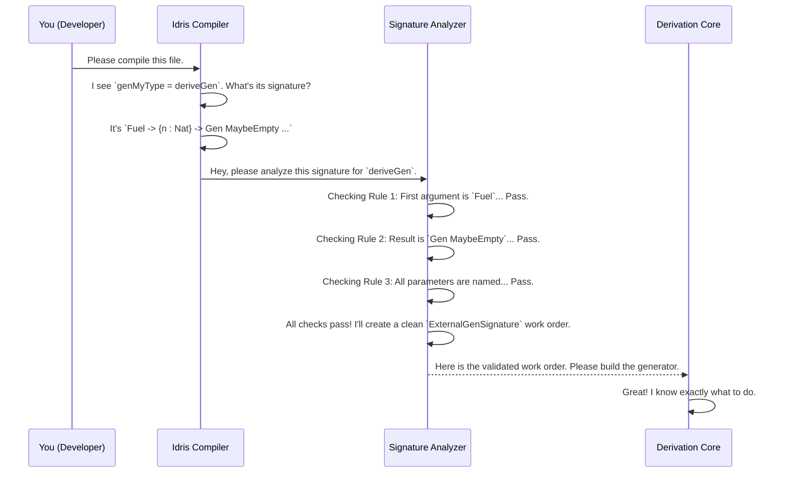

# Chapter 8: Generator Signature Analysis

In [Chapter 7: Model-Based Coverage](07_model_based_coverage.md), we learned how to inspect the *output* of our generators to ensure they are producing a diverse range of test data. We've become quality assurance experts for our finished products.

But what about the very beginning of the process? When we ask `deriveGen` to build a generator for us, we give it an order in the form of a type signature. What if that order is confusing, incomplete, or breaks the rules?

This chapter introduces the "administrative assistant" of `DepTyCheck`: **Generator Signature Analysis**. It's the component that checks your request *before* the complex work of derivation begins, ensuring everything is clear and valid from the start.

### The Problem: A Confusing Work Order

Imagine you send a work order to a factory. If the order says, "Build a vehicle, but don't specify the engine, and also the wheels should be made of cheese," the factory will grind to a halt. The workers will be confused, and you'll either get an error message you don't understand or a very strange, useless vehicle.

The same is true for `deriveGen`. It has a few fundamental rules about the "work orders" (generator signatures) it can accept.

Consider the signature for a `SortedList` generator:
```idris
genSortedList : Fuel -> Gen MaybeEmpty SortedList
genSortedList = deriveGen
```

This is a perfect work order. But what if you wrote one of these instead?

1.  **Missing `Fuel`:**
    ```idris
    genSortedList : Gen MaybeEmpty SortedList
    genSortedList = deriveGen
    ```
    *Problem:* How does the generator know when to stop making the list longer? It needs a `Fuel` budget!

2.  **Unnamed Parameter:**
    ```idris
    data Pair a = MkPair a a
    genPair : Fuel -> {a : Type} -> Gen MaybeEmpty (Pair a)
    genPair = deriveGen
    ```
    *Problem:* How can `deriveGen` know what type `a` is? The caller needs to provide it, but the argument `{_ : Type}` is unnamed. `deriveGen` requires all parameters to be named so it knows where they are used.

3.  **Wrong `Gen` Type:**
    ```idris
    genSortedList : Fuel -> Gen NonEmpty SortedList
    genSortedList = deriveGen
    ```
    *Problem:* The derivation engine is designed to handle cases where generation might fail (e.g., fuel runs out). It always produces a `Gen MaybeEmpty`. Requesting a `Gen NonEmpty` breaks this contract.

If `deriveGen` tried to work with these confusing orders, it would lead to chaos. We need a gatekeeper to check the request first.

### The Administrative Assistant: Signature Analysis

Generator Signature Analysis is the first thing that runs when the compiler sees `deriveGen`. It's a vigilant pre-flight check on your generator's type signature. Its job is to:

1.  **Enforce the Rules:** It checks for all the common-sense rules, like "The first argument must be `Fuel`," and "The return type must be `Gen MaybeEmpty ...`".
2.  **Provide Friendly Errors:** If a rule is broken, it stops the process immediately and gives you a clear error message pointing directly to the problem. It's the difference between "Error in line 521 of internal library code" and "The first argument must be of type `Fuel`".
3.  **Standardize the Request:** If all the rules pass, it translates your signature into a clean, standardized format called an `ExternalGenSignature`.

This `ExternalGenSignature` is like a validated, stamped work order. It contains all the necessary information in a structured way, such as:
*   The exact type you want to generate (`SortedList`).
*   Which parameters you, the caller, will provide (the "given" parameters).
*   Which parameters `deriveGen` needs to generate on its own.

This standardized work order is then passed to the core derivation engine we saw in [Chapter 5: Derivation Core & Strategy](05_derivation_core___strategy.md), ensuring the rest of the factory has a clear and unambiguous plan to work from.

### Under the Hood: The Pre-Flight Checklist

Let's visualize what happens when you compile code containing `deriveGen`.



If any check had failed, the `Signature Analyzer` would have immediately sent an error message back to you via the compiler, and the `Derivation Core` would never even have been called.

#### A Glimpse at the Code

This analysis logic lives in the `checkTypeIsGen` function inside `src/Deriving/DepTyCheck/Gen.idr`. When `deriveGen` is called, it passes the signature you wrote to this function.

Let's look at a few (aggressively simplified) snippets from `checkTypeIsGen` to see how it works.

**Check 1: Does the signature have any arguments at all?**
The first argument must be `Fuel`, so there has to be at least one.

```idris
-- From: src/Deriving/DepTyCheck/Gen.idr

-- `unPi` splits a function type into its arguments and return type.
let (sigArgs, sigResult) = unPi sig

let (firstArg::moreArgs) = sigArgs
  | [] => fail "No arguments in the generator function signature, at least a fuel argument must be present"
```
This code checks if the list of arguments `sigArgs` is empty. If it is, it fails with a helpful error message.

**Check 2: Is the first argument actually `Fuel`?**

```idris
-- From: src/Deriving/DepTyCheck/Gen.idr

-- Check that this argument is of type `Fuel`.
unless !(firstArgTypeName `isSameTypeAs` `{Data.Fuel.Fuel}) $
  failAt firstArgFC "The first argument must be of type `Fuel`"
```
Here, it inspects the type of the `firstArg` and compares it to the type of `Fuel`. If they don't match, it fails.

**The Golden Ticket: `ExternalGenSignature`**

If all the checks pass, the analyzer packs everything it has learned into an `ExternalGenSignature` record. This record is defined in `src/Deriving/DepTyCheck/Gen/Signature.idr`.

```idris
-- From: src/Deriving/DepTyCheck/Gen/Signature.idr (simplified)

public export
record ExternalGenSignature where
  constructor MkExternalGenSignature
  -- The type we want to generate (e.g., `SortedList`).
  targetType : TypeInfo
  
  -- The arguments the user will provide.
  givenParams : SortedMap (Fin targetType.args.length) (ArgExplicitness, Name)
  
  -- ...and other info about argument ordering.
```
This record is the clean, unambiguous "work order" that the rest of `DepTyCheck` uses. It separates the problem into "what we need to build" (`targetType`) and "what tools we have" (`givenParams`).

### Conclusion

In this chapter, we've met the diligent administrative assistant of `DepTyCheck`: **Generator Signature Analysis**. We learned that it's an essential first step in the `deriveGen` process that:

*   **Validates** your generator's type signature against a set of crucial rules.
*   Provides **clear, early error messages** if the signature is invalid.
*   Standardizes the request into a clean `ExternalGenSignature` record for the rest of the derivation engine.

This gatekeeper component makes `DepTyCheck` more robust and user-friendly. It catches common mistakes upfront and ensures that the complex machinery of the derivation core is always working with a clear and correct plan.

Now that we have a validated work order for the *generator*, the next step for the engine is to look even deeper. It needs to analyze the blueprints of the *data type itself*, specifically its constructors. How does `DepTyCheck` understand the rules embedded inside a constructor like `(::) : (x : Nat) -> (xs : SortedList) -> LTEHead x xs => SortedList`? That's our next topic.

Next up: [Chapter 9: Deep Constructor Application Analysis](09_deep_constructor_application_analysis.md).

---

Generated by [AI Codebase Knowledge Builder](https://github.com/The-Pocket/Tutorial-Codebase-Knowledge)