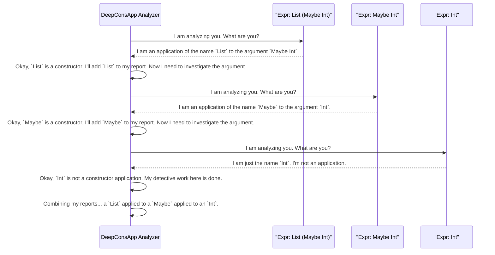

# Chapter 9: Deep Constructor Application Analysis

In [Chapter 8: Generator Signature Analysis](08_generator_signature_analysis.md), we met `DepTyCheck`'s "administrative assistant," which checks our `deriveGen` work order *before* the factory starts building. It ensures the generator's signature is valid and easy to understand.

Now that the work order is approved, the factory needs to read the detailed blueprints for the product itself. When it encounters a complex part with nested rules, how does it figure out what's inside and how it's put together?

This chapter introduces a specialized internal utility: **Deep Constructor Application Analysis**. Think of it as `DepTyCheck`'s resident chemist, who can take any complex type and tell you exactly what it's made of.

### The Problem: Seeing Inside a Molecule

Imagine `DepTyCheck`'s [derivation engine](05_derivation_core___strategy.md) is trying to build a `SortedList`. It looks at the blueprint for adding an element:

```idris
(::) : (x : Nat) -> (xs : SortedList) -> LTEHead x xs => SortedList
```

The third argument, `LTEHead x xs`, is a proof. `DepTyCheck` can't treat this as a black box. To build a valid `SortedList`, it needs to understand that:
1.  `LTEHead` is a type constructor.
2.  It is being applied to two other arguments from the same constructor: `x` and `xs`.

This dependency is crucial! It tells the derivation engine that to generate the proof `LTEHead x xs`, it must first have values for `x` and `xs`.

Similarly, if you have a type like `List (Maybe Int)`, a human can see it's a list containing optional integers. But how does a machine see that? It needs a tool to break this "molecule" down into its constituent "atoms": `List`, `Maybe`, and `Int`.

### The Chemist's Toolkit: `analyseDeepConsApp`

Deep Constructor Application Analysis, implemented by a function called `analyseDeepConsApp`, is the tool for this job. It's a specialized utility that takes a type expression and recursively breaks it down.

Its job is to answer two key questions:
1.  Is this expression a chain of data constructors being applied to each other? (e.g., `List` applied to `Maybe` applied to `Int`)
2.  If so, what are all the constructors and free variables involved in this chain?

Let's see what the chemist's report looks like for a few examples. We can use a helper function from the `DepTyCheck` examples, `printDeepConsApp`, to visualize the analysis.

#### Example 1: `List (Maybe Int)`

If we ask our analyzer to look at the type `List (Maybe Int)`, it produces a report like this:

**Input Expression:**
```idris
List (Maybe Int)
```
**Analyzer's Report (simplified):**
```
- This is a deep constructor application.
- Applied names found: `List`, `Maybe`.
- It breaks down as: `List` is applied to (`Maybe` applied to `Int`).
```
The analyzer successfully identified the nested structure of the type.

#### Example 2: `LTEHead x xs`

This is the more important case for `DepTyCheck`'s derivation engine. We ask the analyzer to inspect the type `LTEHead x xs`, telling it that `x` and `xs` are "free names" (variables from the surrounding context).

**Input Expression:**
```idris
LTEHead x xs
```
**Analyzer's Report (simplified):**
```
- This is a deep constructor application.
- Applied names found: `LTEHead`, `x`, `xs`.
- It breaks down as: `LTEHead` is applied to the free names `x` and `xs`.
```
This is the golden ticket! The report explicitly states that the `LTEHead` type depends on `x` and `xs`. The derivation engine can now use this information to conclude that `x` and `xs` must be generated *before* the proof `LTEHead x xs` can be constructed.

### Under the Hood: The Recursive Detective

How does `analyseDeepConsApp` perform this chemical analysis? It works like a recursive detective. Let's trace its thought process for the type `List (Maybe Int)`.



This top-down, recursive process allows the analyzer to unravel even deeply nested and complex type expressions, mapping out their entire structure.

#### A Glimpse at the Code

The core of this logic is in `src/Deriving/DepTyCheck/Util/DeepConsApp.idr`. The main function is `analyseDeepConsApp`. Let's look at a highly simplified version of its main logic.

```idris
-- From: src/Deriving/DepTyCheck/Util/DeepConsApp.idr (heavily simplified)
analyseDeepConsApp : TTImp -> m (DeepConsAnalysisRes)
analyseDeepConsApp e = do
  -- 1. Split the expression into a function and its arguments.
  let (function, args) = unAppAny e
    | _ => throwError "not an application"

  -- 2. Check if the function is a data constructor.
  let Just con = lookupCon function
    | Nothing => throwError "not a constructor"

  -- 3. Recursively analyze all the arguments.
  deepArgs <- for args $ \arg =>
    analyseDeepConsApp (getExpr arg)
  
  -- 4. Combine the results from this level and the recursive calls.
  pure $ combineResults (con, deepArgs)
```
This snippet shows the essence of the recursive detective:
1.  `unAppAny e` is the tool used to see if an expression `e` is a function applied to arguments.
2.  `lookupCon` checks if the function is a known data constructor.
3.  The `for` loop is where the recursion happens: the analyzer calls itself on each argument to investigate deeper.
4.  Finally, it pieces together what it found at the current level with the reports from its recursive calls.

### Why Is This So Important?

Deep Constructor Application Analysis is a cornerstone of the `deriveGen` process. While [Generator Signature Analysis](08_generator_signature_analysis.md) checks the *generator's* type, this analysis inspects the *data's* type.

It is the primary tool used by the `LeastEffort` strategy we saw in [Chapter 5: Derivation Core & Strategy](05_derivation_core___strategy.md). That strategy needs to figure out the dependencies between a constructor's arguments to find the correct generation order. `analyseDeepConsApp` is what provides that dependency information. Without it, `deriveGen` wouldn't know to generate `x` before `LTEHead x xs`, and the automatic derivation of generators for complex dependent types would be impossible.

### Conclusion

In this chapter, we've peered into `DepTyCheck`'s internal laboratory and met its "chemist," the Deep Constructor Application Analysis utility.

We've learned that:
-   This tool recursively breaks down complex type expressions to understand their internal structure.
-   It acts like a detective, identifying all the constructors and free variables involved in a type application.
-   This analysis is the critical source of dependency information that allows `DepTyCheck`'s core derivation engine to figure out the correct order to generate data.

You'll never call `analyseDeepConsApp` directly, but it's working hard behind the scenes every time you use `deriveGen`. It is one of the key "smarts" that makes automatic generation for dependent types possible.

We've now toured the major conceptual components of `DepTyCheck`, from user-facing tools like `deriveGen` to the deep internal machinery. In our final chapter, we'll zoom back out and look at how to set up, build, and test a project that uses `DepTyCheck`.

Next up: [Chapter 10: Build & Test Configuration](10_build___test_configuration.md).

---

Generated by [AI Codebase Knowledge Builder](https://github.com/The-Pocket/Tutorial-Codebase-Knowledge)