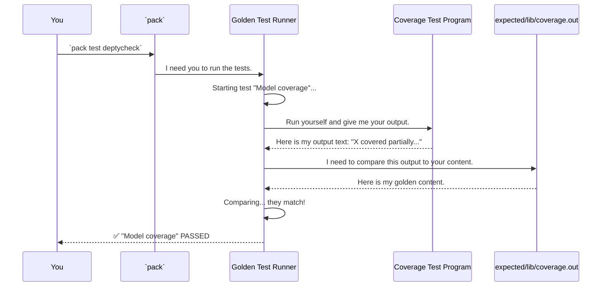

# Chapter 10: Build & Test Configuration

In our journey through `DepTyCheck`, we've explored its powerful tools, from the magic of `deriveGen` to the intricate internal machinery like [Chapter 9: Deep Constructor Application Analysis](09_deep_constructor_application_analysis.md). We've seen *what* the library does. In this final chapter, we'll zoom out and look at *how* the `DepTyCheck` project itself is built, tested, and organized.

Think of this as a tour of the project's central command center. This collection of configuration files defines everything from project dependencies to how the extensive test suite ensures that `DepTyCheck` remains stable and reliable.

### The Problem: Managing a Complex Project

`DepTyCheck` isn't just one library; it's a library, a test suite, and a whole gallery of example projects. How do you manage all of these interconnected pieces?
-   How do you tell the compiler which files belong to the library and which belong to an example?
-   How do you manage dependencies, ensuring that every part of the project has what it needs?
-   Most importantly, for a complex code-generation library, how do you make sure a small change doesn't accidentally break something and alter the generated code in subtle ways?

The answer lies in a combination of Idris's standard project format and a clever testing strategy.

### The Project Command Center

The `DepTyCheck` project's configuration is handled by a few key files. Let's look at the three most important ones.

#### 1. The Package Blueprint: `deptycheck.ipkg`

An `.ipkg` file is the standard way to describe a single project or library in Idris. It's like a table of contents for the compiler.

```idris
-- A simplified deptycheck.ipkg
package deptycheck

sourcedir = "src"
modules = Deriving.DepTyCheck.Gen
        -- ... many more modules ...
        , Test.DepTyCheck.Gen.Coverage

depends = ansi
        , elab-util-extra
        , random-pure
```
*   `package deptycheck`: The name of our package.
*   `sourcedir = "src"`: Tells the compiler to look for source code in the `src/` directory.
*   `modules = ...`: A list of all the files (modules) that make up the `DepTyCheck` library.
*   `depends = ...`: A list of other libraries that `DepTyCheck` needs to work.

Every sub-project, like the examples and the test suite, has its own `.ipkg` file.

#### 2. The Monorepo Manager: `pack.toml`

Since `DepTyCheck` contains many sub-projects, we use the `pack` package manager to handle them all. The `pack.toml` file is the master blueprint for `pack`, telling it where to find every single package in the entire repository.

```toml
# A simplified pack.toml

-- Defines the main deptycheck library
[custom.all.deptycheck]
type = "local"
path = "."
ipkg = "deptycheck.ipkg"

-- Defines one of the example projects
[custom.all.sorted-list-so-comp]
type = "local"
path = "examples/sorted-list-so-comp"
ipkg = "sorted-list-so-comp.ipkg"
```
This file defines each project as a "local" package, giving it a name (`deptycheck`, `sorted-list-so-comp`), a path to its folder, and the name of its `.ipkg` blueprint. This is how you can build any example, like we saw in [Chapter 1: Example Data Structures](01_example_data_structures.md), by simply running `pack build sorted-list-so-comp` from anywhere in the project.

#### 3. The Quality Assurance Protocol: Golden Testing

The most interesting part of `DepTyCheck`'s configuration is its test suite. The library's main job is generating code or textual reports. How do you test this effectively?

`DepTyCheck` uses a technique called **golden testing**. The idea is simple but powerful:
1.  Run a test program that produces some output (e.g., generated code, a coverage report).
2.  Save this "correct" output to a file. This is the "golden" or "expected" result.
3.  From now on, whenever you run the tests, the test runner will automatically compare the new output against the golden file.

If the output is identical, the test passes. If there's even a one-character difference, the test fails, and the runner shows you a diff. This is incredibly effective at catching regressions. If a change to `DepTyCheck`'s internal logic accidentally changes the generated code, the tests will immediately catch it.

### The Test Suite in Action

Let's see how this works. The main entry point for the test suite is `tests/tests.ipkg`, which defines an executable called `runtests`. This executable is managed by `tests/Tests.idr`.

```idris
-- From: tests/Tests.idr (simplified)
module Tests

import Test.Golden.RunnerHelper

main : IO ()
main = goldenRunner $
  [ "Model coverage" `atDir` "lib/coverage"
  , "The library documentation" `atDir` "docs"
  , "Derivation: least effort (adt)" `atDir` "derivation/least-effort/adt"
  ]
```
This file declares a list of tests. Each entry gives a test a name (like `"Model coverage"`) and points to a directory (`"lib/coverage"`) where that test's own project lives.

When you run `pack test deptycheck`, the following happens:



If the output from `CoverageTest` had been different from what was in `GoldenFile`, the runner would have reported a failure and shown you the exact lines that changed. This ensures that the complex outputs of [Chapter 7: Model-Based Coverage](07_model_based_coverage.md) and all other features remain consistent and correct.

This golden testing approach gives the developers high confidence that changes to the core derivation logic don't introduce unexpected side effects in the final generated code.

### Exploring the Command Center Yourself

You can now navigate the `DepTyCheck` project with a clear map:
-   **Want to see the library's core definition?** Look at `deptycheck.ipkg`.
-   **Curious how all the example projects are linked together?** Skim `pack.toml`.
-   **Want to know what's being tested?** Check out `tests/Tests.idr`.
-   **Want to see the "correct" output for a test?** Find the corresponding file in the `tests/expected/` directory. For example, the golden file for the `"Model coverage"` test is at `tests/expected/lib/coverage.out`.

### Conclusion: Your Journey Begins

And with that, our tutorial comes to a close. We started with a gallery of fascinating data structures and ended with a tour of the project's command center.

Along the way, we've uncovered the core ideas of `DepTyCheck`:
-   Using `deriveGen` to **automatically create test data generators** for complex, dependently-typed data.
-   Building and composing generators with the powerful **`Gen` monad**.
-   **Tuning and analyzing** the derivation process to get the exact data you need.
-   Peeking under the hood at the **core strategies and analysis tools** that make the magic possible.
-   Understanding how the project is **built and tested** to ensure its reliability.

You now have a solid foundation for using `DepTyCheck` in your own projects. The world of dependent types is rich and powerful, but it comes with the challenge of creating valid data. You are now equipped with a tool designed to meet that challenge head-on.

Happy generating

---

Generated by [AI Codebase Knowledge Builder](https://github.com/The-Pocket/Tutorial-Codebase-Knowledge)