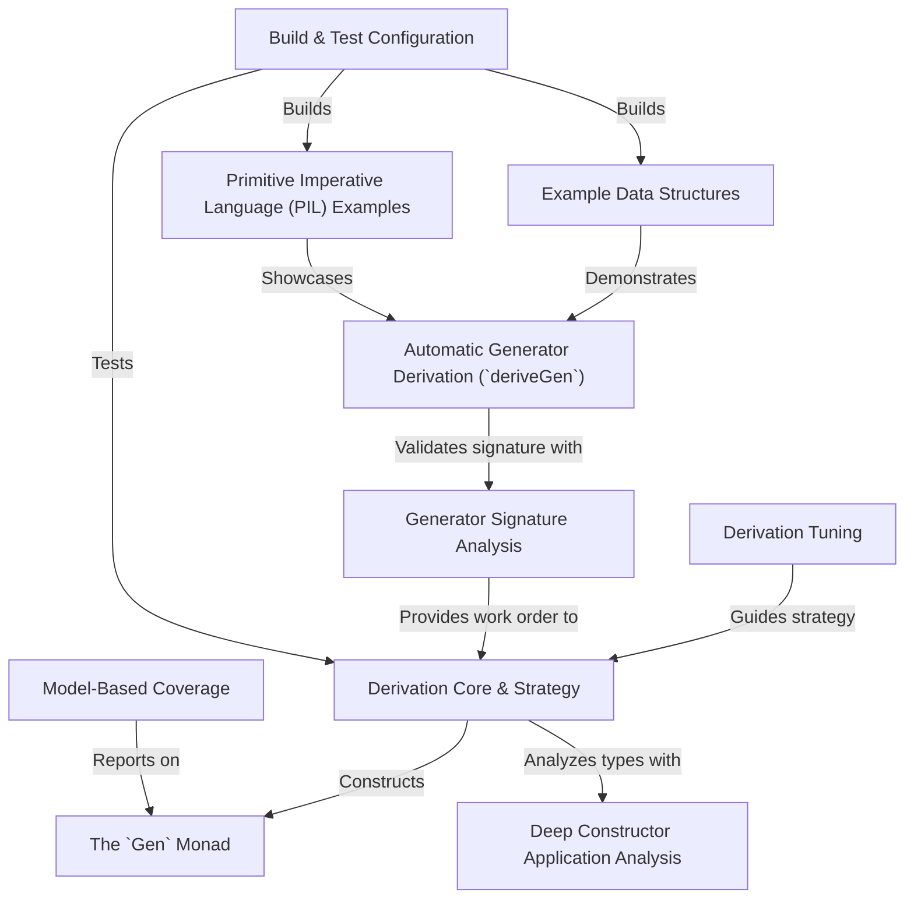

# Tutorial: DepTyCheck

**DepTyCheck** is a library for the Idris 2 programming language that makes it easier to test complex code. Its main superpower is the ability to *automatically create random test data* for even the most complicated data structures, especially those with special rules called 'dependent types'. You define a blueprint for your data, and **DepTyCheck** acts like a smart factory, using its `deriveGen` magic wand to build valid examples for you. This helps find bugs by testing your code against a wide variety of automatically generated inputs.

**Source Repository:** [None](None)

## Chapters

1. [Example Data Structures](01_example_data_structures.md)
2. [Automatic Generator Derivation (`deriveGen`)](02_automatic_generator_derivation___derivegen__.md)
3. [The `Gen` Monad](03_the__gen__monad.md)
4. [Primitive Imperative Language (PIL) Examples](04_primitive_imperative_language__pil__examples.md)
5. [Derivation Core & Strategy](05_derivation_core___strategy.md)
6. [Derivation Tuning](06_derivation_tuning.md)
7. [Model-Based Coverage](07_model_based_coverage.md)
8. [Generator Signature Analysis](08_generator_signature_analysis.md)
9. [Deep Constructor Application Analysis](09_deep_constructor_application_analysis.md)
10. [Build & Test Configuration](10_build___test_configuration.md)

---

Generated by [AI Codebase Knowledge Builder](https://github.com/The-Pocket/Tutorial-Codebase-Knowledge)