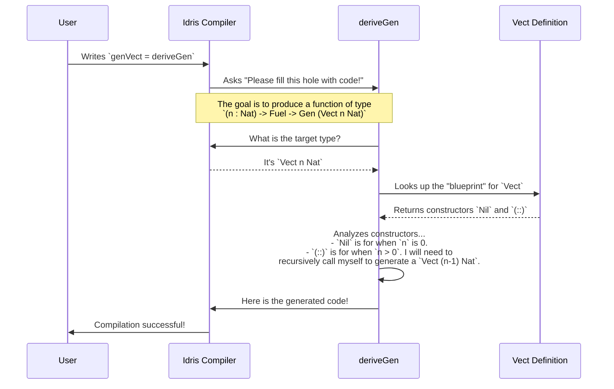

# Chapter 1: Automatic Generator Derivation

Welcome to DepTyCheck! If you've ever found yourself wondering, "How can I possibly test this function with its ridiculously complex input type?", then you're in the right place. DepTyCheck is designed to help you automatically generate test data, even for types with intricate dependencies.

In this first chapter, we'll introduce the "magic wand" of the library: automatic generator derivation.

## The Problem: We Need Test Data!

Imagine you've written a function that operates on a simple list of numbers.

```idris
myFunction : List Nat -> String
myFunction xs = "The list has \{show (length xs)} elements."
```

To test it, you need to create some `List Nat` values. That's easy enough: `[]`, `[1]`, `[42, 100]`, and so on.

But what if your function takes a more complex, dependently-typed structure? For example, a `Vect` (a list with its length encoded in its type) or a custom data type that represents an abstract syntax tree for a programming language.

```idris
-- A vector with its length in the type
data Vect : Nat -> Type -> Type where
  Nil : Vect 0 a
  (::) : a -> Vect k a -> Vect (S k) a

processVect : (n : Nat) -> Vect n String -> String
processVect n v = "Processing a vector of length \{show n}..."
```

Manually creating valid `Vect 5 String` or `Vect 10 String` values for testing is tedious and error-prone. Wouldn't it be great if a machine could just *generate* these values for us?

## The Solution: `deriveGen`

This is where `DepTyCheck` shines. It provides a mechanism to automatically create a "generator" for a given data type. Think of it like a robot chef: you show it the blueprint for a dish (`data MyType = ...`), and it instantly writes a detailed recipe (`Gen MyType`) to create that dish.

This magical tool is called `deriveGen`. Let's see it in action.

Suppose we want a generator for `Vect n Nat`. We just need to write the function signature describing what we want, and `deriveGen` will handle the implementation.

```idris
import Deriving.DepTyCheck.Gen

-- The signature for our generator
-- "Given a length `n` and some Fuel, produce a generator for a `Vect n Nat`"
genVect : (n : Nat) -> Fuel -> Gen (Vect n Nat)

-- The magic!
genVect = deriveGen
```

That's it! `DepTyCheck` will now generate a complete, correct implementation for `genVect` at compile time.

You might be wondering about those two new things in the signature:
- `Fuel`: This is a simple mechanism to ensure that generation eventually stops. For a recursive type like `Vect`, this prevents the generator from trying to create an infinitely long vector. We give it some "fuel", and each recursive step consumes a bit of it.
- `Gen`: This is the container for our generated values. It's a special type that manages the process of random generation. We will explore it in detail in the [next chapter](02__gen__monad_.md).

For now, just think of `(n : Nat) -> Fuel -> Gen (Vect n Nat)` as a function that, when given a length `n`, knows how to produce random vectors of that exact length.

## Generating More Complex Values

The real power of `deriveGen` comes when we need to generate values that are themselves dependent on other generated values.

Let's say we have a type that pairs a number `n` with a `Vect` of that length.

```idris
-- A dependent pair containing a number and a Vect of that length
SizedVect : Type
SizedVect = (n : Nat ** Vect n String)
```

How do we generate a `SizedVect`? We need to generate a `Nat` first, and *then* generate a `Vect` of that specific length.

The signature tells `deriveGen` what to do. The value we want to generate goes inside the `Gen` type.

```idris
genSizedVect : Fuel -> Gen SizedVect
-- In other words: Fuel -> Gen (n : Nat ** Vect n String)

genSizedVect = deriveGen
```

When `DepTyCheck` sees this, it understands:
1. "Okay, I need to produce a `(n : Nat ** Vect n String)`."
2. "First, I'll generate a random `Nat` and call it `n`."
3. "Then, I'll use my knowledge of how to generate a `Vect` to create a `Vect n String`."
4. "Finally, I'll package them together into the `(n ** ...)` pair."

The user only has to state *what* they want, and `deriveGen` figures out *how* to build it.

## How the Magic Works: Under the Hood

So, what's really happening when you write `genVect = deriveGen`? It's not actually magic, but a powerful Idris 2 feature called *elaboration reflection*. This feature allows code to inspect other code at compile time.

Here's a simplified step-by-step walkthrough:



`deriveGen` is a special compile-time function (a "macro") that gets the type it's supposed to generate. It then:
1.  **Inspects the Goal:** It looks at the required type, for example `Gen (Vect n Nat)`. It identifies `Vect` as the target.
2.  **Finds the Definition:** It looks up the data definition for `Vect`.
3.  **Analyzes the Constructors:** It examines each constructor (`Nil` and `(::)`). It sees that `Nil` is the base case for `Vect 0 a` and `(::)` is the recursive step for `Vect (S k) a`.
4.  **Synthesizes the Logic:** It writes new Idris code that implements this logic. The generated code will essentially say:
    -   "Given `n` and `fuel`:
    -   If `n` is `0`, return `Nil`.
    -   If `n` is `S k`, check if we have fuel.
    -   If so, consume some fuel, generate a random `Nat` for the head of the vector, and recursively call the generator to produce a `Vect k Nat` for the tail."
5.  **Fills the Hole:** It hands this newly generated code back to the compiler to complete your program.

The core of this logic lives in the `deriveGenExpr` function in `src/Deriving/DepTyCheck/Gen.idr`. When `deriveGen` is called, it's just a light wrapper.

```idris
-- from src/Deriving/DepTyCheck/Gen.idr
export %macro
deriveGen : DeriveBodyForType => Elab a
deriveGen = do
  -- 1. Get the signature we need to fill
  Just signature <- goal
     | Nothing => fail "..."

  -- 2. Call the main engine to build the code
  tt <- deriveGenExpr signature

  -- 3. Put the generated code in place
  check tt
```

The heavy lifting of analyzing constructors and figuring out the correct order to generate things is handled by `deriveGenExpr` and the internal modules it calls. These modules use a default strategy called `LeastEffort` to decide how to build your type. You can learn more about this and how to change it in the chapter on [Derivation Strategy Tuning](04_derivation_strategy_tuning_.md).

## What About My Own Custom Types?

`deriveGen` knows about built-in types like `Nat` and `String`, and it can figure out how to build any type defined in your project. But what if one of your types contains *another* custom type?

```idris
data MySpecialType = MkMST Nat String

data Container = MkContainer Nat (Vect 5 MySpecialType)
```

If we ask `DepTyCheck` to generate a `Container`, it will know how to create a `Nat` and a `Vect`, but it will get stuck on `MySpecialType`. It doesn't have a recipe for it yet!

We can solve this by providing the `MySpecialType` generator as an argument.

```idris
-- First, define a generator for our special type
genMySpecialType : Fuel -> Gen MySpecialType
genMySpecialType = deriveGen

-- Now, provide it to the Container generator using `=>`
genContainer : (Fuel -> Gen MySpecialType) => Fuel -> Gen Container
genContainer = deriveGen
```

The `(Fuel -> Gen MySpecialType) =>` syntax tells `deriveGen`: "To build a `Container`, you will need a generator for `MySpecialType`. The user will provide it." At the call site, Idris will automatically find `genMySpecialType` and pass it in. This allows you to build a library of simple generators and compose them to create fantastically complex ones.

## Conclusion

You've now seen the central feature of `DepTyCheck`: the ability to automatically derive type-safe, correct generators for complex, dependently-typed data structures. The key is to simply **write the signature of the generator you want**, and let `deriveGen` do the hard work of implementing it by analyzing your type's definition.

We've used the `Gen` type throughout this chapter as a black box. In the next chapter, we'll open that box and take a closer look at what it is, what it does, and how you can use it to build even more powerful and customized generators.

Onward to the [**`Gen` Monad**](02__gen__monad_.md)

---

Generated by [AI Codebase Knowledge Builder](https://github.com/The-Pocket/Tutorial-Codebase-Knowledge)