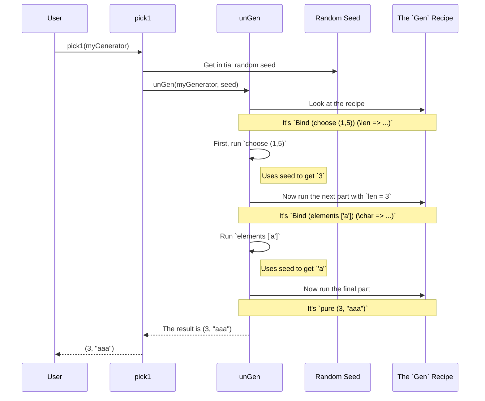

# Chapter 2: The `Gen` Monad

In the [previous chapter](01_automatic_generator_derivation_.md), we saw how `deriveGen` can magically create test data generators for us. We treated the `Gen` type it produced as a black box. Now, it's time to open that box!

Understanding `Gen` is the key to unlocking the full power of `DepTyCheck`. It allows you to move beyond automatic derivation and create your own custom, highly specific test data generators from scratch.

## What is a `Gen a`?

Think of a `Gen a` as a **recipe for making random values of type `a`**.

It's not the value itself, just the instructions.
*   A `Gen String` isn't a `String`, but a set of instructions for how to generate a random `String`.
*   A `Gen (List Nat)` is a recipe for creating a random list of natural numbers.

These recipes can be very simple or incredibly complex. `DepTyCheck` gives you the tools to start with simple ingredients and combine them into a gourmet meal of test data.

## Building Simple Recipes

Let's start with the most basic building blocks.

### `pure`: The Constant Recipe

The simplest recipe is one that always produces the same thing. This is called `pure`.

```idris
import Test.DepTyCheck.Gen

-- A recipe that *always* produces the number 42.
genTheAnswer : Gen NonEmpty Nat
genTheAnswer = pure 42
```
This generator isn't very random, but it's a fundamental starting point.

### `elements`: Pick from a List

A more useful recipe is one that randomly picks a value from a predefined list. For this, we use `elements`.

```idris
-- A recipe to pick one of "rock", "paper", or "scissors".
genChoice : Gen NonEmpty String
genChoice = elements ["rock", "paper", "scissors"]
```

When this generator is run, it will choose one of the three strings with equal probability.

### `choose`: Pick from a Range

If you need a number from a specific range, `choose` is your friend.

```idris
-- A recipe for a random dice roll (a number between 1 and 6).
genD6 : Gen NonEmpty Nat
genD6 = choose (1, 6)
```

## The Emptiness Problem: What if a Type has No Values?

In dependently-typed programming, some types are impossible to create values for. The classic example is a vector of a negative length, or `Fin 0`, a number that is "less than 0". These types are "uninhabited" – they have no members.

A test data generator needs to be aware of this! What should a recipe for `Fin 0` do? It can't produce a value. For this reason, `Gen` has a concept of **emptiness**.

A generator's type tells you whether it's guaranteed to produce a value:
*   `Gen NonEmpty a`: This recipe is **guaranteed** to create a value of type `a`. `genD6` is an example.
*   `Gen MaybeEmpty a`: This recipe **might or might not** create a value.

The ultimate "empty" recipe is `empty`.

```idris
import Data.Fin

-- A recipe for creating a Fin n.
genFin : (n : Nat) -> Gen MaybeEmpty (Fin n)
genFin Z     = empty -- Impossible to make a Fin 0!
genFin (S k) = elements (allFins k) -- Pick any valid Fin (S k)
```
This is a crucial feature. `DepTyCheck` generators can correctly represent the fact that for some inputs (like `n=0`), no test data can be generated.

## Combining Recipes: Applicative and Monadic Style

The real power of `Gen` comes from combining simple recipes to build complex ones.

### Applicative Style: Building a Record

Let's say we have a simple `Person` record and we want to generate random people.

```idris
data Person = MkPerson
  { name : String
  , age  : Nat
  }
```

We can create simple recipes for a `name` and an `age`, and then combine them using special `[| |]` syntax.

```idris
genPerson : Gen NonEmpty Person
genPerson = [| MkPerson (elements ["Alice", "Bob"]) (choose (18, 65)) |]
```

This is `Applicative` syntax. You can read it like this: "To make a `Person`, get a name from the `elements` recipe and an age from the `choose` recipe, then use `MkPerson` to combine them."

### Monadic Style: When One Value Depends on Another

Sometimes, your second recipe depends on the value produced by your first recipe.

Imagine you want to create a pair containing a number `n` and then a string of *that exact length*. You can't decide on the string's recipe until you know what `n` is!

This is where `do` notation comes in. It lets you define a sequence of steps.

```idris
import Data.String

-- A recipe for a (Nat, String) pair where the string's length
-- is the Nat we just generated.
genSizedString : Gen NonEmpty (Nat, String)
genSizedString = do
  -- Step 1: Generate a random length between 1 and 5.
  len <- choose (1, 5)

  -- Step 2: Generate a random character.
  char <- elements ['a', 'b', 'c']

  -- Step 3: Use the results to create the final value.
  pure (len, replicate len char)
```
Let's walk through it:
1. `len <- choose (1, 5)` runs the `choose` recipe and puts the resulting number into the `len` variable.
2. `char <- elements [...]` runs the `elements` recipe to get a character.
3. `pure (len, ...)` combines the results into the final pair. `pure` wraps the final value back into a `Gen`.

This is exactly how `deriveGen` from [Chapter 1](01_automatic_generator_derivation_.md) works its magic on dependent types! When you write `deriveGen` for `(n : Nat ** Vect n String)`, it generates code that looks like this:

```idris
-- This is what `deriveGen` writes for you!
genSizedVect : Fuel -> Gen (n : Nat ** Vect n String)
genSizedVect fuel = do
  -- Step 1: Generate a Nat `n`.
  n <- genNat fuel

  -- Step 2: Use `n` to generate a Vect of that specific length.
  vec <- genVect n fuel

  -- Step 3: Package them together.
  pure (n ** vec)
```

## How It Works: Under the Hood

So what is `Gen` really? It's a data type that describes the structure of your recipe.

```idris
-- A simplified view of the Gen data type
data Gen : Emptiness -> Type -> Type where
  Empty : Gen MaybeEmpty a   -- An impossible recipe.
  Pure  : a -> Gen em a      -- A recipe for a constant value.
  OneOf : List (Gen em a) -> Gen em a -- A recipe to choose from other recipes.
  Bind  : Gen em b -> (b -> Gen em a) -> Gen em a -- A "do this, then that" recipe.
  -- ...and a few others, like `Raw` for primitive random functions.
```
When you write `genChoice = elements ["a", "b"]`, `DepTyCheck` translates it into something like `OneOf [Pure "a", Pure "b"]`. When you write a `do` block, it becomes a series of `Bind` constructors.

So how does this "recipe" get turned into an actual value? Through a function called `unGen`.



The `unGen` function is an interpreter that walks through your `Gen` recipe.

1.  It takes the `Gen` value and a random seed.
2.  It looks at the top-level constructor of the `Gen` (`Pure`, `OneOf`, `Bind`, etc.).
3.  If it's `Pure x`, it just returns `x`.
4.  If it's `OneOf [g1, g2, ...]`, it uses the random seed to pick one of the sub-generators and recursively calls `unGen` on it.
5.  If it's `Bind g f`, it first calls `unGen` on `g` to get a value `x`, then it calls `unGen` on the result of `f(x)`. This is how `do` notation works.

Here is a tiny piece of the actual implementation from `src/Test/DepTyCheck/Gen.idr` that shows this interpreter pattern:

```idris
-- Simplified from the actual source code
unGen : Gen em a -> m (Maybe a)
unGen Empty      = pure Nothing
unGen (Pure x)   = pure (Just x)
unGen (Bind g f) = do
  mval <- unGen g
  case mval of
    Nothing => pure Nothing
    Just x  => unGen (f x)
```
As you can see, `unGen` is a recursive function that deconstructs the recipe step-by-step, using a random source along the way, to finally produce a single, concrete value.

## Conclusion

You've now seen that `Gen a` is not magic, but a well-defined datatype that acts as a "recipe" for generating random data.

- You can create simple recipes using `pure`, `elements`, and `choose`.
- You can combine them to build complex data structures using applicative (`[| |]`) and monadic (`do`) style.
- The `Gen` monad is particularly powerful because it allows you to generate data whose structure depends on previously generated random values.
- The system is aware of "emptiness", allowing it to correctly handle dependently-typed structures that may not be constructible for certain inputs.

Now that you know how to build and combine these recipes, you're ready to put them to work. In the next chapter, we'll see how to use these generators to actually write and run property-based tests.

Onward to [**Testing and Validation Examples**](03_testing_and_validation_examples_.md)

---

Generated by [AI Codebase Knowledge Builder](https://github.com/The-Pocket/Tutorial-Codebase-Knowledge)