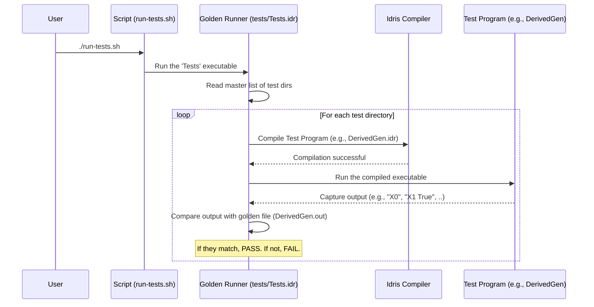

# Chapter 3: Testing and Validation Examples

In the [previous chapter](02__gen__monad_.md), we opened the box and saw how the [`Gen` Monad](02__gen__monad_.md) works as a "recipe" for creating random data. We learned to build our own simple recipes and saw how `deriveGen` uses the same principles to build complex ones.

Now, where can we find more examples of these recipes? How do we see what `DepTyCheck` is truly capable of? The answer might surprise you: you can learn a lot by looking at the project's own test suite!

This chapter will guide you through the `DepTyCheck` tests, which double as a massive library of usage examples. Think of it as a giant cookbook or a gallery showcasing everything the `DepTyCheck` "robot chef" can prepare, from simple snacks to complex, multi-course meals.

## The Test Suite as a Cookbook

The `DepTyCheck` codebase contains over 1000 individual test files. While that sounds intimidating, they are organized into clear categories. We can learn by exploring a few key sections of this "cookbook":

1.  **Input Validation Tests (`inputvalidation`)**: The "Safety Warnings" section. This shows you what `deriveGen` *cannot* do and why, helping you understand its boundaries.
2.  **Core Derivation Tests (`core`, `least-effort`)**: The "Gallery of Dishes". This is a huge collection showing successful generator derivations for a wide variety of data types.
3.  **Distribution Tests (`distribution`)**: The "Nutrition Facts". This section shows how you can analyze and fine-tune the statistical properties of your generators.

Let's take a look at each of these sections.

### 1. Input Validation: Knowing the Limits

A good tool not only works well but also tells you clearly when you're using it wrong. The `inputvalidation` tests are designed to ensure `DepTyCheck` provides helpful compile-time errors for incorrect inputs. They serve as excellent documentation for the limitations of `deriveGen`.

Imagine you have this data type:

```idris
-- From: tests/derivation/inputvalidation/params-before-fuel/ValidateInput.idr

data X : Fin n -> Fin n -> Type where
  MkX : X {n=10} 5 6
```
This is a `data` type `X` that can only be constructed with very specific compile-time numbers.

Now, what if we wrote a generator signature where one of the dependent types (`n`) isn't available to `deriveGen`?

```idris
-- This will NOT compile!
n_mentioned_in_wrong_place : Fuel -> (a, b : Fin n) -> Gen MaybeEmpty $ X a b
n_mentioned_in_wrong_place = deriveGen
```

This code asks `deriveGen` to create a generator for `X a b`. However, the type `X` depends on a number `n` (via `Fin n`), but `n` is "hidden" inside the types of `a` and `b`. `DepTyCheck` can't figure out what `n` should be!

Instead of generating incorrect code, `DepTyCheck` will fail to compile and give you an error explaining that it can't solve for `n`. The tests in the `inputvalidation` directory are full of examples like this, cataloging all the ways you might misuse `deriveGen` and ensuring the compiler guides you back to the right path.

### 2. Core Derivation: The Gallery of Possibilities

The `core` and `least-effort` directories are the heart of the example gallery. They contain hundreds of tests demonstrating successful derivations for all sorts of Algebraic Data Types (ADTs) and Generalized ADTs (GADTs).

Let's look at a simple but interesting example from `tests/derivation/core/typealias con 002/DerivedGen.idr`. First, we have a data type that uses type aliases which depend on a `Bool` value.

```idris
-- A type alias that changes based on a boolean
ConstantUseTypeAlias : Bool -> Type
ConstantUseTypeAlias True  = Bool
ConstantUseTypeAlias False = Nat

-- A data type using this alias
data X : Type where
  X0 : X
  X1 : Bool -> X
  X2 : ConstantUseTypeAlias True -> ConstantUseTypeAlias False -> X
```
The `X2` constructor is interesting: its first argument is a `Bool` (`ConstantUseTypeAlias True`), and its second is a `Nat` (`ConstantUseTypeAlias False`). Even with this level of indirection, deriving a generator is trivial:

```idris
checkedGen : Fuel -> Gen MaybeEmpty X
checkedGen = deriveGen
```
That's it! `deriveGen` automatically looks through the `ConstantUseTypeAlias` definition and figures out the correct types to generate for `X2`.

The test file then runs this generator to make sure it works as expected.

```idris
main : IO ()
main = runGs [ G checkedGen ]
```
The `runGs` function is a test-harness utility that runs the generator and prints some samples. If you were to run this, you would see output like:

```
-- Possible output from running the test
> X0
> X1 False
> X2 True 42
> X1 True
> ...
```
By browsing the `core` directory, you can find a working example for almost any kind of data structure you can imagine.

### 3. Distribution Tests: Controlling the Randomness

Sometimes, you don't just want random data; you want data with a specific *shape*. For example, when generating lists, you might want to get more empty lists or more long lists. The `distribution` tests show how to verify and tune these statistical properties.

Consider a simple `ListNat` type.

```idris
-- From: tests/derivation/distribution/list-nat-tuned-004/CheckDistribution.idr
data ListNat : Type where
  Nil  : ListNat
  (::) : Nat -> ListNat -> ListNat
```
By default, `deriveGen` would choose between the `Nil` constructor and the `(::)` constructor with roughly equal probability. What if we want to make empty lists more common?

We can provide a hint to `deriveGen` to tune the probabilities. This is a sneak peek of concepts from [Derivation Strategy Tuning](04_derivation_strategy_tuning_.md).

```idris
ProbabilityTuning `{CheckDistribution.Nil}.dataCon where
  tuneWeight = const 2
```
This snippet tells `deriveGen`: "When you see the `Nil` constructor, treat it as if it appeared twice. This will double its chance of being picked."

The test then defines the generator as usual and runs a special check.

```idris
listNats : Fuel -> Gen MaybeEmpty ListNat
listNats = deriveGen

main : IO ()
main = printVerdict (listNats $ limit 5) ...
```
The `main` function in these files does something sophisticated:
1.  It runs the `listNats` generator thousands of times.
2.  It measures the frequency of different list lengths (`0`, `1`, `2`, etc.).
3.  It compares this observed frequency to a mathematical formula describing the *expected* frequency.
4.  It prints a verdict: does the generator's actual output match the statistical model?

This ensures that `DepTyCheck`'s tuning mechanisms are precise and work as advertised.

## Under the Hood: How the Tests are Run

You might wonder how over 1000 files are compiled and checked automatically. The answer is a "golden test" runner. The process works like this: each test is a small, runnable program that prints its results to the console. The testing framework compiles and runs each one, comparing its output to a previously saved, "golden" output file. If the new output matches the golden file, the test passes.



The master list of all tests is defined in a single file, `tests/Tests.idr`. It's a simple list of directories that the `goldenRunner` should visit.

```idris
-- from tests/Tests.idr
main : IO ()
main = goldenRunner $
  [ "Derivation: input validation" `atDir` "derivation/inputvalidation"
  , "Derivation: core" `atDir` "derivation/core"
  , "Derivation: distribution" `atDir` "derivation/distribution"
  -- ... and many more
  ]
```
This simple but powerful setup allows the entire suite of examples to be automatically verified, ensuring that they are always correct and up-to-date.

## Conclusion

The `DepTyCheck` test suite is more than just a tool for developers; it's a rich, practical, and comprehensive learning resource for users.

-   The **input validation** tests teach you the rules and boundaries of `deriveGen`.
-   The **core derivation** tests provide a vast gallery of working examples for nearly any data type.
-   The **distribution** tests demonstrate advanced techniques for fine-tuning the statistical behavior of your generators.

By exploring these tests, you can move from basic usage to advanced mastery of `DepTyCheck`. We got a small taste of tuning generator behavior in this chapter. In the next chapter, we will fully explore this powerful feature.

Onward to [**Derivation Strategy Tuning**](04_derivation_strategy_tuning_.md)

---

Generated by [AI Codebase Knowledge Builder](https://github.com/The-Pocket/Tutorial-Codebase-Knowledge)