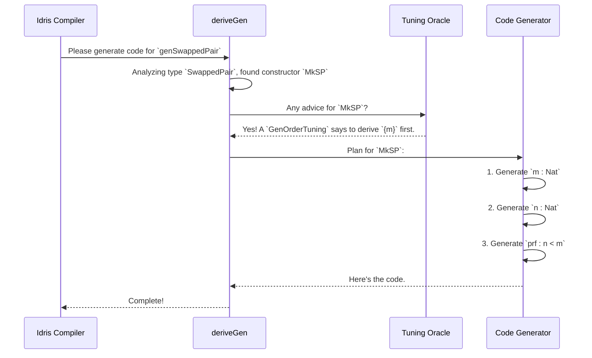

# Chapter 4: Derivation Strategy Tuning

In our journey so far, we've treated `DepTyCheck`'s `deriveGen` as a "robot chef" that automatically figures out how to cook up test data based on a type's "blueprint". By default, this chef uses a simple "least effort" strategy: it looks at a constructor's arguments from left to right and generates them in that order.

This works surprisingly well for many types! But what happens when you have a very complex recipe where the ingredients need to be prepared in a very specific order? Or what if you want to tell the chef, "I want a lot more salad and a lot less soup today"?

This chapter introduces **Derivation Strategy Tuning**, which lets you give these kinds of advanced instructions to the robot chef. You'll learn how to take control of the generation process to handle tricky dependent types and fine-tune the statistical distribution of your test data.

## The Problem: When the Default Order Fails

Our robot chef's default strategy is to generate a constructor's arguments from left to right. This is simple and effective, until it isn't.

Consider a type that pairs two numbers, `n` and `m`, along with a proof that `n` is less than `m`. What if we wrote the arguments in a tricky order?

```idris
data SwappedPair : Type where
  MkSP : (n : Nat) -> (prf : n `LT` m) -> (m : Nat) -> SwappedPair
```
This defines a `SwappedPair` built with `MkSP`. Let's trace the robot chef's thought process if we ask it to generate a `SwappedPair`:
1.  "Okay, I need to generate `MkSP`. I'll start with the first argument, `n : Nat`." This is easy, it generates a random `Nat`, let's say `5`.
2.  "Next is the second argument, `prf : n `LT` m`." Uh oh. This becomes `prf : 5 `LT` m`. The chef needs to find a proof that 5 is less than... what? It doesn't know what `m` is yet! It hasn't generated it.
3.  The chef is stuck. It can't proceed.

At compile time, `deriveGen` will see this problem and report an error, telling you that it cannot figure out how to generate `prf` because `m` is not yet available.

## The Solution: `GenOrderTuning`

We need to give the chef a hint. We need to say: "Hey! Before you worry about the proof `prf`, you *must* generate `m` first." This is exactly what `GenOrderTuning` is for.

It's a special interface that you implement to provide custom ordering instructions for a specific constructor.

```idris
import Deriving.DepTyCheck.Gen

-- Tell `deriveGen` how to handle the `MkSP` constructor
GenOrderTuning `{MkSP}.dataCon where
  isConstructor = itIsConstructor
  deriveFirst _ _ = [`{m}]
```
Let's break down this magical snippet:
*   `GenOrderTuning `{MkSP}.dataCon`: We are providing tuning instructions specifically for the constructor `MkSP`.
*   `isConstructor = itIsConstructor`: This is some boilerplate magic that confirms to the compiler that `MkSP` is indeed a constructor.
*   `deriveFirst _ _ = [`{m}]`: This is the core instruction! It says, "The list of arguments to derive first is just `m`." The `{m}` is a special "name literal" that refers to the argument named `m`.

Now, when we derive our generator, `DepTyCheck` will consult our instructions.

```idris
-- This will now compile successfully!
genSwappedPair : Fuel -> Gen MaybeEmpty SwappedPair
genSwappedPair = deriveGen
```

The chef's new plan is:
1.  "The user gave me `GenOrderTuning` for `MkSP`. It says to generate `m` first." It generates `m`, let's say `10`.
2.  "Now I'll generate the remaining arguments. I'll start with `n : Nat`." It generates `n`, let's say `5`.
3.  "Finally, I'll generate `prf : n `LT` m`." This is now `prf : 5 `LT` 10`. This is a provable statement, so the chef can find a proof.
4.  Success! It calls `MkSP 5 (theProof) 10`.

`GenOrderTuning` gives you precise control over the "recipe," allowing you to resolve complex dependencies that the default strategy can't handle.

## Another Problem: Unbalanced Data

Let's imagine you're testing a function that operates on lists. You know that bugs often hide in edge cases, like empty lists or lists with one element. By default, `deriveGen` for a list would give roughly a 50% chance to `Nil` and a 50% chance to `Cons`. This means half of your test cases will be for empty lists, and the other half will be distributed among lists of length 1, 2, 3, and so on, making it harder to specifically target long lists or short lists.

What if you wanted to test code that handles large lists? You'd want to tell the chef, "Go easy on the `Nil`s; I want more `Cons` today!"

## The Solution: `ProbabilityTuning`

`ProbabilityTuning` lets you adjust the "weight" of each constructor, changing how likely `deriveGen` is to pick it.

Let's define a simple enum type.

```idris
data Choice = A | B | C
```
By default, a generator for `Choice` would produce `A`, `B`, and `C` with roughly equal probability (1/3 each). Let's say we want to make `A` twice as likely and `B` four times as likely as `C`.

```idris
import Deriving.DepTyCheck.Gen

-- Make constructor `A` twice as likely
ProbabilityTuning `{A}.dataCon where
  isConstructor = itIsConstructor
  tuneWeight = (*2)

-- Make constructor `B` four times as likely
ProbabilityTuning `{B}.dataCon where
  isConstructor = itIsConstructor
  tuneWeight _ = 4
```
Here's how it works:
*   Every constructor starts with a default "weight" of `1`.
*   `tuneWeight = (*2)`: For constructor `A`, we provide a function that takes the old weight (`1`) and returns a new one (`1 * 2 = 2`).
*   `tuneWeight _ = 4`: For constructor `B`, we just return a constant new weight of `4`.
*   We don't provide a `ProbabilityTuning` for `C`, so its weight stays at the default of `1`.

The final weights are: `A` (2), `B` (4), and `C` (1). The total weight is `2 + 4 + 1 = 7`. The probability of generating each constructor is now:
- `A`: 2/7
- `B`: 4/7
- `C`: 1/7

With these instructions, our generator will produce a distribution of values heavily skewed towards `B`.

```idris
genChoice : Fuel -> Gen MaybeEmpty Choice
genChoice = deriveGen
```

This is incredibly useful for tailoring your test data generation to stress-test specific parts of your code. Want to check for bugs with empty lists? Increase the weight of `Nil`. Want to check for bugs with very deep trees? Decrease the weight of the leaf-node constructors.

## How It Works: The Tuning Oracle

How does `deriveGen` know about these special `GenOrderTuning` and `ProbabilityTuning` implementations? It consults a "Tuning Oracle" during compilation.

When `deriveGen` analyzes a data type, it goes through each constructor. For each one, it pauses and asks the oracle for advice.



This "Tuning Oracle" isn't a separate entity; it's part of the compiler's process. The `deriveGen` macro is programmed to search the context for any implementations of the `GenOrderTuning` or `ProbabilityTuning` interfaces that match the constructor it's currently working on.

Let's glance at the definition of these interfaces in `src/Deriving/DepTyCheck/Gen/Tuning.idr`.

```idris
-- from src/Deriving/DepTyCheck/Gen/Tuning.idr

-- Interface for tuning generation order
public export
interface GenOrderTuning (0 n : Name) where
  isConstructor : ...
  deriveFirst : ... -> List (ConArg ...)

-- Interface for tuning generation probability
public export
interface ProbabilityTuning (0 n : Name) where
  isConstructor : ...
  tuneWeight : Nat1 -> Nat1
```
These are just standard Idris `interface` definitions. There's no deep magic in the interfaces themselves. The magic is that `deriveGen` is a macro that has been specifically programmed to look for implementations of these interfaces at compile time.

If it finds a matching implementation, it uses the information from `deriveFirst` or `tuneWeight` to adjust its code-generation plan. If it doesn't find one, it just proceeds with its default "least effort" and "equal probability" strategies.

## Conclusion

You've now unlocked the advanced controls for `DepTyCheck`'s automatic derivation engine. You are no longer just a customer of the robot chef; you are a head chef who can give it precise instructions.

-   **`GenOrderTuning`** is your tool for untangling complex dependencies between constructor arguments, telling `deriveGen` the exact order in which to generate them.
-   **`ProbabilityTuning`** is your dial for controlling the statistical distribution of test data, allowing you to generate more or fewer values of a certain shape to better target your tests.

These tools provide the ultimate flexibility, allowing you to combine the convenience of automatic derivation with the power of manual customization. In the next chapter, we will see these concepts, along with everything else we've learned, come together in a large, real-world example.

Onward to [**Example: Primitive Imperative Languages (PIL)**](05_example__primitive_imperative_languages__pil__.md)

---

Generated by [AI Codebase Knowledge Builder](https://github.com/The-Pocket/Tutorial-Codebase-Knowledge)