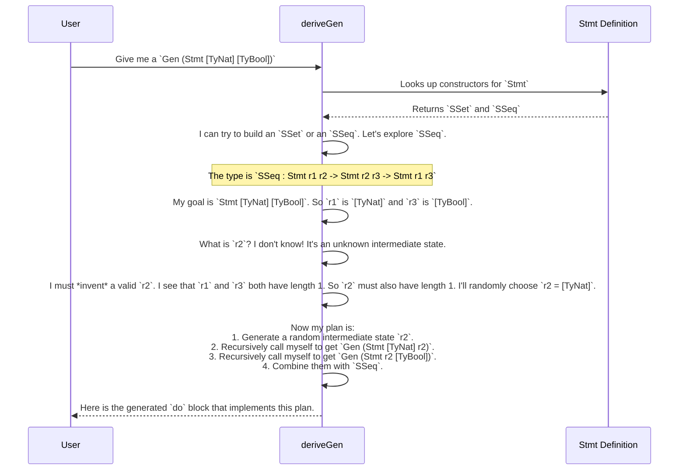

# Chapter 5: Example: Primitive Imperative Languages (PIL)

In the [previous chapter](04_derivation_strategy_tuning_.md), we learned how to become head chefs, giving precise instructions to `DepTyCheck`'s "robot chef" using [Derivation Strategy Tuning](04_derivation_strategy_tuning_.md). We saw how to untangle tricky dependencies with `GenOrderTuning` and shape our test data with `ProbabilityTuning`.

Now, it's time to see all these concepts come together in the ultimate showcase project: the Primitive Imperative Languages (PIL). This chapter will explore a collection of advanced case studies that demonstrate the true power of `DepTyCheck`. We're moving from cooking simple dishes to preparing entire multi-course meals.

## The Goal: Generate Correct Programs Automatically

Imagine you're designing a new programming language. You define its syntax (what programs look like) and its static semantics (the rules that determine if a program is "correct" or "well-typed"). For example, you can't add a number to a string, and you can't use a variable that hasn't been declared.

How do you test your compiler or interpreter? You need to write a lot of programs in your new language—some correct, some incorrect. Writing the correct ones by hand can be incredibly tedious, especially if your language has complex rules.

What if we could **automatically generate an endless supply of syntactically and semantically correct programs**?

This is the challenge that the PIL examples are designed to solve. They define several toy programming languages using Idris's powerful dependent types. The types themselves enforce the language's rules. Then, we simply point `DepTyCheck` at these type definitions and ask it to derive a generator. The result is a generator that produces valid, well-typed programs, for free!

## Meet `pil-reg`: A Language with Registers

Let's look at the simplest language in the collection, `pil-reg`. It's a tiny imperative language with two types (`TyNat`, `TyBool`) and a handful of registers (`r0`, `r1`, `r2`, ...).

The "state" of our program at any point in time is the list of types stored in the registers. We'll call this `Regs`, which is just an alias for `List Ty`. For example, `[TyNat, TyBool]` means `r0` holds a `Nat` and `r1` holds a `Bool`.

### Defining Correct Expressions with Types

First, we define expressions. An `Expr` in `pil-reg` is defined with a dependent type that tracks two things:
1.  `regs : Regs`: The register state required for the expression to be valid.
2.  `t : Ty`: The type of the value that the expression will produce.

```idris
-- A simplified view of Expr
data Expr : (regs : List Ty) -> (t : Ty) -> Type where
  -- A constant value (e.g., 5 or True) has no register requirements
  EConst : (v : val) -> Expr regs (typeOf v)
  -- Reading from a register `idx` is only valid if `idx` is in bounds.
  -- The expression's type is the type stored at that register.
  EReg : (idx : Fin (length regs)) -> Expr regs (lookup idx regs)
```
This definition makes it impossible to write an incorrect expression. You literally cannot construct a value of type `Expr` that reads from a non-existent register. The Idris type-checker will stop you.

### Defining Correct Statements with Types

Statements are even more interesting. A statement transforms the register state. So, its type needs to track the state *before* it runs and the state *after* it runs.

```idris
-- A simplified view of Stmt
data Stmt : (before : List Ty) -> (after : List Ty) -> Type where
```

A statement is a "transformer" from one register state to another. Let's look at two example statements:

1.  **Set a register (`SSet`)**: This statement takes a register index and an expression, and it updates the value in that register. The "after" state is the same as the "before" state, but with the type at that index updated.

    ```idris
    -- Set register `idx` to the value of expression `e`.
    SSet : (idx : Fin (length before)) -> (e : Expr before ty) ->
           Stmt before (replaceAt idx ty before)
    ```
    The types guarantee that the expression `e` is valid in the `before` context.

2.  **Sequence of statements (`SSeq`)**: This is how we build a program—by running one statement after another.

    ```idris
    -- Run stmt1, then run stmt2.
    SSeq : Stmt r1 r2 -> Stmt r2 r3 -> Stmt r1 r3
    ```
    This is the most critical rule. It says you can only sequence two statements if the **output state (`r2`) of the first statement exactly matches the input state (`r2`) of the second statement**. This pipeline ensures that the register state flows correctly through the entire program.

## Deriving a Program Generator

Now for the magic. We want a generator that can create a valid program—a `Stmt` that transforms some initial state `r1` to a final state `r3`. Writing this by hand would be a nightmare. You'd have to invent an intermediate state `r2`, then come up with a `Stmt r1 r2`, then a `Stmt r2 r3`, and so on.

But with `DepTyCheck`, we just write the signature.

```idris
import Example.Pil.Lang
import Deriving.DepTyCheck.Gen

-- A generator for a statement that transforms `before` to `after`.
genStmt : (before, after : List Ty) -> Fuel -> Gen (Stmt before after)
genStmt = deriveGen
```

And that's it. You've just created a random program generator. When you run `genStmt [TyNat] [TyBool] fuel`, it will produce syntactically correct and type-safe `pil-reg` programs that start with a `Nat` in `r0` and end with a `Bool` in `r0`.

## How It Works: The Derivation Engine's Master Plan

How can `deriveGen` possibly figure this out? It's all about analyzing those dependent types, especially the tricky `SSeq` constructor.

Let's imagine you ask `DepTyCheck` to generate a `Stmt [TyNat] [TyBool]`. The derivation engine's thought process is remarkably sophisticated.



The core insight is that `deriveGen` is smart enough to identify these "unification variables" or "intermediate holes" in the types (like `r2`). It doesn't give up; it actively tries to solve for them. It will generate a random, valid intermediate state and then recursively build the pieces around it. The final generated code looks something like this:

```idris
-- A simplified sketch of what `deriveGen` writes for `SSeq`
do
  -- 1. Invent a random intermediate state `r2`.
  r2 <- genRandomRegisterState a_certain_length

  -- 2. Generate the first part of the program.
  stmt1 <- genStmt r1 r2 fuel

  -- 3. Generate the second part of the program.
  stmt2 <- genStmt r2 r3 fuel

  -- 4. Combine them.
  pure (SSeq stmt1 stmt2)
```

This ability to solve for intermediate dependencies is the crown jewel of `DepTyCheck`'s derivation engine. You can find the real-world versions of these definitions and generators in the `examples/pil-reg` directory of the `DepTyCheck` project.

## Beyond `pil-reg`: A Whole Cookbook

`pil-reg` is just the first course. The `examples` directory is a full cookbook of advanced use cases:

-   `pil-fun` (`examples/pil-fun`): This language extends `pil-reg` with **functions**. This introduces even more complex type constraints, such as tracking the arguments a function expects and what type it returns. `DepTyCheck` is used to generate well-typed programs that correctly define and call functions.
-   `pil-dyn` (`examples/pil-dyn`): This language explores **dynamic features**, where not all type information is known at compile time. It demonstrates how `DepTyCheck` can still be used to generate valid programs even when the type system is more flexible.

These examples are all structured as independent, runnable `ipkg` projects. They serve as living documentation and the ultimate confidence test for the library.

## Conclusion

The PIL case studies are the final proof of `DepTyCheck`'s power. They show that the library is not just for simple records or lists, but is capable of tackling the highly constrained and deeply dependent structures found in the abstract syntax trees of programming languages.

The key takeaway is this: **if you can describe the rules of a complex system using dependent types, you can use `DepTyCheck` to automatically generate valid instances of that system for testing.**

We've seen how to generate programs that are *statically correct*—they follow the language's typing rules. But are these programs any good? Do they terminate? Do they do anything interesting? Just because a program is well-typed doesn't mean it's bug-free at runtime. In the next chapter, we will explore how to answer these questions.

Onward to [**Runtime Model Coverage**](06_runtime_model_coverage_.md)

---

Generated by [AI Codebase Knowledge Builder](https://github.com/The-Pocket/Tutorial-Codebase-Knowledge)