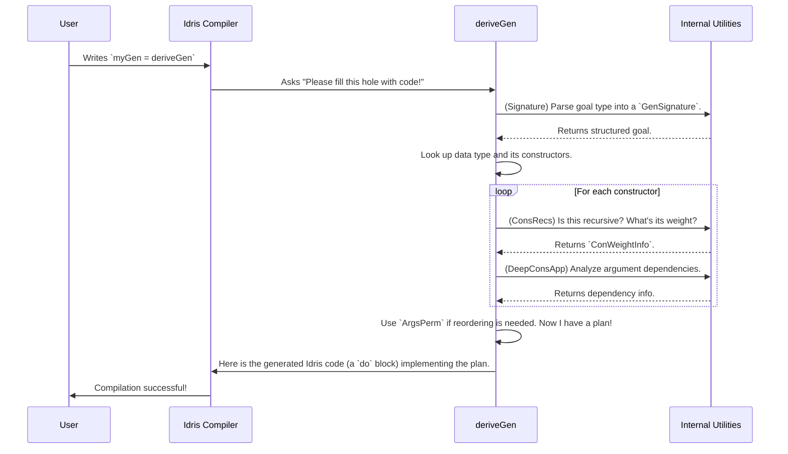

# Chapter 7: Derivation Internals & Utilities

Welcome to the final chapter of our `DepTyCheck` tutorial! In the previous chapter on [Runtime Model Coverage](06_runtime_model_coverage_.md), you learned how to inspect your generators to ensure they produce a diverse set of test data. You've now seen all the major features of `DepTyCheck`, from the magic of `deriveGen` to advanced tuning and quality control.

In this chapter, we're going to take a peek behind the curtain. We've spent a lot of time giving orders to our "robot chef", `deriveGen`. Now, let's open its toolbox and see the specialized gadgets it uses to do its job. This is for the curious, for those who want to understand the "how" behind the magic, or for anyone who might want to contribute to `DepTyCheck` one day.

## The Robot Chef's Toolkit

Think of `deriveGen` as an incredibly sophisticated robot chef. Its job is to take a "recipe request" (a type signature like `Fuel -> Gen (Vect n Nat)`) and instantly produce a perfect, detailed recipe (`Gen` value) to generate that dish. To do this, it needs a set of powerful internal tools. These are the specialized knives, whisks, and thermometers that allow it to analyze complex blueprints and create flawless recipes every time.

These utilities are not things you'll typically use yourself, but understanding them reveals the elegant machinery that powers `DepTyCheck`. The main tools in the kit are:

-   **`Signature`:** The blueprint interpreter. It reads and understands your recipe request.
-   **`DeepConsApp` & `ArgsPerm`:** The dependency analyzer and planner. It figures out the correct order to prepare ingredients, especially when one depends on another.
-   **`ConsRecs`:** The recursion and fuel manager. It ensures the chef knows when to stop cooking to avoid infinite loops.

Let's look at each of these tools in turn.

### The Blueprint Interpreter: `Signature`

When you write `genMyType = deriveGen`, the first thing the robot chef must do is understand what `MyType` you're asking for. Is it a `Vect n String`? Is it a `(n : Nat ** Vect n String)`? Does it have any pre-supplied arguments?

The `Signature` module is responsible for parsing your function signature into a structured, machine-readable format. It turns a `TTImp` (Idris's internal representation of a type) into a `GenSignature` record.

```idris
-- Simplified from: src/Deriving/DepTyCheck/Gen/Signature.idr

record GenSignature where
  constructor MkGenSignature
  -- The type we want to generate, e.g., `Vect`
  targetType : TypeInfo
  -- Which arguments are GIVEN to us, e.g., `n` in `Vect n Nat`
  givenParams : SortedSet (Fin targetType.args.length)
```

This record is the chef's work order. For a generator of type `(n : Nat) -> Fuel -> Gen (Vect n Nat)`, it would create a `GenSignature` that says:

-   **`targetType`**: `Vect`
-   **`givenParams`**: The first argument, `n`, is given.

This simple record is the starting point for all of `deriveGen`'s planning.

### The Dependency Planner: `DeepConsApp` & `ArgsPerm`

Once the chef knows its goal, it looks at the available constructors for the `targetType`. Sometimes, the order of a constructor's arguments is tricky. We saw this in the chapter on [Derivation Strategy Tuning](04_derivation_strategy_tuning_.md) with our `SwappedPair`:

```idris
data SwappedPair : Type where
  MkSP : (n : Nat) -> (prf : n `LT` m) -> (m : Nat) -> SwappedPair
```
The chef can't make the `prf` until it knows what `m` is, but `m` comes later! This is where the dependency planner tools come in.

-   **`DeepConsApp` ("Deep Constructor Application")**: This is the analyzer. It has a function called `analyseDeepConsApp` which walks through a constructor's type (`n `LT` m`) and identifies all the variables it depends on (`n` and `m`). It's smart enough to see that to generate `prf`, you first need `m`.

-   **`ArgsPerm` ("Arguments Permutation")**: This is the re-planner. Once `DeepConsApp` (or a manual `GenOrderTuning` rule) identifies a different order is needed, `ArgsPerm` provides utilities like `reorder` to shuffle the plan. The new plan becomes: "Generate `m` first, *then* generate `n` and `prf`".

```idris
-- Simplified from: src/Deriving/DepTyCheck/Util/ArgsPerm.idr

-- Takes a permutation and a vector, and reorders the vector.
reorder : (perm : Vect n (Fin n)) -> Vect n a -> Vect n a
reorder perm orig = perm <&> \i => index_ i orig
```

These tools work together to untangle complex dependencies, allowing `deriveGen` to create a valid generation plan even for types with non-obvious argument ordering.

### The Safety Valve: `ConsRecs` and Fuel

If we ask the chef to generate a `List Nat`, it could try to make an infinitely long list by always choosing the `Cons` constructor. To prevent this, it needs a safety valve: **`Fuel`**.

The `ConsRecs` ("Constructor Recursiveness") module is the chef's fuel manager. Before it starts cooking, it inspects every constructor of a type and classifies it.

```idris
-- Simplified from: src/Deriving/DepTyCheck/Gen/ConsRecs.idr

-- Information about how "heavy" a constructor is.
record ConWeightInfo where
  constructor MkConWeightInfo
  weight : Either Nat1 RecWeightInfo

-- For recursive constructors, how do they behave?
data RecWeightInfo : Type where
  -- A normal recursive call that consumes fuel.
  SpendingFuel : ... -> RecWeightInfo
  -- A special case where recursion gets "smaller" in a provable way.
  StructurallyDecreasing : ... -> RecWeightInfo
```
For a `List Nat`, `ConsRecs` would tell the chef:
-   `Nil`: This is a base case. It's not recursive. Its "weight" is `1`.
-   `Cons`: This is a recursive case. It's of the `SpendingFuel` type. If you choose this, you must consume some fuel.

This information is crucial for two reasons. First, it's what ensures generation terminates. Second, the "weight" is used to decide probabilities. This is the underlying mechanism that `ProbabilityTuning` from [Chapter 4](04_derivation_strategy_tuning_.md) modifies.

### The Whole Process: `deriveGen` in Action

Now, let's put it all together. What happens when the compiler sees `myGen = deriveGen`?



`deriveGen` is an orchestrator. It doesn't do all the hard work itself. Instead, it uses this powerful toolkit of specialized internal utilities to analyze the problem, form a plan, and finally synthesize the correct Idris code to implement that plan.

## Conclusion: You've Reached the End!

Congratulations! You have completed the `DepTyCheck` tutorial. You've journeyed from the simple magic of [Automatic Generator Derivation](01_automatic_generator_derivation_.md) to the powerful control of the [`Gen` Monad](02__gen__monad_.md), and all the way to peeking at the internal machinery in this chapter.

We've seen that `DepTyCheck` is more than just a `deriveGen` macro; it's a comprehensive framework for property-based testing in a dependently-typed world. Its power lies in its ability to understand the rich information encoded in your types and use that information to automate the tedious and error-prone task of creating valid test data.

The "robot chef" and its internal toolkit are designed to handle the complexity so that you can focus on what matters: defining your types correctly and writing properties that capture the essence of your program's behavior. We hope `DepTyCheck` empowers you to test your most complex dependently-typed programs with confidence and ease.

Thank you for joining us on this tour. Happy testing

---

Generated by [AI Codebase Knowledge Builder](https://github.com/The-Pocket/Tutorial-Codebase-Knowledge)