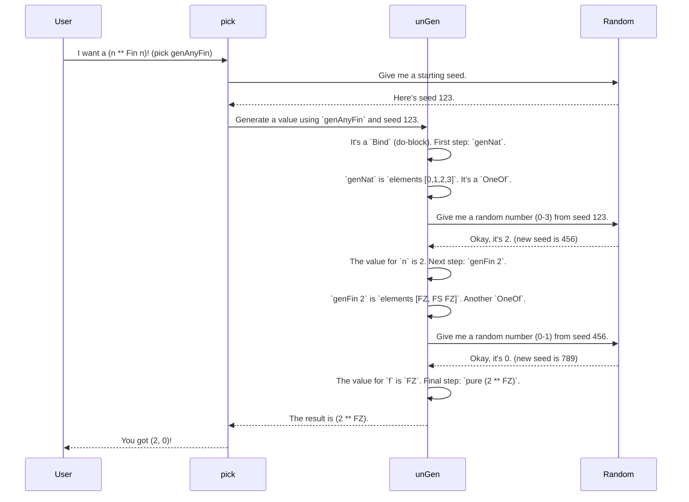

# Chapter 1: The `Gen` Monad

Welcome to the `DepTyCheck` tutorial! We're going to dive into the world of property-based testing for dependent types in Idris. At the very heart of this process is the ability to generate random test data. That's where our journey begins: with the `Gen` monad.

### What's a Generator? The Recipe Book Analogy

Imagine you have a recipe book. Each recipe tells you how to make a specific dish. Some recipes are simple ("take an egg from the carton"), while others are complex ("first, make the pasta dough, then prepare the sauce...").

In `DepTyCheck`, a `Gen a` is exactly like a recipe for producing a random value of type `a`. It's a blueprint for creating data. We can have simple recipes and combine them to create recipes for incredibly complex, dependently-typed data structures.

Let's start with the most basic recipe.

### The Simplest Recipe: `elements`

The easiest way to generate a random value is to pick one from a predefined list. For this, we use the `elements` function.

Let's write a generator that produces a random `String` from a list of fruits.

```idris
import Test.DepTyCheck.Gen

-- A recipe to randomly pick one fruit
genFruits : Gen NonEmpty String
genFruits = elements ["apple", "banana", "orange"]
```

Here, `genFruits` is our recipe. The type `Gen NonEmpty String` tells us two things:
1.  `Gen ... String`: It's a generator for `String` values.
2.  `NonEmpty`: This generator is guaranteed to never be empty; it can always produce a value.

When we "run" this generator, it will randomly pick either `"apple"`, `"banana"`, or `"orange"` with equal probability.

### Combining Recipes: `oneOf`

What if we have multiple recipe books (or multiple recipes) and want to randomly choose which one to follow? That's what `oneOf` is for. It takes a list of generators and randomly picks one of them to run.

Let's create another generator for berries and then combine it with our fruit generator.

```idris
-- A recipe to randomly pick a berry
genBerries : Gen NonEmpty String
genBerries = elements ["strawberry", "blueberry"]

-- A recipe that either follows the genFruits recipe
-- OR the genBerries recipe.
genChoices : Gen NonEmpty String
genChoices = oneOf [genFruits, genBerries]
```

When we run `genChoices`, the system first makes a 50/50 choice: either run `genFruits` or run `genBerries`.
*   If it chooses `genFruits`, we get "apple", "banana", or "orange".
*   If it chooses `genBerries`, we get "strawberry" or "blueberry".

This means "apple" is not as likely to appear as "strawberry", because it has to share its 50% chance with two other fruits! This control over probability is very powerful.

### Building Complex Data: The Applicative `<*>`

Most of the time, we aren't just generating simple strings or numbers. We're generating structured data. Let's say we have a data type for a `Meal` that consists of a main course and a side.

```idris
data Meal = MkMeal String String
```

How do we create a generator for a `Meal`? We need to run two generators—one for the main and one for the side—and combine their results using the `MkMeal` constructor. `DepTyCheck` provides a clean syntax for this, which uses the `Applicative` interface.

```idris
-- A recipe for a random Meal
genMeal : Gen NonEmpty Meal
genMeal = [| MkMeal genFruits genBerries |]
```

This is incredibly intuitive! It reads just like a normal function call, but with generators as arguments. Under the hood, `DepTyCheck` runs `genFruits`, then runs `genBerries`, and pipes their results into `MkMeal` to create a `Meal`. For example, we might get `MkMeal "apple" "strawberry"` or `MkMeal "orange" "blueberry"`.

### Dependent Recipes: The Monad `>>=`

This is where `DepTyCheck` and dependent types truly shine. What if the *second* recipe you need to follow depends on the result of the *first* one?

Consider the a dependently-typed `Fin n`, which represents a number from `0` to `n-1`. A value of type `Fin 0` is impossible, as there are no numbers "from 0 to -1". A value of type `Fin 3` could be `0`, `1`, or `2`.

Let's write a generator `genFin` that takes a number `n` and returns a recipe for a random `Fin n`.

```idris
import Data.Fin

-- A recipe for a Fin n, given an n
genFin : (n : Nat) -> Gen MaybeEmpty (Fin n)
genFin Z     = empty
genFin (S k) = elements (allFins k) -- allFins k gives [0, 1, ..., k]
```

Notice two crucial things:
1.  **`Gen MaybeEmpty`**: The result type is `MaybeEmpty`. This is because the generator *might* be empty.
2.  **`genFin Z = empty`**: If we ask for a `Fin 0`, the generator is `empty`. It's a recipe that says "you can't make this dish." This ability to represent impossible generations is vital for dependent types.

Now, what if we want to generate a random `n` *and then* generate a random `Fin n`? The second generator (`genFin`) depends on the value produced by the first (our random `n`). This is a job for the `Monad` interface, using `do` notation.

```idris
-- A generator for some Nat (we'll see how to do this automatically later)
genNat : Gen NonEmpty Nat
genNat = elements [0, 1, 2, 3]

-- A recipe to generate a Nat `n` and a Fin `n` that depends on it
genAnyFin : Gen MaybeEmpty (n ** Fin n)
genAnyFin = do
  n <- genNat      -- 1. Run the genNat recipe to get a number `n`
  f <- genFin n    -- 2. Use that `n` to get the right genFin recipe, and run it
  pure (n ** f)  -- 3. Package the results
```

This is the power of the `Gen` monad. It allows you to chain generating steps, where each step can use the values created in the previous ones. If `genNat` happens to produce `0`, then `genFin 0` will be `empty`, and the whole `genAnyFin` generation will correctly fail for that attempt, producing no value.

### Under the Hood

How does this all work? Let's peek inside. The `Gen` data type is, in a simplified view, defined like this:

```idris
-- A simplified look at the Gen data type
-- From: src/Test/DepTyCheck/Gen.idr

data Gen : Emptiness -> Type -> Type where
  Pure  : a -> Gen em a
  OneOf : List (Gen em a) -> Gen em a
  Bind  : Gen em a -> (a -> Gen em b) -> Gen em b
  Empty : Gen MaybeEmpty a
  -- ... and a few others
```
- `Pure x`: The simplest recipe: "the value is just `x`."
- `OneOf gs`: The recipe is "pick one of the recipes in the list `gs` and follow it." (`elements` is built on this).
- `Bind g f`: This is the magic behind `do` notation. The recipe is "first, follow recipe `g` to get a value `x`. Then, pass `x` to the function `f` to get your *next* recipe, and follow that."
- `Empty`: A recipe for something that can't be made.

When you ask for a random value, a function like `pick` or `unGen` walks this `Gen` structure, using a random number generator at each `OneOf` or other choice point to decide which path to take.



### Conclusion

You've just learned the fundamentals of `DepTyCheck`'s core abstraction, the `Gen` monad. You now know:
- A `Gen a` is a "recipe" for creating random values of type `a`.
- You can create simple recipes with `elements` and combine them with `oneOf`.
- You can build complex, structured data using the `Applicative` `[| ... |]` syntax.
- You can create dependent generators, where one step depends on the last, using the `Monad` `do` syntax.
- `DepTyCheck`'s generators are aware of "emptiness," which is essential for working with dependent types.

Manually writing generators is powerful, but it can become tedious for large data types. What if `DepTyCheck` could write them for us? In the next chapter, we'll see exactly how that's possible.

Next: [Automatic `Gen` Derivation](02_automatic__gen__derivation.md)

---

Generated by [AI Codebase Knowledge Builder](https://github.com/The-Pocket/Tutorial-Codebase-Knowledge)