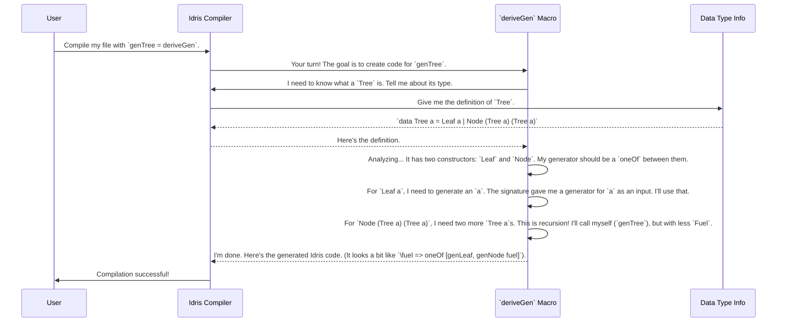

# Chapter 2: Automatic `Gen` Derivation

In the [previous chapter](01_the__gen__monad.md), we saw how to build "recipes" for random data by hand using the `Gen` monad. It's powerful, but for complex data structures, it can feel like writing out a five-course meal recipe from scratch every time you want to cook. What if you had a robot chef that could look at a picture of a dish and instantly write the recipe for you?

This is exactly what `DepTyCheck`'s automatic generator derivation does. This is the "magic" that makes the library so powerful and easy to use.

### The Problem: Too Much Boilerplate

Let's imagine a simple binary tree.

```idris
data Tree a = Leaf a | Node (Tree a) (Tree a)
```

If we wanted to write a generator for `Tree Int`, we'd have to write something recursive. We'd have to decide when to stop recurring (to avoid making an infinitely large tree), and we'd have to remember to combine all the choices correctly. It's doable, but it's tedious work that you have to repeat for every single data type you want to test.

This is where `deriveGen` comes to the rescue.

### The Magic: `deriveGen`

`deriveGen` is a function that you don't *call* at runtime; you use it to tell the Idris compiler to write code *for you* at compile time.

Let's write a generator for our `Tree` data type. All we need to do is:
1.  Define the signature of the generator we want.
2.  Set its implementation to `deriveGen`.

```idris
%language ElabReflection

import Deriving.DepTyCheck.Gen
import Test.DepTyCheck.Gen

data Tree a = Leaf a | Node (Tree a) (Tree a)

-- Our desired generator signature
genTree : (Fuel -> Gen MaybeEmpty a) => Fuel -> Gen MaybeEmpty (Tree a)
genTree = deriveGen
```

That's it! Let's break down this magical incantation.

*   `%language ElabReflection`: This is a special command for the Idris compiler. It translates to "Please enable your advanced self-inspection abilities." `DepTyCheck` needs this to look at your data type's definition.
*   `genTree = deriveGen`: This is the key. You're telling the compiler: "You see the `genTree` signature I wrote above? Please figure out how to implement it and fill in the code yourself."
*   `Fuel`: What's this? For recursive types like `Tree`, we need a way to stop the generator from making infinitely large trees. `Fuel` is just a number that tells the generator how "deep" it's allowed to go. Each time it makes a recursive call (like making the `Node` of a tree), it uses up some fuel. When it runs out, it can only pick non-recursive options (like `Leaf`).
*   `(Fuel -> Gen MaybeEmpty a) =>`: This part of the signature is an `auto` implicit argument. It tells `deriveGen`: "To build a `Tree a`, you will need a recipe for how to build an `a`. I expect you to find one in the context when you need it."

When the compiler sees `deriveGen`, it stops and thinks. It looks at the `Tree` data type, sees it can be a `Leaf a` or a `Node (Tree a) (Tree a)`, and automatically writes a generator that makes a random choice between the two, handling the recursion and fuel for you.

### Handling Dependent Types

This is where the magic really shines. Let's consider a vector with a length known at the type level, `Vect n a`. Writing a generator for this by hand is tricky. But with `deriveGen`, it's still just one line.

What if we want a generator that, given a length `n`, creates a `Vect` of exactly that length?

```idris
-- genInt is some generator for Integers we have elsewhere
genVectOfN : (n : Nat) -> (Fuel -> Gen MaybeEmpty Int) => Fuel -> Gen MaybeEmpty (Vect n Int)
genVectOfN = deriveGen
```

`DepTyCheck` is smart enough to see that the `n` in `Vect n Int` comes from the function's input. It will generate code that correctly produces a vector of exactly length `n`.

But what if we want to generate a `Vect` of some *random* length? We can tell `deriveGen` to generate the length for us too!

```idris
-- We assume a genNat to generate a random Nat is available
-- (we can even derive it with `genNat : Fuel -> Gen MaybeEmpty Nat = deriveGen`)
genAnyVect : (Fuel -> Gen MaybeEmpty Nat) => (Fuel -> Gen MaybeEmpty Int) => Fuel -> Gen MaybeEmpty (n ** Vect n Int)
genAnyVect = deriveGen
```

Look at the return type: `Gen MaybeEmpty (n ** Vect n Int)`. This is a dependent pair. It means "generate a pair where the first element is a `Nat` that we'll call `n`, and the second element is a `Vect n Int` whose length *depends on* that `n` we just generated."

Even for this complex, dependent requirement, the implementation is still just `deriveGen`. You describe *what* you want, and `DepTyCheck` figures out *how* to make it.

### Under The Hood: The Robot Chef at Work

How does this actually happen? It's a process called **elaborator reflection**. Think of it as the compiler having a conversation with `DepTyCheck`.

Here's a simplified step-by-step of what happens when the compiler sees `genTree = deriveGen`:



This all happens in a fraction of a second. You get a perfectly tailored, correct generator without writing any of the complex logic yourself.

The magic happens inside `Deriving/DepTyCheck/Gen.idr`. The main macro is defined very simply:

```idris
-- From: src/Deriving/DepTyCheck/Gen.idr

export %macro
deriveGen : DeriveBodyForType => Elab a
deriveGen = do
  Just signature <- goal
     | Nothing => fail "..."
  tt <- deriveGenExpr signature
  check tt
```

*   `%macro`: Tells Idris this is a special compile-time function.
*   `goal`: The macro asks the compiler: "What type do you want me to fill in?" This gives it the signature, like `Fuel -> Gen (Tree a)`.
*   `deriveGenExpr signature`: This is the real engine. It takes the type signature, performs all the analysis shown in the diagram, and builds a representation of the final Idris code. This is the core logic you can learn more about in [Derivation Core Engine](07_derivation_core_engine.md).
*   `check tt`: The macro gives the generated code back to the compiler and says, "Please use this!"

### Conclusion

You've now seen the most powerful feature of `DepTyCheck`: automatic `Gen` derivation. You've learned that:
-   Writing generators by hand can be tedious boilerplate.
-   `deriveGen` automates this process using the power of **elaborator reflection**.
-   You simply provide a **signature** for the generator you want, and `DepTyCheck` writes the implementation for you.
-   This works for simple types, recursive types (using `Fuel`), and even complex **dependent types**.

Now that we can easily generate random data for any type, how do we use it to actually run tests and check properties of our code? That's our next topic.

Next: [Testing Infrastructure](03_testing_infrastructure.md)

---

Generated by [AI Codebase Knowledge Builder](https://github.com/The-Pocket/Tutorial-Codebase-Knowledge)