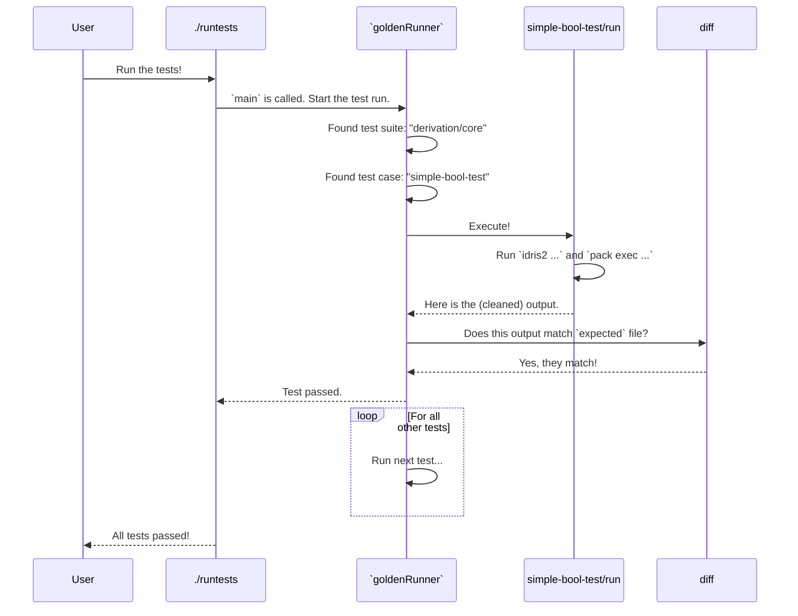

# Chapter 3: Testing Infrastructure

In the [previous chapter](02_automatic__gen__derivation.md), we saw the magic of `deriveGen` automatically writing random data generators for us. This is a very powerful, compiler-like feature. But with great power comes the need for great testing! How can we be sure that the code `deriveGen` creates is correct in dozens of different situations?

We need a way to test the tester. This chapter pulls back the curtain on the scaffolding that holds `DepTyCheck`'s extensive test suite together.

### The Problem: Testing a Code Generator

Imagine you've built a robot that assembles Lego kits. How would you test it? You wouldn't just watch it move its arms. You'd give it a a set of instructions, let it build the model, and then compare the finished model to the picture on the box.

Testing `deriveGen` is very similar. We need to:
1.  Write a tiny Idris program that uses `deriveGen` (the "instructions").
2.  Compile and run that program (let the "robot" build the model).
3.  Capture its output and compare it to a pre-written "correct" output file (the "picture on the box").

This is a classic technique called **golden testing**. Our testing infrastructure is designed to make running hundreds of these little golden tests simple and reliable.

### Anatomy of a Golden Test

In `DepTyCheck`, a single test isn't just one file. It's a small, self-contained **directory**. Let's look at the structure of a typical test case, which we'll call `simple-bool-test`:

```
tests/derivation/core/simple-bool-test/
├── DerivedGen.idr
├── expected
└── run
```

1.  `DerivedGen.idr`: The actual Idris code we want to test. It's a small program that uses `deriveGen` and then prints something to the console.
2.  `expected`: A plain text file containing the exact output we expect when we run our test. This is the "golden" file.
3.  `run`: A shell script that knows how to compile and run `DerivedGen.idr`.

Let's look inside each of these files.

#### The Code Under Test: `DerivedGen.idr`

This file contains the core logic for our test. For a simple `Bool` test, it might look like this. We'll use `deriveGen` to create a `Bool` generator and then print one of the trees of possible outcomes.

```idris
-- tests/derivation/core/simple-bool-test/DerivedGen.idr
%language ElabReflection

import Deriving.DepTyCheck.Gen
import Test.DepTyCheck.Pretty

genBool : Gen NonEmpty Bool
genBool = deriveGen

main : IO ()
main = putStrLn $ show $ prettyTree genBool
```
This is a complete program! It asks `deriveGen` to create a `Bool` generator, and then it prints a visualization of the generator's structure.

#### The Expected Output: `expected`

After running the `main` program above, we expect a specific output that shows `genBool` is a choice between `True` and `False`. This is what we save in the `expected` file.

```text
-- tests/derivation/core/simple-bool-test/expected
oneOf
- pure False
- pure True
```
This file is our "picture on the box." It's the standard against which we measure success.

#### The Runner: `run`

The `run` script is the engine that brings it all together. It's a small shell script that tells the computer how to execute the test. A simplified version looks like this:

```bash
# tests/derivation/core/simple-bool-test/run

# 1. Compile and run the Idris program
# 2. Pipe its output to a cleaning script
idris2 --check DerivedGen.idr && pack exec DerivedGen.idr | ./cleaner.sh
```

This script does two crucial things:
1.  It compiles the `DerivedGen.idr` file. If `deriveGen` produces bad code, this step will fail, and the test will fail.
2.  If it compiles, the script runs the program and pipes its output to a helper script.

Now, why do we need a "cleaning" script?

### Keeping Tests Stable with `.clean-names`

Compilers often generate unique, unstable names for internal variables, like `arg:123` or `$resolved456`. If we ran the same test twice, the output might be `arg:123` the first time and `arg:789` the second. This would cause our golden test to fail, even though the logic is identical!

The `.clean-names` script is a clever "find and replace" tool that fixes this. It reads the output from our program and replaces any unstable names with consistent, predictable ones (e.g., `arg:XXX1`, `$resolved:XXX1`).

```idris
-- From file: tests/.clean-names
-- An awk script that finds things like `arg:123` or `P:foo:4567`
-- and replaces the number with a stable counter, like `arg:XXX1` and `P:foo:XXX1`.

{
    out = ""
    while (match($0, /(P:[A-z]+:|arg:|...).*/)) {
        // ... logic to find and replace numbers ...
    }
    print out $0
}
```

Think of it as a gatekeeper that tidies up the output before we compare it to the `expected` file, ensuring our tests only fail when there's a *real* problem.

### The Orchestra Conductor: `Tests.idr`

We might have hundreds of these test directories. Running them one by one would be a nightmare. We need a main program to discover and run all of them automatically. This is the job of `Tests.idr`.

`Tests.idr` acts like an orchestra conductor. It doesn't play any instruments itself, but it points to all the musicians (our test directories) and tells them when to play. It uses a helper library, `golden-runner-helper`, to do the hard work.

```idris
-- From file: tests/Tests.idr
module Tests

import Test.Golden.RunnerHelper

main : IO ()
main = goldenRunner $
  [ "Derivation: core" `atDir` "derivation/core"
  , "Derivation: distribution" `atDir` "derivation/distribution"
  , "The `Gen` monad" `atDir` "lib/gen-monad"
  // ... and many more test suites ...
  ]
```

This main program defines a list of all the high-level test suites. The `goldenRunner` function then walks through these directories, finds every sub-directory with a `run` script and an `expected` file, and executes the test.

### Under The Hood: A Test Run

Let's visualize the entire process when you launch the test suite from your terminal.



This entire infrastructure allows `DepTyCheck` to test its most complex feature—the automatic code generation of `deriveGen`—in a robust, scalable, and maintainable way. Each test is small and isolated, making it easy to pinpoint exactly what went wrong when a test fails. This is crucial for a project that deals with something as intricate as the [Derivation Core Engine](07_derivation_core_engine.md).

### Conclusion

You've just taken a tour of the `DepTyCheck` testing infrastructure! It might seem like a lot of moving parts, but the core idea is simple and powerful. You learned:

-   `DepTyCheck` uses **golden testing** to verify its behavior.
-   A test is a directory containing Idris code (`DerivedGen.idr`), an expected output (`expected`), and a `run` script.
-   The `run` script compiles and executes the test code.
-   An output cleaning script (`.clean-names`) makes test results stable and predictable.
-   A central `Tests.idr` program acts as a "test runner" to orchestrate hundreds of tests across different categories.

This a-la-carte system allows for granular and precise testing of a compiler-like feature. Now that we've seen how `DepTyCheck` is tested, let's look at a more practical example of how you can *use* it to test your own programs.

Next: [Primitive Imperative Language (PIL) Examples](04_primitive_imperative_language__pil__examples.md)

---

Generated by [AI Codebase Knowledge Builder](https://github.com/The-Pocket/Tutorial-Codebase-Knowledge)