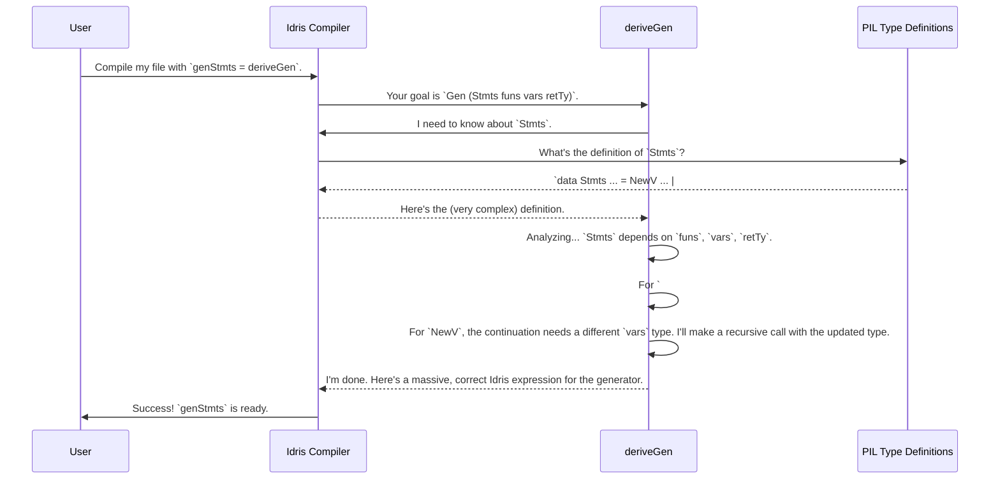

# Chapter 4: Primitive Imperative Language (PIL) Examples

In the [previous chapter](03_testing_infrastructure.md), we looked at the robust testing infrastructure that ensures `DepTyCheck` itself is reliable. This is like learning how the factory that builds a powerful engine is quality-controlled. Now, it's time to see that engine in action on a real-world challenge.

This chapter introduces the Primitive Imperative Language (PIL) examples. These aren't part of the core library, but they are the entire motivation for its existence. They serve as advanced "stress tests" that demonstrate the true power of `DepTyCheck`.

### The Ultimate Goal: Testing a Compiler

Imagine you are writing a compiler for a new programming language. How do you test it? You need to ensure it correctly translates valid programs and rejects invalid ones. A great way to do this is to generate thousands of random, syntactically-valid programs and feed them to your compiler.

But generating "valid programs" is incredibly difficult. A program is only valid if it follows all the language's rules:
-   You can't use a variable before it's declared.
-   You can't add an integer to a boolean.
-   You must call a function with the correct number and type of arguments.

In Idris, we can enforce these rules using the type system itself! Let's see what that looks like.

### A Glimpse of a "Primitive Imperative Language" (PIL)

A PIL is a tiny, toy programming language defined entirely within Idris's type system. Let's look at a simplified piece of a PIL called `pil-fun`, which has variables, functions, and statements.

The type for a program statement might look something like this:

```idris
-- Simplified from examples/pil-fun/src/Language/PilFun.idr
data Stmts : (funs : Funs) -> (vars : Vars) -> (retTy : MaybeTy) -> Type where
  -- Create a new variable and continue
  NewV : ... -> (cont : Stmts funs (vars :< ty) retTy) -> Stmts funs vars retTy

  -- Assign a value to a mutable variable
  (#=) : (n : IndexIn vars) -> -- The variable 'n' must be in scope
         AtIndex n ty Mutable => -- And it must be mutable
         ... ->
         Stmts funs vars retTy

  -- Return a value
  Ret  : Expr funs vars retTy -> Stmts funs vars (Just retTy)
  -- ... and many other kinds of statements
```

Don't worry about the exact details. Focus on the big picture: `Stmts funs vars retTy`. This is a dependent type. The type of a valid sequence of statements **depends on**:
1.  `funs`: The list of functions currently in scope.
2.  `vars`: The list of variables currently in scope.
3.  `retTy`: The return type the statement block is expected to produce.

When we create a new variable with `NewV`, notice the type of the continuation: `Stmts funs (vars :< ty) retTy`. The list of variables `vars` has been updated at the type level! The type system itself tracks the scope.

### The Problem: A Generator-Writing Nightmare

Now, back to our compiler testing goal. We need a `Gen (Stmts funs vars retTy)`. How would we write this by hand? Let's try to imagine it.

1.  To start, we'd need a `oneOf` to pick between `NewV`, `#=`, `Ret`, etc.
2.  If we pick `#=`, we first need to generate a valid `IndexIn vars`—an index of a variable that actually exists in the current scope `vars`.
3.  Then, we need to prove to the type checker that this variable is `Mutable`.
4.  Then, we need to generate an expression `Expr funs vars ty` that has the *same type* as that variable.
5.  If we pick `NewV`, we have to recursively call our generator with an *updated* `vars` list in its type.

This would be an incredibly complex, bug-prone generator to write by hand. And this is a *simplified* example! Maintaining all these dependent constraints manually is a herculean task.

### `deriveGen` to the Rescue

This is the exact problem `DepTyCheck` was built to solve. For these incredibly complex, dependently-typed data structures, we can still ask the compiler to write the generator for us.

To generate a valid program for our PIL, we just write the signature we want and let `deriveGen` do the work.

```idris
%language ElabReflection

import Deriving.DepTyCheck.Gen
import Language.PilFun -- Our toy language

-- A recipe to generate a valid program with a given context
genStmts : Fuel -> (funs : Funs) -> (vars : Vars) -> (retTy : MaybeTy)
         -> Gen MaybeEmpty (Stmts funs vars retTy)
genStmts = deriveGen
```
That's it. That one line, `genStmts = deriveGen`, is the whole point.

You tell `DepTyCheck` *what* you want: "a generator for a `Stmts` with this function context, this variable context, and this return type." `DepTyCheck` then inspects the `Stmts` data type, understands all the dependencies between constructors like `NewV` and `#=`, and builds the complex, recursive generator *for you*.

### Under the Hood: Analysis on a Grand Scale

How does this work? It's the same process we saw in [Automatic `Gen` Derivation](02_automatic__gen__derivation.md), but applied to a much more intricate type.



The `DepTyCheck` repository contains several of these PILs in the `examples/` directory (`pil-reg`, `pil-fun`, `pil-dyn`). They each explore different language features like mutable registers or dynamically-scoped variables, and each one is a testament to the power of automatic derivation for types that are too complex to handle manually.

For example, in `examples/pil-fun/`, a script `prebuild = "sh .derive-in-parallel"` is used in the package file. This script just tells the compiler to generate all the necessary PIL generators using `deriveGen` before building the main executable, which then uses those generators to test a compiler backend.

### Conclusion

You've now seen the primary motivation behind `DepTyCheck` and its most powerful application. The PIL examples show us that:

-   We can model complex systems like programming language rules using dependent types in Idris.
-   Writing random data generators for these systems by hand is often infeasible due to the sheer number of invariants and dependencies.
-   `deriveGen` can automatically and correctly create these generators, enabling powerful property-based testing for compilers, interpreters, or any other dependently-typed system.
-   This makes `DepTyCheck` an indispensable tool for ensuring the correctness of highly complex, dependently-typed software.

While `deriveGen` is incredibly powerful out-of-the-box, sometimes we need to guide it. What if we want to generate more `If` statements and fewer `NewV` statements? How can we influence the "shape" of the random data? That's what we'll explore next.

Next: [Generator Derivation Tuning](05_generator_derivation_tuning.md)

---

Generated by [AI Codebase Knowledge Builder](https://github.com/The-Pocket/Tutorial-Codebase-Knowledge)