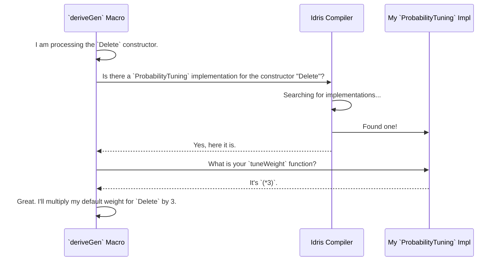

# Chapter 5: Generator Derivation Tuning

In the [previous chapter on PIL examples](04_primitive_imperative_language__pil__examples.md), we saw the incredible power of `deriveGen` to automatically create generators for even the most complex, dependently-typed data structures. It's like having a robot chef that can instantly write a recipe for any dish you show it.

But what if you have specific preferences? What if you want the dish to be extra spicy, or you want the vegetables cooked before the meat? The default recipe might be good, but it's not always perfect. This is where Generator Derivation Tuning comes in. It provides you with "control knobs" to guide the automatic derivation process.

### The Problem: We Need More Control

The `deriveGen` robot chef is brilliant, but it makes some simple assumptions:
1.  **Equal Probability**: When generating data for a type like `data X = A | B | C`, it will give `A`, `B`, and `C` an equal, one-third chance of being chosen. What if you want to test `A` more frequently?
2.  **Default Order**: When a constructor has multiple arguments, especially dependent ones, `deriveGen` tries to generate them in the order they are written. Sometimes, this is inefficient or even impossible.

Generator Derivation Tuning gives us two interfaces to solve these problems: `ProbabilityTuning` and `GenOrderTuning`.

### Knob 1: `ProbabilityTuning` (Changing the Spice Level)

Let's imagine you're testing a function that behaves differently for different constructors of a type.

```idris
data Command = Add | Delete | Modify
```

By default, `deriveGen` will create a generator that picks `Add`, `Delete`, and `Modify` with equal probability. But maybe the `Delete` case is the most complex and bug-prone. We want to test it more! We can use `ProbabilityTuning` to tell the robot chef to add more "Delete spice."

To do this, we provide a special `interface` implementation.

```idris
%language ElabReflection

import Deriving.DepTyCheck.Gen

-- The data type we are generating
data Command = Add | Delete | Modify

-- Our tuning implementation for the `Delete` constructor
ProbabilityTuning "Delete".dataCon where
  isConstructor = itIsConstructor
  tuneWeight = (*3)
```

Let's break this down:
*   `ProbabilityTuning "Delete".dataCon where`: This line says "I am providing tuning instructions for the constructor named `Delete`." The `.dataCon` part is a little bit of syntax to get the name just right for the compiler.
*   `isConstructor = itIsConstructor`: This is a magic safety check. It ensures that `Delete` is a real constructor. If you misspelled it, you'd get a compile-time error.
*   `tuneWeight = (*3)`: This is the actual instruction! It tells `deriveGen`: "Whatever the default probability weight for `Delete` was, multiply it by 3."

Now, when `deriveGen` creates the generator, `Delete` will be three times more likely to be generated than `Add` or `Modify`. You can also set it to a fixed weight, like `tuneWeight _ = 5`. It's that easy!

### Knob 2: `GenOrderTuning` (Cooking in the Right Order)

This knob is for more advanced, dependent-type scenarios. Let's look at a type that represents a pair of numbers where the first must be less than the second.

```idris
data SmallerPair : Type where
  MkPair : (n : Nat) -> (m : Nat) -> (LT n m) -> SmallerPair
```

To create a `SmallerPair`, `deriveGen` needs to generate `n`, `m`, and a proof that `n < m`. The default strategy is to generate them in order:
1.  Generate a random `n` (say, `10`).
2.  Generate a random `m` (say, `4`).
3.  Try to generate a proof that `10 < 4`. This is impossible! The generation fails.

The generator will eventually succeed by random chance, but it's very inefficient. A much better strategy is to generate `m` first, and *then* generate an `n` that is guaranteed to be smaller than `m`.

`GenOrderTuning` lets us give `deriveGen` this exact instruction.

```idris
GenOrderTuning "MkPair".dataCon where
  isConstructor = itIsConstructor
  deriveFirst _ _ = [`{m}, `{n}]
```

This tells the derivation engine:
*   `deriveFirst _ _ = ...`: "I'm telling you which arguments of `MkPair` to generate first."
*   `[`{m}, `{n}]`: "First, generate the argument named `m`. Then, generate the argument named `n`." The proof argument isn't mentioned, so it will be generated last.

Using this "hint," `deriveGen` will now follow a much smarter strategy:
1.  Generate a random `m` (say, `10`).
2.  Now, knowing `m` is `10`, generate a random `n` that is less than `10` (say, `4`).
3.  Finally, with `n=4` and `m=10`, generate the proof that `4 < 10`. This is always possible. Success!

This lets you fine-tune the generation strategy for complex dependent types without having to write the entire generator yourself.

### Under The Hood: How Does It Find Our Knobs?

How does `deriveGen` know to use our tuning implementations? It's all thanks to Idris's interface resolution system. Think of it like a chef consulting a special set of "preference cards" before cooking.

When `deriveGen` analyzes a data type and finds a constructor (like `Delete` or `MkPair`), it pauses and asks the Idris compiler a question.



This process happens automatically at compile-time. You simply define the tuning implementation, and `deriveGen` finds and uses it. This "a-la-carte" approach keeps your tuning logic separate from your data definitions and generators.

Let's peek at the source code for these interfaces.

```idris
-- Simplified from: src/Deriving/DepTyCheck/Gen/Tuning.idr

-- The interface for tuning probability weights
public export
interface ProbabilityTuning (0 n : Name) where
  isConstructor : ... -- The safety a check
  tuneWeight : Nat1 -> Nat1

-- The interface for tuning generation order
public export
interface GenOrderTuning (0 n : Name) where
  isConstructor : ... -- The safety a check
  deriveFirst : ... -> List (ConArg ...)
```

The interfaces are quite simple. They are parameterized by a `Name`, which is the name of the constructor we want to tune. `ProbabilityTuning` requires you to provide a function `tuneWeight` that transforms the default weight. `GenOrderTuning` requires a function `deriveFirst` that returns a list of arguments to prioritize. This is the core mechanism that connects your "preference cards" to the [Derivation Core Engine](07_derivation_core_engine.md).

### Conclusion

You've just learned how to take control of the automatic generator derivation process. While `deriveGen` is powerful on its own, its true flexibility comes from the ability to tune its behavior. You now know:

-   `deriveGen` makes default assumptions about probability and generation order.
-   The `ProbabilityTuning` interface acts like a "spice level" knob, allowing you to change the relative frequency of different constructors.
-   The `GenOrderTuning` interface is a powerful "recipe order" knob, letting you guide the generation process for complex dependent arguments.
-   These tunings are implemented as simple interfaces that `deriveGen` automatically discovers and uses at compile time.

You are now a master chef, able to not only generate random data automatically but also to sculpt its shape and distribution to meet your exact testing needs. But how can we be sure our carefully tuned generators are actually testing all the interesting parts of our program? Next, we'll explore how `DepTyCheck` helps you answer that question.

Next: [Model Coverage Reporting](06_model_coverage_reporting.md)

---

Generated by [AI Codebase Knowledge Builder](https://github.com/The-Pocket/Tutorial-Codebase-Knowledge)