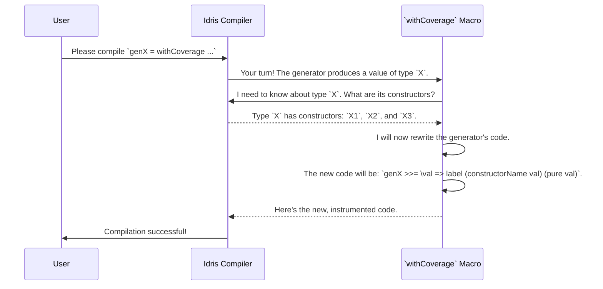

# Chapter 6: Model Coverage Reporting

In the [previous chapter](05_generator_derivation_tuning.md), you learned how to fine-tune your generators, acting like a master chef adjusting a recipe. But even a master chef tastes the dish to make sure it's right. After creating and tuning our generators, how can we be sure they are actually producing the variety of data we need? Are we testing all the interesting possibilities, or are our property-based tests repeatedly running on the same narrow slice of inputs?

This is where Model Coverage Reporting comes in. Think of it as a quality control inspector for your test data, giving you a detailed report on which parts of your data structures are being tested and, more importantly, which parts are being missed.

### The Problem: Test Data Blind Spots

Imagine we have a data type representing a simple UI element that can be a button, a checkbox, or a text input.

```idris
data UIElement = Button String | Checkbox Bool | TextInput String
```

We write a generator for `UIElement` to use in our property-based tests. But what if, due to a mistake in our generator's logic, it *only ever generates* `Button` and `Checkbox` values? Our tests for `TextInput` would never run! Our test suite would pass, but it would have a massive blind spot, giving us a false sense of security.

We need a way to ask: "Over the course of 100 test runs, which constructors of `UIElement` were actually generated?"

### The Solution: Tracking with `withCoverage`

`DepTyCheck` provides a simple way to enable this tracking: the `withCoverage` wrapper. You simply wrap it around an existing generator, and it starts keeping score.

Let's create a flawed generator for a type `X` that intentionally misses one of its constructors.

```idris
data X = X1 | X2 Nat | X3 String

-- This generator will never produce an `X2`!
genX : Fuel -> Gen NonEmpty X
genX fl = withCoverage $ oneOf
  [ pure X1
  , [| X3 "some string" |]
  ]
```

By wrapping our generator in `withCoverage`, we're telling `DepTyCheck`: "Please watch what this generator produces and be ready to report on it." It's like attaching a tiny GPS tracker to every value that gets created.

### How to Generate and Read the Report

Generating a coverage report is a three-step process:

1.  **Initialize a Report Card**: Create an empty "report card" for the generator you want to inspect.
2.  **Run and Collect Data**: Run the generator many times and collect all the "tracker" data.
3.  **Fill and Print the Report**: Use the collected data to fill in the report card and then print it to see the results.

Let's see the code for this process.

```idris
import Test.DepTyCheck.Gen.Coverage

-- Step 1: Initialize the "report card"
let coverageReport = initCoverageInfo genX

-- Step 2: Run the generator 100 times and collect the coverage data
let generatedData = unGenTryND 100 someSeed (genX (limit 10))
let rawCoverage = concatMap fst generatedData

-- Step 3: Fill the report card and print it
let finalReport = registerCoverage rawCoverage coverageReport
putStrLn $ show finalReport
```

*   `initCoverageInfo genX`: This macro looks at `genX`, sees that it produces type `X`, and creates a blank report for `X` and all its constructors (`X1`, `X2`, `X3`).
*   `unGenTryND 100 ...`: This function runs our generator 100 times. It returns a list of pairs: `(rawCoverageData, generatedValue)`. We only care about the first part.
*   `registerCoverage ...`: This function takes our blank report and all the raw data we collected, tallies up the scores, and produces the final, filled-in report.

When we run this, `putStrLn` will print a beautifully formatted and colored report (colors shown here as text):

```text
X [covered partially] (100 times)
  - X1: [covered] (50 times)
  - X2: [not covered]
  - X3: [covered] (50 times)
```

The report immediately tells us the story:
*   The type `X` was "covered partially" because not all of its constructors were hit.
*   `X1` and `X3` were successfully generated 50 times each.
*   `X2` was **`[not covered]`**. We've found our blind spot!

With this information, we can go back and fix our generator, confident that we know exactly where the problem is.

### Under The Hood: How Tracking Works

This whole process relies on two key pieces of magic: the `withCoverage` macro and the `Writer` monad.

#### The `withCoverage` Macro

`withCoverage` isn't a normal function; it's a compile-time macro. When the Idris compiler sees `withCoverage genX`, a conversation happens.


The macro effectively rewrites your generator. It takes the original generator and chains it with a `label` call. This `label` call inspects the generated value (like `X1`), turns its constructor name into a `String` ("X1"), and records it.

This happens at compile-time, so the instrumentation is baked directly into your generator, making it very efficient.

#### Collecting Labels with `unGenD`

So how are these labels recorded? This is where the `Writer` monad comes in. The functions `unGenD` and `unGenTryND` (from `src/Test/DepTyCheck/Gen/Coverage.idr`) run your generator in a special context that listens for `label` calls.

```idris
-- Simplified from: src/Test/DepTyCheck/Gen/Coverage.idr
export
unGenD : ... => Gen em a -> m (ModelCoverage, a)
unGenD = map swap . runWriterT . unGen {m = WriterT ModelCoverage ...}
```
Every time a `label` is encountered during generation, the `WriterT ModelCoverage` context "writes down" the label in a log. `ModelCoverage` is just a fancy name for a map of labels to their counts.

After the generator finishes, `unGenD` gives you back two things: the final generated value and the complete log of all labels encountered along the way.

Finally, `registerCoverage` is a simple function that iterates through this log and updates the counters in the pretty `CoverageGenInfo` report card we initialized earlier. It connects the raw label `"X1"` to the `X1` constructor of type `X` in the report.

### Conclusion

You've just learned how to use `DepTyCheck` to audit your own generators, ensuring your tests are as thorough as you think they are. You now know that:
-   Property-based testing can have **blind spots** if your generators are incomplete.
-   Model Coverage Reporting helps you find these blind spots.
-   You enable tracking by wrapping your generator with `withCoverage`.
-   A three-step process of **initialize, collect, and register** produces a human-readable report.
-   The report clearly shows which types and constructors were `covered` and which were `not covered`.
-   This is powered by a compile-time macro (`withCoverage`) and a `Writer`-based generator runner (`unGenD`).

We've now seen how to build, tune, and monitor our generators. But what is the true engine at the heart of `deriveGen` that makes all of this possible in the first place? In the next chapter, we'll dive deep into that engine and see how `DepTyCheck` analyzes your types.

Next: [Derivation Core Engine](07_derivation_core_engine.md)

---

Generated by [AI Codebase Knowledge Builder](https://github.com/The-Pocket/Tutorial-Codebase-Knowledge)