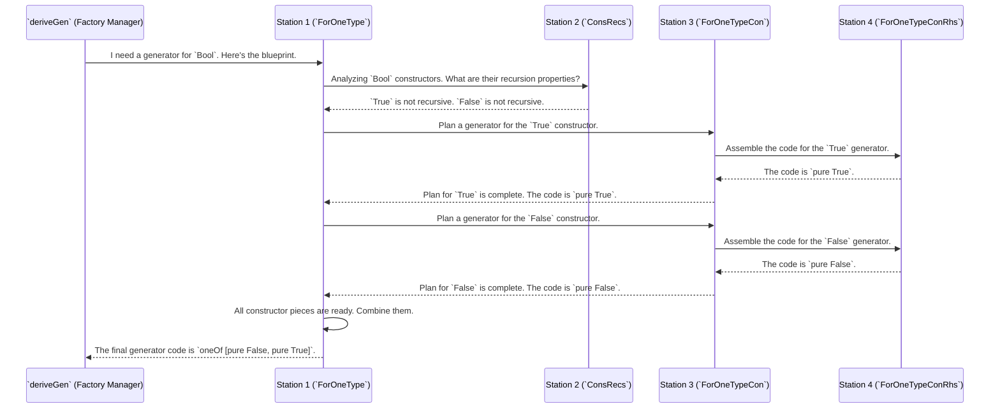

# Chapter 7: Derivation Core Engine

In the [previous chapter on Model Coverage Reporting](06_model_coverage_reporting.md), we saw how to check that our generators are producing a good variety of test data. We've learned to write, derive, tune, and audit our generators. But the biggest piece of magic, `deriveGen`, remains a bit of a black box. How does it actually look at a type and write a complex generator all by itself?

This chapter opens the hood and shines a light on the engine room of `deriveGen`: the **Derivation Core Engine**.

### The Problem: How Do You Automate Code Writing?

Let's think about our simple `Vect` example from an earlier chapter.

```idris
data Vect : Nat -> Type -> Type where
  Nil  : Vect Z a
  (::) : a -> Vect k a -> Vect (S k) a
```

`deriveGen` needs to write a function that, given `n`, generates a `Vect n a`. This involves:
1.  Knowing which constructor to use for a given `n` (`Nil` for `Z`, `::` for `S k`).
2.  Knowing how to handle recursion for the `::` case.
3.  Knowing it needs a generator for `a` to build the elements.
4.  Putting it all together into a final, valid Idris code expression.

Doing this for one type is hard. Doing it for *any* possible dependently-typed data structure is a monumental task. The Derivation Core Engine solves this problem by not solving it all at once. Instead, it breaks the task down into a pipeline of smaller, more manageable stages, just like an assembly line in a factory.

### The Assembly Line for Generators

Imagine a factory that builds custom generators. `deriveGen` is the factory manager. When you ask it to build a generator, it sends the order down an assembly line. This assembly line is the Derivation Core Engine.

Each station on the line has one specific job. They are connected by "conveyor belts" which are, in our case, Idris `interface`s. This modular design is the key to managing the complexity.

Here are the main stations on the assembly line:

1.  **Station 1: Reading the Blueprint (`ForOneType`)**.
    The process starts here. This station takes the overall goal (e.g., "build a `Gen (Vect n a)`) and creates a plan. It decides that to build a generator for `Vect`, it needs to build small generator pieces for `Nil` and `::`. It then sends these smaller jobs down the line.

2.  **Station 2: Analyzing the Parts (`ConsRecs`)**.
    This is the quality control and logistics station. It looks at each constructor (`Nil`, `::`) and determines its properties. Is it recursive? (`::` is, `Nil` is not). How does it affect `Fuel`? This analysis is crucial and is covered in detail in the chapter on [Recursion and Weight Analysis](08_recursion_and_weight_analysis.md).

3.  **Station 3: Planning the Assembly Order (`ForOneTypeCon`)**.
    This station receives a job for a *single constructor*, like `::`. It's a planning station. For `(val : a) -> (tail : Vect k a) -> Vect (S k) a`, it must decide the order of operations. Should it generate `val` first, then `tail`? Or maybe the other way around? This is especially important for dependent types where one argument's type depends on another's value.

4.  **Station 4: Assembling the Code (`ForOneTypeConRhs`)**.
    This is the final assembly station. It takes the plan from Station 3 and generates the actual Idris code for that one constructor's generator. For `::`, it will write code that looks something like this (in spirit): `do val <- gen_a; tail <- gen_vect_k; pure (val :: tail)`.

This pipeline allows `DepTyCheck` to tackle the huge problem of generator derivation one small, well-defined piece at a time.

### Under the Hood: A Walkthrough

Let's trace a simple request through the assembly line. Suppose the compiler sees `genBool : Gen Bool = deriveGen` for `data Bool = True | False`.



Each stage communicates with the next, passing along its results. The final result is a complete, well-formed piece of Idris code that `deriveGen` gives back to the compiler.

### The Interfaces: Our Conveyor Belts

This modular design is made possible by a set of interfaces. Each "station" implements an interface, promising to do a specific job.

The primary interface is `DeriveBodyForType`, found in `src/Deriving/DepTyCheck/Gen/ForOneType/Interface.idr`. This is our "Station 1".

```idris
-- Simplified from the actual source code
public export
interface DeriveBodyForType where
  -- Given a generator signature, produce the body of the function.
  canonicBody : GenSignature -> Name -> m (List Clause)
```
Its job is to orchestrate the whole process for a given type. A simplified implementation would look like this:

```idris
-- Simplified from Deriving/DepTyCheck/Gen/ForOneType/Impl.idr
instance DeriveBodyForType where
  canonicBody sig name = do
    -- For each constructor of the target type...
    consBodies <- for sig.targetType.cons $ \con =>
      -- ...ask the next station (`canonicConsBody`) to plan the generator for it.
      canonicConsBody sig con

    -- Combine the results from all constructors into a `oneOf [...]`.
    pure [ finalClause (combineWithOneOf consBodies) ]
```

This implementation passes the work for each individual constructor on to the next station in the pipeline, `canonicConsBody`, which lives in `src/Deriving/DepTyCheck/Gen/ForOneTypeCon/Impl.idr`. This function is "Station 3", which plans the assembly. It, in turn, calls out to the code-building "Station 4", which is governed by the `DeriveBodyRhsForCon` interface.

```idris
-- Simplified from Deriving/DepTyCheck/Gen/ForOneTypeRhs/Interface.idr
public export
interface DeriveBodyRhsForCon where
  -- Given a signature, a constructor, and other info,
  -- generate the code for that one constructor's generator.
  consGenExpr : ... -> m TTImp
```

This demonstrates the pipeline in action: `DeriveBodyForType` iterates through constructors and calls a helper (`canonicConsBody`), which analyzes dependencies and then calls `consGenExpr` to finally build the code for that small part. This separation of concerns is what makes the system powerful and extensible.

### Conclusion

You've now had a tour of the engine room behind `deriveGen`. You've learned that:

-   The **Derivation Core Engine** is a modular pipeline for building generators, much like an assembly line.
-   It breaks the complex problem of code generation into smaller, manageable stages: planning for the whole type, analyzing constructors, planning for one constructor, and assembling the final code.
-   These stages are connected by `interface` "conveyor belts" that pass work from one station to the next.
-   This modularity allows `DepTyCheck` to handle the immense complexity of deriving generators for arbitrary dependent types.

We've mentioned that "Station 2" is responsible for analyzing constructors to see if they are recursive. This is a critical step that controls how `Fuel` is used and prevents infinite generation loops. In the next chapter, we'll zoom in on exactly how this station works.

Next: [Recursion and Weight Analysis](08_recursion_and_weight_analysis.md)

---

Generated by [AI Codebase Knowledge Builder](https://github.com/The-Pocket/Tutorial-Codebase-Knowledge)