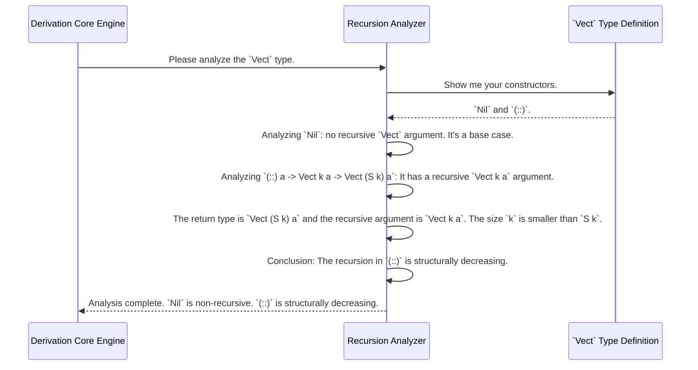

# Chapter 8: Recursion and Weight Analysis

In the [previous chapter](07_derivation_core_engine.md), we explored the `DepTyCheck` factory floor—the **Derivation Core Engine**—and saw how it builds generators piece by piece. We mentioned a crucial quality control station that analyzes each part for its "recursive properties." Welcome to that station.

Think of Recursion and Weight Analysis as the chief structural engineer of the `deriveGen` factory. Before any construction begins, the engineer must examine the blueprints (your data type definitions) to understand how the structure holds itself up. This analysis is vital for building generators that are both safe (they don't run forever) and smart (they handle dependent types correctly).

### The Problem: Infinite Loops and Smarter Generation

When `deriveGen` sees a recursive type, it faces a major challenge: how to avoid getting stuck in an infinite loop?

Consider a simple `List`:
```idris
data List a = Nil | Cons a (List a)
```
If we tell `deriveGen` to make a `List`, and it decides to use the `Cons` constructor, it then needs to generate *another* `List`. If it always picks `Cons`, it will try to build a `List` of infinite length, and our program will never finish.

Now consider a `Vect`, a list with a length encoded in its type:
```idris
data Vect : Nat -> Type -> Type where
  Nil  : Vect Z a
  (::) : a -> Vect k a -> Vect (S k) a
```
If we ask for a `Vect 3 Int`, the generator should be much smarter. It absolutely *must* pick the `::` constructor three times and then `Nil` once. It shouldn't need a generic "stop!" mechanism; the type itself tells it when to stop.

The job of Recursion and Weight Analysis is to distinguish between these two scenarios.

### Concept 1: "Fuel-Spending" Recursion

For a type like `List`, where the recursion isn't controlled by a size parameter in the type, `DepTyCheck` uses a concept called `Fuel`. We saw this in earlier chapters. `Fuel` is like a tank of gas.
- The generator starts with a full tank.
- Every time it makes a "fuel-spending" recursive call (like using `Cons`), it uses up one unit of fuel.
- When the fuel runs out (`Dry`), it can only choose non-recursive options (like `Nil`).

The Recursion and Weight Analysis engine looks at `List`, inspects the `Cons` constructor, sees the recursive `List a` argument, and labels it: **"This is fuel-spending recursion."** This tells the [Derivation Core Engine](07_derivation_core_engine.md) to generate code that checks the `Fuel` level before making a recursive call.

### Concept 2: "Structurally Decreasing" Recursion

For a type like `Vect`, the situation is different. When generating a `Vect (S k) a`, the recursive part is a `Vect k a`. The recursion is on a type whose size parameter `k` is "structurally smaller" than the original `(S k)`.

The analysis engine spots this pattern and labels the `::` constructor's recursion differently: **"This is structurally decreasing recursion on a known-sized type."**

This is a powerful insight! It means the generator doesn't need to spend `Fuel`. The recursion will naturally terminate when the size parameter hits its base case (like `Z` for `Vect`). The "weight" or complexity of generating a `Vect n a` isn't some arbitrary fuel number; it's directly proportional to `n`. This allows `deriveGen` to create much more efficient and precise generators.

### Under the Hood: The Engineer's Report

When the [Derivation Core Engine](07_derivation_core_engine.md) tasks the recursion analyzer with inspecting a type, the analyzer produces a detailed report. Let's see how this works for `Vect`.



This report is then used by the other factory stations to build the final generator. The code for `(::)` will not check for fuel; instead, it will just make a recursive call for `Vect k a`.

This entire analysis is performed by code in the `Deriving/DepTyCheck/Gen/ConsRecs.idr` file. Let's look at the data structures that represent the engineer's report.

First, here is the type that represents the different kinds of recursion:
```idris
-- Simplified from: src/Deriving/DepTyCheck/Gen/ConsRecs.idr
public export
data RecWeightInfo : Type where
  SpendingFuel : ... -> RecWeightInfo
  StructurallyDecreasing : (decrTy : TypeInfo) -> (wExpr : TTImp) -> RecWeightInfo
```
- `SpendingFuel`: This represents our `List` scenario. The analysis has concluded that recursion here will consume `Fuel`.
- `StructurallyDecreasing`: This represents our `Vect` scenario. The analysis has found a parameter that gets smaller with each call.

This information is then stored for each constructor.
```idris
-- Simplified from: src/Deriving/DepTyCheck/Gen/ConsRecs.idr
public export
record ConWeightInfo where
  constructor MkConWeightInfo
  weight : Either Nat1 RecWeightInfo
```
- For a non-recursive constructor like `Nil`, the `weight` will be `Left 1` (a simple, constant weight).
- For a recursive constructor like `::` (for `Vect`), the `weight` will be `Right (StructurallyDecreasing ...)`.
- For `Cons` (for `List`), the `weight` will be `Right (SpendingFuel ...)`.

The main function `getConsRecs` is the analyzer itself. It iterates through all known data types, inspects every constructor, and fills out these `ConWeightInfo` records. The `isRecursive` helper function and other logic inside `getConsRecs` are responsible for figuring out exactly which kind of recursion is happening.

This detailed pre-analysis is what makes `deriveGen` so smart. It's not just blindly creating recursive calls; it's performing a sophisticated, type-level static analysis to understand the *nature* of the recursion before writing a single line of generator code.

### Conclusion

You've just learned about the "structural engineer" of `DepTyCheck`, the Recursion and Weight Analysis component. This critical step ensures that automatically derived generators are safe and efficient. You now know that:

-   The analysis distinguishes between two main kinds of recursion.
-   **Fuel-spending recursion** is for types like `List`, where a `Fuel` mechanism is needed to guarantee termination.
-   **Structurally decreasing recursion** is for types like `Vect`, where recursion on a size parameter naturally leads to termination.
-   This analysis is performed at compile-time by inspecting the type definitions.
-   The results are stored in data structures like `RecWeightInfo` and are used by the [Derivation Core Engine](07_derivation_core_engine.md) to generate the correct code for each constructor.

This analysis is incredibly powerful, but sometimes a constructor's arguments are themselves complex function applications. How does `DepTyCheck` handle those? In the next chapter, we'll dive into another deep analysis component that tackles just that.

Next: [Deep Constructor Application Analysis](09_deep_constructor_application_analysis.md)

---

Generated by [AI Codebase Knowledge Builder](https://github.com/The-Pocket/Tutorial-Codebase-Knowledge)