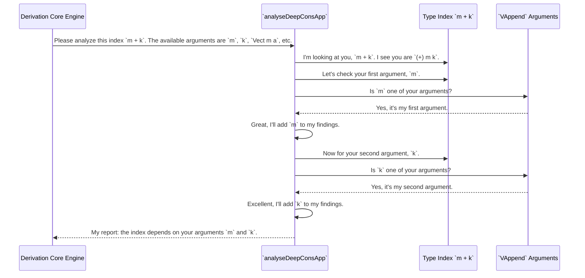

# Chapter 9: Deep Constructor Application Analysis

In the [previous chapter](08_recursion_and_weight_analysis.md), we saw how `DepTyCheck` acts like a structural engineer, analyzing your data types to understand their recursive nature. That analysis helps build safe, terminating generators. But sometimes, the complexity isn't in the recursion, but in the very definition of a single constructor, especially with GADTs (Generalized Algebraic Data Types).

This chapter introduces a highly specialized tool from `DepTyCheck`'s analysis toolkit: **Deep Constructor Application Analysis**. Think of it as a forensic specialist who can take a complex piece of evidence—a type index—and break it down into its fundamental components.

### The Problem: When Types Are Equations

In Idris, we can use GADTs to enforce complex rules. Let's imagine we're building a data structure for vector operations, and we want a constructor for appending two a vectors.

```idris
data Vect : Nat -> Type -> Type where
  Nil  : Vect 0 a
  (::) : a -> Vect k a -> Vect (S k) a

data VecOp : (len : Nat) -> Type -> Type where
  VAppend : (m : Nat) -> (k : Nat) ->
            Vect m a -> Vect k a -> VecOp (m + k) a
```

The type of `VAppend` is fascinating. It creates a `VecOp` where the length parameter `len` is defined by an equation: `m + k`.

Now, imagine we ask `deriveGen` to create a generator for `VecOp 5 String`. How would it handle `VAppend`? A naive approach would be disastrously inefficient:
1.  Generate a random number `m` (say, `10`).
2.  Generate a random number `k` (say, `12`).
3.  Check: is `10 + 12 == 5`? No. This attempt fails.
4.  Try again... and again... and again. The chances of randomly picking two numbers that sum to `5` are extremely low.

`DepTyCheck` needs to be much smarter. It needs to look at the type index `m + k` and understand that it's an equation built from the constructor's arguments. It needs to know that to generate a `VecOp 5 a`, it must find `m` and `k` that satisfy `m + k = 5`.

This is precisely the job of Deep Constructor Application Analysis.

### A Forensic Analysis of Types

Deep Constructor Application Analysis (DCAA) is the tool the [Derivation Core Engine](07_derivation_core_engine.md) uses to dissect these complex type indices. When it encounters `VAppend`, it doesn't just see the arguments `m`, `k`, `Vect m a`, and `Vect k a`. It also sends the result type index, `VecOp (m + k) a`, to the DCAA specialist for analysis.

The analysis process is like a detective examining a complex device:
1.  **Isolate the interesting part:** The analyzer focuses on the index `m + k`.
2.  **Break it down:** It sees that `m + k` is actually the function `(+)` applied to two arguments.
3.  **Identify the components:** It identifies these arguments as `m` and `k`.
4.  **Cross-reference suspects:** It checks if `m` and `k` are in the list of `VAppend`'s formal arguments. Yes, they are!
5.  **File the report:** The analyzer reports back to the main engine: "The result index is built by applying `(+)` to your first two arguments, `m` and `k`."

Armed with this report, the derivation engine can devise a much more intelligent plan:
1.  **To get `m + k = 5`**: First, generate an `m` that is at most `5`. Let's say it generates `m = 2`.
2.  **Solve for the rest**: The engine now knows `k` *must* be `3`. There is no other choice.
3.  **Generate dependents**: Now that it has `m = 2` and `k = 3`, it can proceed to generate the dependent vectors: a `Vect 2 a` and a `Vect 3 a`.

This is orders of magnitude more efficient and is the key to handling GADTs with complex indices.

### Under The Hood: The `analyseDeepConsApp` Function

This analysis is not magic; it's a recursive function that walks through Idris expressions at compile-time. The heart of the DCAA is the `analyseDeepConsApp` function, found in `src/Deriving/DepTyCheck/Util/DeepConsApp.idr`.

Let's look at a simplified sketch of its purpose:
```idris
-- From: src/Deriving/DepTyCheck/Util/DeepConsApp.idr

-- Simplified for clarity
analyseDeepConsApp : (freeNames : Set Name) -> -- The constructor's arguments
                     (analysedExpr : TTImp) -> -- The expression to analyze (e.g., m + k)
                     m (List Name)             -- Returns the arguments used in the expression
```
This function takes the set of available argument names (like `m` and `k`) and the expression to analyze. It returns a list of the arguments it found inside that expression.

The process is visualized below:



### The "Fill-in-the-Blanks" Template (`BindExprFun`)

The analysis is even more clever than just returning a list of names. It also returns a "template" of the original expression with holes where the arguments used to be. This is represented by `BindExprFun`.

For our `m + k` example, the template is essentially `(+) <hole1> <hole2>`.

The `BindExprFun` is a function that lets you fill in those holes. This is incredibly useful for the code-generation part of the engine. It means the engine can reconstruct the original expression or a modified version of it without having to re-parse it. This keeps the different parts of the [Derivation Core Engine](07_derivation_core_engine.md) neatly separated.

Here is the data type that holds the result of the analysis. Notice how it returns both the list of names and the "fill-in-the-blanks" function.
```idris
-- Simplified from: src/Deriving/DepTyCheck/Util/DeepConsApp.idr

public export
BindExprFun : Nat -> Type
BindExprFun n = (Fin n -> TTImp) -> TTImp -- A function to fill `n` holes

public export
DeepConsAnalysisRes : Type
DeepConsAnalysisRes = (appliedFreeNames : List Name ** BindExprFun appliedFreeNames.length)
```
So, `analyseDeepConsApp` gives the engine a complete package: a list of dependencies and a reusable template of the expression structure.

### Conclusion

You've just explored one of the most specialized and powerful analysis tools in `DepTyCheck`. Deep Constructor Application Analysis is the reason `deriveGen` can so intelligently handle GADTs.

You've learned that:
-   GADT constructors can have type indices that are complex expressions, like `m + k`.
-   **Deep Constructor Application Analysis (DCAA)** is a tool that breaks down these expressions to find out which constructor arguments they depend on.
-   This information allows `deriveGen` to create a smart generation plan, drastically improving efficiency and enabling the generation of values that satisfy complex type-level equations.
-   Under the hood, this is powered by the `analyseDeepConsApp` function, which recursively analyzes an expression and returns not just the dependencies but also a reusable "template" of the expression.

This analysis focused on the result type of a *single constructor*. But what about the overall goal of the entire generator? For example, how does `deriveGen` understand a request for a `Gen (n ** Vect n a)` versus a `Gen (Vect 5 a)`? The final chapter of our deep dive into the engine will cover precisely that.

Next: [Generator Signature Analysis](10_generator_signature_analysis.md)

---

Generated by [AI Codebase Knowledge Builder](https://github.com/The-Pocket/Tutorial-Codebase-Knowledge)