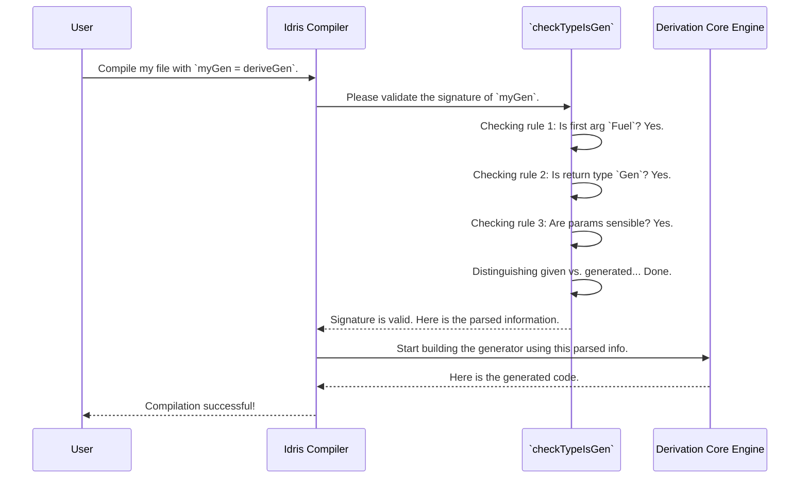

# Chapter 10: Generator Signature Analysis

Welcome to the final chapter of our deep dive into `DepTyCheck`'s internals! In the [previous chapter on Deep Constructor Application Analysis](09_deep_constructor_application_analysis.md), we saw how a specialized tool could dissect complex type-level equations. We've explored the factory floor, the structural engineers, and the forensic specialists. Now, we arrive at the very beginning of the process: the reception desk.

Generator Signature Analysis is the front door to the entire `deriveGen` factory. Before any complex analysis or code generation can begin, this component meticulously validates the generator signature you've provided. It's like a bouncer at an exclusive club, checking your ID to make sure everything is in order before letting you in. This early validation is crucial for providing clear, helpful error messages instead of letting you get lost in the machinery inside.

### The Problem: Garbage In, Garbage Out

Imagine you're trying to use `deriveGen`, but you make a small mistake in the type signature.

```idris
-- A tiny mistake: we forgot the Fuel argument!
genMyType : Gen MaybeEmpty MyType
genMyType = deriveGen
```

Without a good "bouncer," the [Derivation Core Engine](07_derivation_core_engine.md) might start its complex work, only to crash halfway through with a confusing, internal error message. The problem is simple, but the feedback would be anything but.

The goal of Generator Signature Analysis is to catch these simple mistakes immediately and give you a precise, actionable error message.

### The Bouncer's Checklist

When you write `myGen = deriveGen`, the signature analysis component immediately grabs the type signature of `myGen` and runs it through a strict checklist. Here are the most important rules it enforces:

1.  **Is `Fuel` the First Argument?** Every derived generator for a potentially recursive type needs a `Fuel` argument to ensure termination. The analysis checks that the very first argument of your function is of type `Fuel`.
2.  **Is the Return Type a `Gen`?** The whole point is to create a generator. The analysis verifies that the final return type is a `Gen MaybeEmpty ...`.
3.  **Are All Parameters Sensible?** It checks that all other function arguments are clearly named and are not strange kinds (like `0`-multiplicity erased arguments), which `deriveGen` doesn't support.
4.  **Are There Any Duplicate Names?** It ensures that all parameters, both given and generated, have unique names.

If your signature passes all these checks, you're granted access. If not, you're stopped at the door with a helpful tip on how to fix your "ID."

Let's look at some examples from `DepTyCheck`'s own test suite.

#### Example 1: Missing `Fuel`

Here's a common mistake, straight from `tests/derivation/inputvalidation/bad-fuel/ValidateInput.idr`.

```idris
-- Missing the Fuel argument
genY_noFuel_given : (a, b : Type) -> Gen MaybeEmpty $ Y a b
genY_noFuel_given = deriveGen
```

The signature analysis immediately flags this. Instead of a cryptic crash, you get a clear error at compile time:

> **Error:** No arguments in the generator function signature, at least a fuel argument must be present.

#### Example 2: `Fuel` in the Wrong Place

The `Fuel` argument must be the very first one.

```idris
-- Fuel is not the first argument
genY_missplFuel_aft : (a, b : Type) -> Fuel -> Gen MaybeEmpty $ Y a b
genY_missplFuel_aft = deriveGen
```

Again, the analysis catches this and points you to the problem:

> **Error:** The first argument must be explicit, unnamed, present at runtime and of type `Fuel`.

#### Example 3: Invalid Auto-Implicit Argument

This component also validates "external" generators provided as auto-implicits. It checks that they, too, are valid generator signatures.

```idris
-- The auto-implicit argument `List Int` is not a generator!
genY_nongen_autoimpl_list_nofuel : Fuel -> List Int => ...
genY_nongen_autoimpl_list_nofuel = deriveGen
```

You'll get a descriptive error telling you that one of your dependencies is not a valid generator.

### Distinguishing Given vs. Generated

One of the most important jobs of this analysis is to figure out which parts of your type you want to *generate* and which parts you are providing as *inputs*. It does this by comparing the function arguments to the arguments of the dependent pair in the return type.

Consider these two signatures:

```idris
-- `n` is a GIVEN input
genVectOfN : Fuel -> (n : Nat) -> Gen MaybeEmpty (Vect n Int)

-- `n` will be GENERATED
genAnyVect : Fuel -> Gen MaybeEmpty (n ** Vect n Int)
```
The signature analyzer looks at the return type.
-   In `genVectOfN`, the return type is just `Gen (Vect n Int)`. It sees `n` is *not* inside a dependent pair `(**)` in the `Gen`, so it concludes that `n` must be a "given" parameter, which it expects to find in the function's arguments.
-   In `genAnyVect`, the return type is `Gen (n ** Vect n Int)`. The `n ** ...` tells the analyzer that `n` is a parameter "to be generated."

This distinction is fundamental to how the rest of the derivation engine plans its work.

### Under The Hood: The `checkTypeIsGen` Function

The main entry point for this whole process is a function called `checkTypeIsGen`, located in `src/Deriving/DepTyCheck/Gen.idr`. When `deriveGen` is called, it immediately passes the goal signature to this function.

Here's a simplified visualization of what happens:



Let's peek at a few simplified snippets from `checkTypeIsGen` to see how it performs these checks at compile-time.

**1. Checking for `Fuel`:**
The function first breaks the signature `sig` into its arguments and return type. Then it checks the very first argument.

```idris
-- Simplified from: src/Deriving/DepTyCheck/Gen.idr

let (sigArgs, sigResult) = unPi sig

-- check that there are at least some parameters
let (firstArg::sigArgs) = sigArgs
  | [] => failAt ... "at least a fuel argument must be present"

-- check the type of the fuel argument
unless !(firstArg.type `isSameTypeAs` `{Fuel}) $
  failAt ... "The first argument must be of type `Fuel`"
```

**2. Checking the Return Type:**
Next, it inspects the return type `sigResult` to ensure it's a `Gen MaybeEmpty ...`.

```idris
-- check the resulting type is `Gen`
let IApp _ (IApp _ (IVar _ genName) ...) targetType = sigResult
  | _ => failAt ... "The result must be of type `Gen MaybeEmpty ...`"

unless !(genName `isSameTypeAs` `{Test.DepTyCheck.Gen.Gen}) $
  failAt ... "The result type must be of type `Gen`"
```

**3. Parsing Given vs. Generated:**
Finally, it looks at `targetType` to see if it's a dependent pair. This is how it distinguishes what to generate versus what is given.

```idris
-- treat the generated type as a dependent pair
let Just (paramsToBeGenerated, targetType) = unDPairUnAlt targetType
  | Nothing => ... -- It's not a DPair, so nothing is generated.

-- Now it has a list of `paramsToBeGenerated` and a list of `givenParams`
-- from the function arguments. It can pass this info to the next stage.
```
Once all these checks pass, `checkTypeIsGen` packages all the information it has gathered—the target type, the given parameters, the parameters to be generated—into a neat record and hands it off to the [Derivation Core Engine](07_derivation_core_engine.md) to begin the real work.

### Conclusion

You have now reached the end of our journey through the architecture of `DepTyCheck`! You've seen how the "reception desk" of **Generator Signature Analysis** acts as a critical first step. It validates user input, provides clear and early feedback, and organizes the request into a structured format for the rest of the factory.

You've learned that this component:
-   Acts as a "bouncer" for the `deriveGen` macro.
-   Enforces a strict set of rules on the generator's signature, like requiring a leading `Fuel` argument and a `Gen` return type.
-   Catches common user errors early and provides helpful, targeted error messages.
-   Is responsible for the crucial task of distinguishing which parameters are **given** by the caller and which need to be **generated**.

From the simple elegance of the [The `Gen` Monad](01_the__gen__monad.md) to the intricate assembly line of the [Derivation Core Engine](07_derivation_core_engine.md) and its specialized analysis tools, you have now seen all the major components that make `DepTyCheck` a powerful tool for property-based testing in Idris. You are now equipped with the knowledge to not only use the library effectively but also to understand how it works and even contribute to its development. Happy testing

---

Generated by [AI Codebase Knowledge Builder](https://github.com/The-Pocket/Tutorial-Codebase-Knowledge)