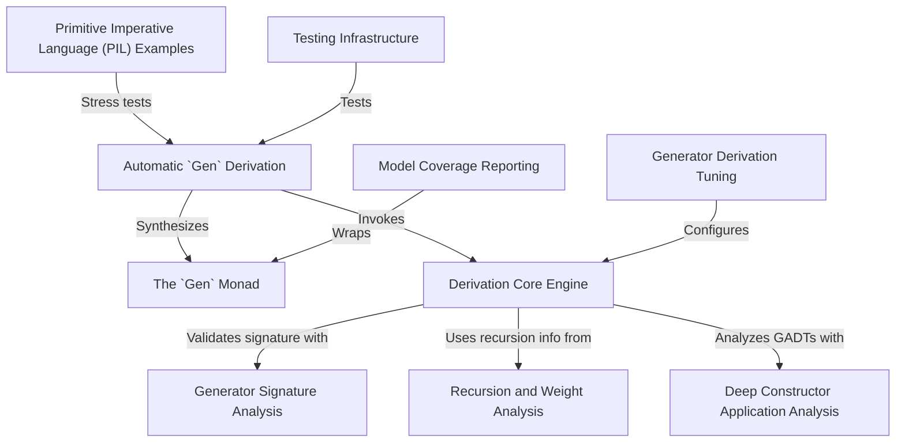

# Tutorial: DepTyCheck

`DepTyCheck` is a library for the **Idris 2** programming language that simplifies *property-based testing*, especially for code that uses complex *dependent types*. Its main feature is the ability to **automatically create** random test data generators. You just define your data structure, and `DepTyCheck` writes the code (`deriveGen`) to produce valid random examples of it, saving you from writing a lot of complicated boilerplate.

**Source Repository:** [None](None)

## Chapters

1. [The `Gen` Monad](01_the__gen__monad.md)
2. [Automatic `Gen` Derivation](02_automatic__gen__derivation.md)
3. [Testing Infrastructure](03_testing_infrastructure.md)
4. [Primitive Imperative Language (PIL) Examples](04_primitive_imperative_language__pil__examples.md)
5. [Generator Derivation Tuning](05_generator_derivation_tuning.md)
6. [Model Coverage Reporting](06_model_coverage_reporting.md)
7. [Derivation Core Engine](07_derivation_core_engine.md)
8. [Recursion and Weight Analysis](08_recursion_and_weight_analysis.md)
9. [Deep Constructor Application Analysis](09_deep_constructor_application_analysis.md)
10. [Generator Signature Analysis](10_generator_signature_analysis.md)

---

Generated by [AI Codebase Knowledge Builder](https://github.com/The-Pocket/Tutorial-Codebase-Knowledge)