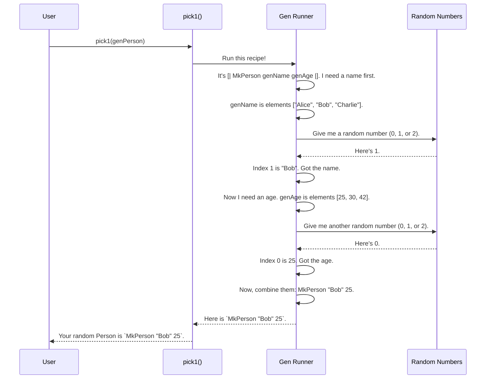

# Chapter 1: `Gen`: The Data Generator

Welcome to your journey with `DepTyCheck`! Before we can test anything, we need a way to generate test data. Lots and lots of random, varied test data. But how do we do that, especially for the complex, dependent types in Idris?

This is where the star of our show comes in: `Gen`.

Think of `Gen a` as a **recipe for creating random values of type `a`**. It's the heart of the library, a blueprint that tells `DepTyCheck` how to bake up any kind of test data you can imagine.

In this chapter, we'll learn how to write these recipes, from simple ones that pick from a list to complex, dynamic ones that are essential for testing dependent types.

### Your First Recipe: `elements`

Let's start with the simplest recipe imaginable. Suppose you want to generate a random `String` from a specific list of choices. You can use the `elements` function.

```idris
import Test.DepTyCheck.Gen

-- A recipe for generating one of three strings
genSomeStrings : Gen NonEmpty String
genSomeStrings = elements ["one", "two", "three"]
```

Let's break this down:
- `genSomeStrings` is the name of our recipe.
- `Gen NonEmpty String` is its type. It says this is a recipe (`Gen`) for a `String`. The `NonEmpty` part is a promise: this recipe will *always* succeed in producing a value. It can never be "empty" or fail.
- `elements [...]` is the recipe itself. It simply says: "pick one item from this list, with each item having an equal chance of being chosen."

### Combining Recipes: `oneOf`

What if you have multiple recipes and you want to choose between them? For that, we have `oneOf`. It takes a list of generators and creates a new one that randomly picks one of the *entire* recipes to run.

```idris
-- Another recipe for generating strings
genMoreStrings : Gen NonEmpty String
genMoreStrings = elements ["more", "even more"]

-- A recipe that combines our first two recipes
genCombined : Gen NonEmpty String
genCombined = oneOf [genSomeStrings, genMoreStrings]
```

Here, `genCombined` has a 50% chance of using `genSomeStrings` (which will then pick "one", "two", or "three") and a 50% chance of using `genMoreStrings` (which will pick "more" or "even more").

This is different from just putting all the strings in one `elements` list! With `genCombined`, the strings "one", "two", and "three" are collectively as likely to appear as the strings "more" and "even more".

### Building Complex Data

Making simple strings is fun, but what about our own custom data types? `Gen` can compose recipes to build up more complex values.

Let's imagine we have a `Person` data type.

```idris
data Person = MkPerson String Nat

-- A recipe for a random name
genName : Gen NonEmpty String
genName = elements ["Alice", "Bob", "Charlie"]

-- A recipe for a random age
genAge : Gen NonEmpty Nat
genAge = elements [25, 30, 42]
```

We can now combine `genName` and `genAge` to create a recipe for a whole `Person` using special `[| ... |]` syntax.

```idris
-- A recipe for a random Person
genPerson : Gen NonEmpty Person
genPerson = [| MkPerson genName genAge |]
```

This is incredibly powerful! The `[| ... |]` syntax lets us build our data just like we normally would, but we plug in *recipes* instead of values. `DepTyCheck` sees this and understands: "To make a `Person`, I need to run the `genName` recipe to get a string, run the `genAge` recipe to get a number, and then put them together with `MkPerson`."

### The Magic Ingredient: Dynamic, Dependent Recipes

Here's where `Gen` truly shines and what makes it perfect for Idris. `Gen` is a **monad**.

Don't worry if that word sounds intimidating! In our recipe analogy, it just means you can create **dynamic recipes where the next step depends on the outcome of the previous one.**

This is essential for dependent types. For example, to generate a value of type `Vect n String` (a list of strings with a known length `n`), you can't just generate a random vector. You first need to generate a length `n`, and *then*, based on that specific `n`, generate a vector of that exact length.

Let's see this with a classic dependent type, `Fin n`, which represents a number from `0` to `n-1`. How could we generate a pair containing a number `n` and a `Fin n`?

We'll use `do` notation, which is Idris's syntax for these dynamic, multi-step recipes.

```idris
-- A helper that generates a Fin n for a *given* n
-- (Don't worry about the implementation)
genFin : (n : Nat) -> Gen MaybeEmpty (Fin n)
genFin n = -- ... implementation details

-- A recipe for a random Nat from 1 to 3
genNat : Gen NonEmpty Nat
genNat = elements [1, 2, 3]

-- A dynamic recipe for a pair (n ** Fin n)
genAnyFin : Gen NonEmpty (n ** Fin n)
genAnyFin = do
  n <- genNat      -- Step 1: Get a random Nat and call it `n`
  f <- genFin n    -- Step 2: Use `n` to create a *new* recipe for Fin n, and run it
  pure (n ** f)  -- Step 3: Package the results
```

This is the core idea!
1.  We run `genNat` and the result is put into the variable `n`.
2.  Crucially, that `n` is then used in the very next line to create `genFin n`, a brand new recipe tailored to the number we just generated.
3.  We run this new recipe to get `f`, a value of type `Fin n`.
4.  Finally, `pure` wraps it all up into our final `(n ** f)` pair.

This dynamic, step-by-step generation is what allows `DepTyCheck` to handle the rich world of dependent types.

### Under the Hood: What is a `Gen`?

A `Gen` isn't some magical incantation; it's just a data structure that describes a plan. When you ask for a random value, a "runner" function follows the plan, using a random number generator to make choices along the way.

Let's visualize running `genPerson` from our earlier example.



The `Gen` data type itself in `src/Test/DepTyCheck/Gen.idr` has a few key constructors that represent these different kinds of plans:

```idris
data Gen : Emptiness -> Type -> Type where
  Pure  : a -> Gen em a         -- A recipe that always produces one specific value.
  OneOf : ... -> Gen em a       -- A choice between several recipes (used by `elements`).
  Bind  : ... -> Gen em a       -- A dynamic, multi-step recipe (used by `do` notation).
  ...
```

- `Pure val`: The simplest recipe. It just holds a single value and always returns it.
- `OneOf [g1, g2, ...]`: Holds a list of other recipes. The runner will pick one at random.
- `Bind g1 f`: This is the engine for our dynamic recipes. It holds the first recipe (`g1`) and a function (`f`) that takes the result of `g1` and produces the *next* recipe.

### What's Next?

You now know the fundamentals of writing recipes for test data! You can:
- Create simple generators with `elements`.
- Combine them with `oneOf`.
- Build up complex data structures.
- Use `do` notation for dynamic recipes that handle dependent types.

Writing all these recipes by hand for every data type can get repetitive. Wouldn't it be amazing if `DepTyCheck` could just look at your data type and write a sensible recipe for you, automatically?

That's exactly what we'll explore in the next chapter.

Next: [`deriveGen`: The Automatic Recipe Writer](02__derivegen___the_automatic_recipe_writer_.md)

---

Generated by [AI Codebase Knowledge Builder](https://github.com/The-Pocket/Tutorial-Codebase-Knowledge)