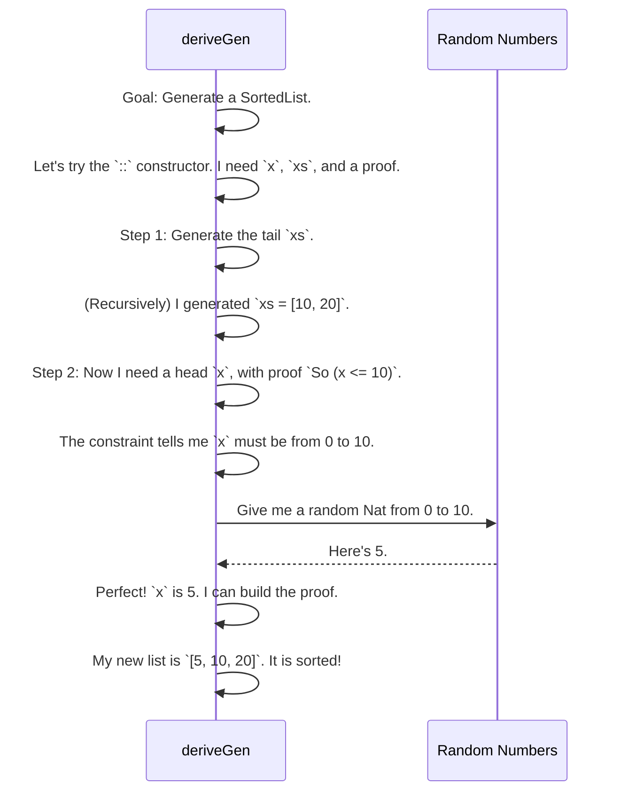

# Chapter 3: Example Data Structures

In the last chapter, [``deriveGen``: The Automatic Recipe Writer](02__derivegen___the_automatic_recipe_writer_.md), we discovered the magic of automatically creating data generators. We saw that `deriveGen` can look at a simple data type and figure out how to build it.

But what about more complex, "real-world" data? How do we handle structures with special rules, like a list that must always be sorted, or a list that can't have any duplicate items?

This is where the power of Idris's type system and `DepTyCheck` truly come together. This chapter is a "cookbook" of recipes. We'll look at a few common, tricky data structures and see how to define them in a way that `deriveGen` can understand and automatically generate valid examples for us.

### Recipe 1: The Sorted List

Imagine you need to test a function that operates on sorted lists. A bug might only appear if the list is sorted correctly. How can you generate thousands of random, *valid* sorted lists?

You can't just generate a random list and hope for the best. Instead, we'll define a `SortedList` type where the "sorted" rule is baked directly into its definition.

```idris
data SortedList : Type where
  Nil  : SortedList
  (::) : (x : Nat) -> (xs : SortedList) -> IsSorted x xs => SortedList

```

This looks a lot like a normal `List`, but the `(::)` constructor has a mysterious third argument: `IsSorted x xs`. This is a **proof** or a **guarantee**. You are only allowed to add `x` to the front of a list `xs` if you can prove that the result will still be sorted.

So, what does `IsSorted` look like?

```idris
data IsSorted : Nat -> SortedList -> Type where
  FirstElem  : IsSorted n Nil
  StillSorted : So (n <= x) -> IsSorted n (x :: xs)
```

This is the clever part:
- `FirstElem`: You can put *any* number `n` in front of an empty list (`Nil`). That's always sorted.
- `StillSorted`: To put `n` in front of an existing list `(x :: xs)`, you must provide proof that `n` is less than or equal to the current first element, `x`. The `So (n <= x)` part is exactly this proof!

With this definition, it's *impossible* to create an unsorted `SortedList`.

#### `deriveGen` to the Rescue

Now, how does `deriveGen` handle this? It sees the constraint and uses it to make smart decisions. Instead of generating things randomly and checking them, it generates them correctly from the start.

It works backwards:
1.  To create `(x :: xs)`, it first needs a valid `SortedList` `xs`.
2.  Let's say it recursively generates `xs` as `[5, 10, 20]`.
3.  Now it needs to generate the head, `x`. It looks at the constraint: `So (x <= 5)`.
4.  Aha! Instead of picking *any* `Nat`, `deriveGen` now knows it must pick a `Nat` that is less than or equal to 5.
5.  It generates a number in that range (say, `2`), builds the final list `[2, 5, 10, 20]`, and succeeds!

Let's visualize this intelligent process.



By encoding the rule in the type, we turn `deriveGen` from a random generator into a clever puzzle-solver.

### Recipe 2: The Unique-Element List

Here's another classic: a list that cannot contain any duplicates. For example, `["A", "B", "C"]` is valid, but `["A", "B", "A"]` is not.

Just like with the sorted list, we'll bake the "uniqueness" rule into the type itself.

```idris
data UniqStrList : Type where
  Nil  : UniqStrList
  (::) : (s : String) -> (ss : UniqStrList) -> NotIn s ss => UniqStrList
```

This looks familiar! The `(::)` constructor requires a proof that the new string `s` is `NotIn` the rest of the list `ss`.

Let's look at the `NotIn` proof:

```idris
data NotIn : String -> UniqStrList -> Type where
  N_Nil : NotIn x Nil
  N_Cons : So (x /= s) => NotIn x ss -> NotIn x (s :: ss)
```

- `N_Nil`: Any element is "not in" the empty list.
- `N_Cons`: To prove `x` is not in `(s :: ss)`, you need two things:
    1.  Proof that `x` is not equal to the head (`s`), which is `So (x /= s)`.
    2.  A recursive proof that `x` is also `NotIn` the tail (`ss`).

When `deriveGen` sets out to create a `UniqStrList`, it once again works backwards. It generates a tail `ss` first. Then, when it needs to generate a head `s`, it knows `s` cannot be any of the strings already present in `ss`. `DepTyCheck` will keep trying to generate strings until it finds one that satisfies the `NotIn` constraint, guaranteeing a unique list every time.

### Recipe 3: A Glimpse of Sorted Trees

These patterns apply to more than just lists. Consider a binary search tree, where everything in the left branch of a node must be smaller than the node's value, and everything in the right branch must be larger.

We can encode this using type-level numbers that track the minimum and maximum allowed values in any subtree.

```idris
-- A tree where all values are between `min` and `max`.
data SortedTree : (min, max : Nat) -> Type where
  Leaf : (x : Nat) -> SortedTree x x
  Node : (left : SortedTree lmin lmax) ->
         (root : Nat) ->
         (right : SortedTree rmin rmax) ->
         -- The search tree rules:
         (lmax < root, root < rmin) =>
         SortedTree lmin rmax
```

This is more advanced, but do you see the pattern? The `Node` constructor has a tuple of proofs: `(lmax < root, root < rmin)`. This forces the left subtree's maximum value to be less than the root, and the root to be less than the right subtree's minimum value.

Amazingly, `deriveGen` can solve this too! It can generate a valid `left` subtree, a valid `right` subtree, and a `root` value that correctly fits between them, satisfying all the dependent type constraints along the way.

### What's Happening Under the Hood?

You might be wondering how `deriveGen` is so smart. It's not magic, but a methodical process of **constraint solving**.

When you ask it to generate a value, it doesn't just guess. It performs a deep analysis of the type you've requested.

1.  **Decomposition:** It breaks down the type into its component parts. "To build a `Node`, I need a `left` tree, a `root` number, and a `right` tree."
2.  **Dependency Analysis:** It figures out the order of operations. "I can't generate the `root` until I know the `lmax` of the left tree, because its type depends on it."
3.  **Constraint Solving:** It uses the proofs (`So (n <= x)`, `lmax < root`, etc.) as powerful filters. Instead of generating *any* `Nat`, it generates a `Nat` *that satisfies the constraint*. This dramatically narrows the search space and is the key to its efficiency.

This entire process is a systematic journey from a type definition to a concrete plan for generating data.

### Conclusion

In this chapter, we've moved from theory to practice. We saw how to define complex data structures with rich invariants (like being sorted or unique) directly in the type system. More importantly, we saw that by doing so, we empower [`deriveGen`: The Automatic Recipe Writer](02__derivegen___the_automatic_recipe_writer_.md) to act as an intelligent "puzzle solver" that can automatically generate valid test data for us.

These "recipes" are patterns you can use and adapt for your own data structures. The core lesson is: **teach your types the rules, and `DepTyCheck` will know how to play the game.**

So we've seen *what* `deriveGen` can do, but *how* exactly does it perform its analysis? In the next chapter, we'll dive into the internal mechanics and look at the assembly line it uses to build generators.

Next: [Derivation Pipeline](04_derivation_pipeline_.md)

---

Generated by [AI Codebase Knowledge Builder](https://github.com/The-Pocket/Tutorial-Codebase-Knowledge)