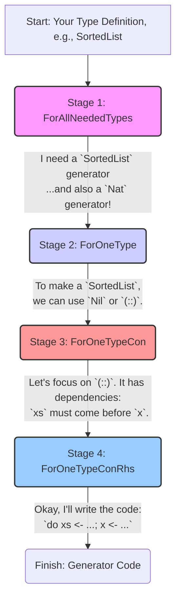
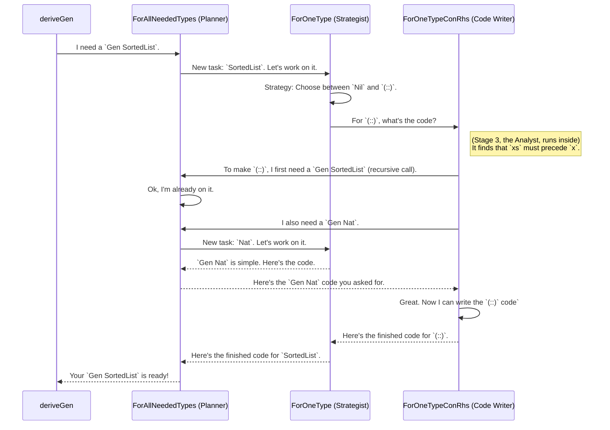

# Chapter 4: Derivation Pipeline

In the previous chapter, [Example Data Structures](03_example_data_structures_.md), we saw the incredible power of `deriveGen`. We learned that if we define our data types with clear rules (like `SortedList`), `deriveGen` can automatically figure out how to generate valid test data. It feels like magic!

But how does it actually work? How does `deriveGen` look at a complex type definition and produce a working generator?

In this chapter, we're going on a "behind the scenes" factory tour. We'll explore the **Derivation Pipeline**, the internal engine that powers `deriveGen`. Think of it as an assembly line for creating data-generator recipes. It breaks the huge, complex task of "writing a generator" into a series of smaller, manageable steps.

### The Assembly Line Analogy

Imagine you're running a factory that builds complex machines (our data generators). You wouldn't have one person do everything from scratch. Instead, you'd have an assembly line with different stations, each with a specific job.

The `DepTyCheck` Derivation Pipeline works the same way. It's a multi-stage process where your type definition goes in one end, and a complete, correct generator function comes out the other.

Here are the main stations on our assembly line:



Let's visit each station to see what it does.

### Stage 1: `ForAllNeededTypes` - The Master Planner

This is the first and most important station. When you ask `deriveGen` to create a generator for `SortedList`, the request first comes here.

**Job:** The Master Planner's job is to manage a "to-do" list of all the generators we need to build.

1.  It receives the initial request: "Make a generator for `SortedList`".
2.  It checks its list. Has it seen `SortedList` before? No. So it adds it to the to-do list.
3.  As it works on `SortedList`, it will discover it also needs to generate `Nat` values. It adds "Make a generator for `Nat`" to the to-do list as well.

This ensures that we don't do the same work twice and that all the necessary "parts" (generators for `Nat`, `String`, etc.) are available before we try to assemble the final product.

In the code, this station manages a queue of derivation tasks.

```idris
-- From: src/Deriving/DepTyCheck/Gen/ForAllNeededTypes/Impl.idr

-- A loop that processes the "to-do" list
deriveAll : m ()
deriveAll = do
  -- Get the current list of tasks
  toDerive <- get {stateType=List _}
  put {stateType=List _} [] -- Clear the list

  -- For each task, create the generator
  for_ toDerive deriveOne

  -- If new tasks were added during that process, loop again!
  when (not $ null toDerive) $ assert_total $ deriveAll
```
This function is like the factory manager, constantly checking the to-do list and dispatching workers until all the jobs are done.

### Stage 2: `ForOneType` - The Recipe Strategist

The Master Planner sends a single task from its to-do list (e.g., "Make a `SortedList` generator") to this station.

**Job:** To create the overall strategy for generating *one specific type*.

This station looks at the type's definition and sees all its constructors. For `SortedList`, it sees `Nil` and `(::)`.

Its job is to write the main body of the generator function. This function will usually be a `case` expression that decides which constructor to use. For example, it might decide to use non-recursive constructors (`Nil`) if it's running out of "fuel", or choose between all constructors if it has plenty of fuel.

```idris
-- From: src/Deriving/DepTyCheck/Gen/ForOneType/Impl.idr

-- Generates the main body for a type's generator
canonicBody sig n = do
  -- ... checks and setup ...

  -- Create a sub-generator for each constructor
  consBodies <- for sig.targetType.cons $ \con =>
    -- canonicConsBody comes from the next stage!
    canonicConsBody sig (consGenName con) con

  -- Create the main expression that chooses between constructors
  let outmostRHS = fuelDecisionExpr fuelArg ...

  pure [ ... .= local consBodies outmostRHS ]
```
This station doesn't worry about the details of *how* to build a `(::)`. It just says, "Here's how you *choose* between `Nil` and `(::)`," and delegates the rest to the next station.

### Stage 3: `ForOneTypeCon` - The Dependency Analyst

The Recipe Strategist sends a constructor (like `SortedList`'s `(::)`) to this station.

**Job:** To analyze a single constructor and figure out its internal dependencies, especially for complex GADTs.

Remember `SortedList`'s `(::)` constructor?

```idris
(::) : (x : Nat) -> (xs : SortedList) -> IsSorted x xs => SortedList
```
This station is the expert C.S.I. agent. It inspects this signature and finds crucial evidence:
- It sees the arguments `x` and `xs`.
- Most importantly, it sees the proof `IsSorted x xs`. It knows this proof means `x`'s value depends on `xs`'s value.
- It concludes: **You must generate `xs` *before* you can generate `x`.**

This analysis is the key to `deriveGen`'s intelligence. It prevents it from making silly mistakes like generating a random `x` and then having no way to build the rest of the list.

### Stage 4: `ForOneTypeConRhs` - The Code Writer

Finally, the plan from the Dependency Analyst ("generate `xs` first, then `x`") arrives at the last station.

**Job:** To take the generation order and write the actual, runnable `do` block code for the generator.

This is where the plan turns into reality. Knowing the order, this station writes an expression that looks like this:

```idris
-- This is the code that this stage *generates*
do
  -- Step 1: Generate the tail `xs` first
  xs <- genSortedList fuel

  -- Step 2: Now that we have `xs`, generate a valid head `x`
  -- (The generator for `x` will be constrained to <= head of `xs`)
  x <- genNatConstrained (getHead xs)

  -- Step 3: We have all the parts, now build it!
  pure (x :: xs)
```
This station's most important task is figuring out the best order to generate the arguments. It contains a function, `searchOrder`, that acts like a puzzle-solver to determine the most efficient sequence.

### A Walkthrough With a Diagram

Let's see the whole assembly line in action for our `SortedList` example.


As you can see, the stages work together, requesting components they need from the master planner (`ForAllNeededTypes`), which then dispatches other workers to complete those sub-tasks. This modular design makes the whole process robust and manageable.

### Conclusion

You've now seen the factory floor! The **Derivation Pipeline** is the powerful, methodical engine that makes `deriveGen` so smart. It's not magic; it's a well-organized assembly line that:

1.  **`ForAllNeededTypes`:** Plans all the generators that need to be built.
2.  **`ForOneType`:** Creates the top-level strategy for one type by looking at its constructors.
3.  **`ForOneTypeCon`:** Analyzes a single constructor to find dependencies.
4.  **`ForOneTypeConRhs`:** Writes the final `do` block code based on that analysis.

This pipeline usually does a fantastic job on its own. But what if you want to give it a hint? What if you know a better way to generate a certain argument? `DepTyCheck` allows you to "tune" the pipeline's behavior.

In the next chapter, we'll learn how to do just that.

Next: [Derivation Tuning](05_derivation_tuning_.md)

---

Generated by [AI Codebase Knowledge Builder](https://github.com/The-Pocket/Tutorial-Codebase-Knowledge)