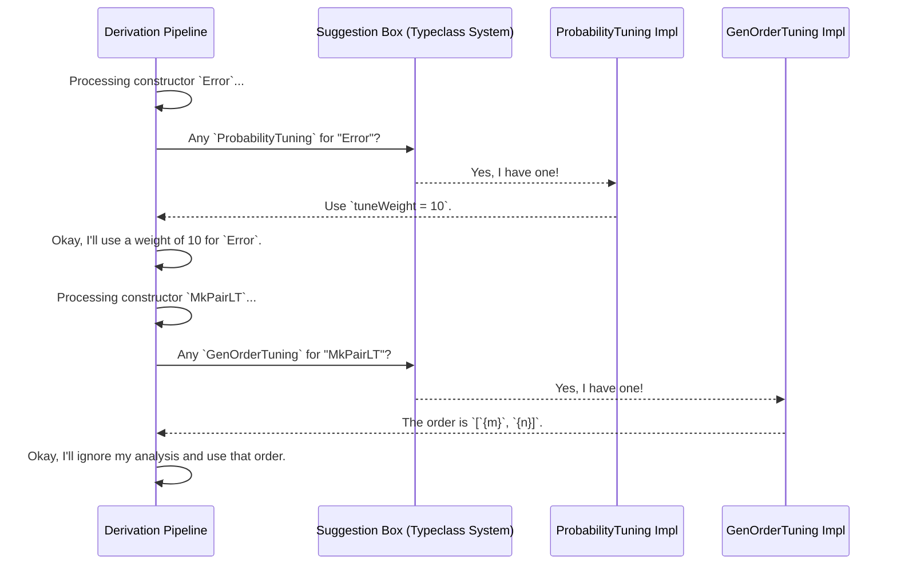

# Chapter 5: Derivation Tuning

In the last chapter, we took a tour of the [Derivation Pipeline](04_derivation_pipeline_.md), the amazing internal assembly line that powers `deriveGen`. We saw that it's smart enough to analyze our types and automatically build a correct data generator. It's like having an automatic chef who can read a list of ingredients and figure out how to make a dish.

But what if the automatic chef isn't perfect? What if you want your cake a little sweeter, or if you know a better order to mix the ingredients? Sometimes, the default recipe is good, but you want to give a few hints to make it *great*.

This is where **Derivation Tuning** comes in. It allows you to give friendly advice to the `deriveGen` "automatic chef" to fine-tune the final generator recipe.

### Why Tune the Recipe?

There are two main reasons you might want to adjust `deriveGen`'s work:

1.  **Changing the Distribution:** By default, if a type has three constructors `A`, `B`, and `C`, `deriveGen` will create a generator that picks each one with roughly equal (1/3) probability. But what if `C` is a rare, important edge case? You might want to tell the chef, "I want more of ingredient `C`!"
2.  **Improving Efficiency:** For complex dependent types, the order in which arguments are generated can matter a lot. The chef might figure out a valid order, but you might know a more efficient one. This is like telling the chef, "Mix the eggs *before* you add the flour; it works much better that way."

`DepTyCheck` provides two simple tools for this: `ProbabilityTuning` and `GenOrderTuning`. Let's learn how to use them.

### `ProbabilityTuning`: "More of this, please!"

`ProbabilityTuning` lets you adjust the "weight" of a constructor, making it more or less likely to be chosen during generation.

Let's imagine we're testing a simple state machine with three states.

```idris
data State = Active | Inactive | Error
```

By default, [`deriveGen`: The Automatic Recipe Writer](02__derivegen___the_automatic_recipe_writer_.md) will produce these states with equal likelihood. But we want to test the `Error` state much more frequently. We can use `ProbabilityTuning` to tell `deriveGen` to increase its weight.

```idris
import Deriving.DepTyCheck.Gen

-- Give the `Error` constructor 10 times the normal weight!
ProbabilityTuning "Error".dataCon where
  isConstructor = itIsConstructor
  tuneWeight _ = 10
```

Let's break this down:
- `ProbabilityTuning "Error".dataCon`: We declare that we are providing a tuning for the constructor named "Error". The `.dataCon` part is special syntax to refer to it.
- `isConstructor = itIsConstructor`: This is a magic line that acts as a safety check. If you misspell the constructor name, Idris will give you a compile-time error here.
- `tuneWeight _ = 10`: This is the core of the hint. It tells the pipeline, "Whatever the default weight for this constructor is, I want you to use the number `10` instead."

Now, when you derive the generator, `Error` will be chosen much more often than `Active` or `Inactive`.

You can also modify the existing weight. Let's make `Active` twice as likely as normal, whatever "normal" is.

```idris
-- Give the `Active` constructor double its default weight.
ProbabilityTuning "Active".dataCon where
  isConstructor = itIsConstructor
  tuneWeight = (*2)
```
Here, `tuneWeight` is a function that takes the old weight and returns a new one. `(*2)` is shorthand for a function that doubles its input.

### `GenOrderTuning`: "Add the Eggs Before the Flour"

This tuning is more advanced and incredibly powerful for dependent types. It lets you specify the *exact order* in which a constructor's arguments should be generated.

Let's consider a type that represents a pair of numbers where the first is strictly less than the second.

```idris
data PairLT : Type where
  MkPairLT : (n : Nat) -> (m : Nat) -> So (n < m) => PairLT
```

The [Derivation Pipeline](04_derivation_pipeline_.md) is smart, but its default strategy might be to:
1.  Generate a random `n`. Let's say it picks `50`.
2.  Generate a random `m`. Let's say it picks `10`.
3.  Try to prove `50 < 10`. This fails.
4.  Try again. And again. And again... until it gets lucky.

This is very inefficient! A much better recipe would be:
1.  Generate `m` first. Let's say `10`.
2.  Now we need `n` and proof `So (n < 10)`. This constrains `n` to be a number between `0` and `9`.
3.  Generate `n` from this much smaller, valid range. Success every time!

We can give this hint to `deriveGen` using `GenOrderTuning`.

```idris
import Deriving.DepTyCheck.Gen.Tuning

GenOrderTuning "MkPairLT".dataCon where
  isConstructor = itIsConstructor
  deriveFirst _ _ = [`{m}, `{n}]
```

Let's look at the key line:
- `deriveFirst _ _ = [`{m}, `{n}]`: This function tells the pipeline, "For the `MkPairLT` constructor, I want you to ignore your own analysis and follow my orders. First, generate the argument named `m`. After that, generate the argument named `n`." The `` `{m} `` syntax is a "name literal," referring to the argument by its name in the source code.

By providing this hint, we guide `deriveGen` to create a much more efficient generator that never gets stuck.

### Under the Hood: The Pipeline's "Suggestion Box"

How does this work? It's not magic. The Derivation Pipeline is designed to be extensible. At key decision points, it checks a "suggestion box" to see if you've provided any tuning hints.

Let's visualize this.



Technically, this "suggestion box" is the Idris type class system. When you write a `ProbabilityTuning` or `GenOrderTuning` block, you are creating an implementation of a special interface (a type class) for a specific constructor name.

The definitions for these interfaces live in `src/Deriving/DepTyCheck/Gen/Tuning.idr`.

```idris
-- from src/Deriving/DepTyCheck/Gen/Tuning.idr

-- The interface for probability hints
public export
interface ProbabilityTuning (n : Name) where
  isConstructor : ...
  tuneWeight : Nat1 -> Nat1
```
When the pipeline is about to calculate the weights for each constructor, it performs a search for an implementation of `ProbabilityTuning` for that constructor. If it finds one, it calls your `tuneWeight` function. If not, it just uses its default logic.

```idris
-- The interface for ordering hints
public export
interface GenOrderTuning (n : Name) where
  isConstructor : ...
  deriveFirst : ... -> List (ConArg ...)
```
Similarly, when the pipeline is about to decide the generation order for a constructor's arguments, it first searches for a `GenOrderTuning` implementation. If it finds one, it uses the list from your `deriveFirst` function. Otherwise, it proceeds with its own complex dependency analysis.

This mechanism is powerful because it's **non-invasive**. You don't need to change `DepTyCheck`'s source code. You just add small, self-contained tuning blocks to your own code to provide expert advice where it's needed most.

### Conclusion

You are now a master chef's assistant! You've learned that while [`deriveGen`: The Automatic Recipe Writer](02__derivegen___the_automatic_recipe_writer_.md) is a brilliant automatic recipe writer, you can provide hints to make its creations even better.

-   **`ProbabilityTuning`** lets you adjust the ingredient mix, making certain constructors more or less common in your generated test data.
-   **`GenOrderTuning`** lets you optimize the recipe's steps, guiding `deriveGen` to a more efficient generation strategy for complex dependent types.

These tools give you fine-grained control, turning a good automatic process into a great one tailored to your specific testing needs.

So far, we've seen many small examples and data structures. In the next chapter, we'll tie everything together and see how `DepTyCheck` can be used to test a more substantial example: a small programming language!

Next: [Primitive Imperative Language (PIL) Examples](06_primitive_imperative_language__pil__examples_.md)

---

Generated by [AI Codebase Knowledge Builder](https://github.com/The-Pocket/Tutorial-Codebase-Knowledge)