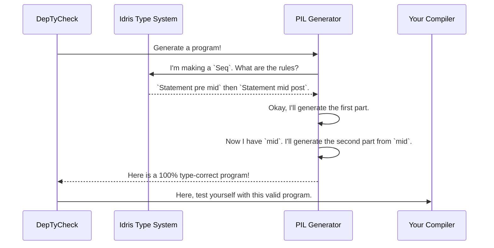

# Chapter 6: Primitive Imperative Language (PIL) Examples

In the last chapter, [Derivation Tuning](05_derivation_tuning_.md), we learned how to act as a chef's assistant, giving hints to `deriveGen` to produce even better data generators. We've mastered generating data structures, from simple lists to complex trees.

Now, it's time for the final boss of data generation. What if we want to generate something more than just data? What if we want to generate... a **valid computer program**?

This chapter introduces the Primitive Imperative Language (PIL) examples. These aren't just toys; they are the most advanced use-case in `DepTyCheck`, demonstrating its full power. We'll see how we can use Idris's type system to define the rules of a programming language, and then use `DepTyCheck` to generate programs that are guaranteed to follow those rules.

### The Ultimate Challenge: Generating Correct Programs

Imagine you're building a compiler for a new programming language. How do you test it? You need to feed it thousands of different programs to make sure it works correctly. But you can't just generate random text; that would almost always result in syntax errors. You need programs that are **syntactically valid** and, more importantly, **semantically valid** (i.e., they make sense and don't try to add a number to a string).

This is the problem the PIL examples solve. They define a small, "primitive" programming language inside Idris itself.

Let's use an analogy. Think of a programming language's rules as the rules of a board game:
*   "You can't have two variables with the same name in the same scope." (Rule)
*   "You can only assign a value to a variable if the types match." (Rule)

`DepTyCheck`'s job is to be a player who knows all the rules and can generate a long, valid sequence of moves—a complete, correct program.

### Defining the Rules of the Game

To get `DepTyCheck` to generate valid programs, we first have to *teach it the rules*. We do this by encoding the rules directly into Idris's types.

Let's imagine a tiny language with just one type (`Int`), variables, and assignment. A key concept we need is a **context**, which is just a list of the variables that currently exist and their types.

```idris
-- A context is a list of (variable_name, type) pairs.
-- For example: [("x", Int), ("y", Int)]
Context = List (String, String)
```

Now, we can define a `Statement`. Instead of being just a piece of data, we can define it with dependent types to track how it changes the context.

`Statement pre post` is a statement that is valid in a context `pre` and, after it runs, results in a new context `post`.

```idris
-- A simplified version of a PIL Statement
data Statement : (pre : Context) -> (post : Context) -> Type where
```

Let's add our first rule: a `Declare` statement. It adds a new variable to the context.

```idris
data Statement : (pre : Context) -> (post : Context) -> Type where
  Declare : (name : String) -> (value : Int) ->
            Statement ctx ( (name, "Int") :: ctx )
```
Look closely! The `Declare` constructor creates a `Statement` where the post-context `( (name, "Int") :: ctx )` is the original `ctx` with the new variable added to the front. The type system *guarantees* this transformation.

What about sequential composition (running one statement after another)?

```idris
data Statement : (pre : Context) -> (post : Context) -> Type where
  Declare : ...
  Seq     : Statement pre mid -> Statement mid post ->
            Statement pre post
```
This is the most important rule! To create a `Seq`uence, you need two statements. But they can't be just any statements. The first one must transform `pre` to `mid`, and the second one *must* start in the `mid` context that the first one produced. The type system acts as a pipeline, ensuring the contexts flow correctly from one statement to the next.

### Generating Programs that Follow the Rules

Now that we have our game board and rules, how do we get `DepTyCheck` to play? We need a generator. Because of the dependencies (`mid` context), we can't just generate random pieces. We need a dynamic, multi-step recipe using the `do` notation we learned about in the [`Gen`: The Data Generator ](01__gen___the_data_generator_.md) chapter.

We want to write a generator that, given a starting context `pre`, produces a valid statement and the final `post` context.

```idris
genStatement : (pre : Context) -> Gen NonEmpty (post ** Statement pre post)
```

Here's how we could write the generator for a `Seq` statement. This is the core idea behind all of PIL generation.

```idris
-- Generate a sequence of two statements
genSeq : (pre : Context) -> Gen NonEmpty (post ** Statement pre post)
genSeq pre = do
  -- Step 1: Generate the first statement, starting in `pre`.
  -- This gives us the statement `s1` and its output context, `mid`.
  (mid ** s1) <- genStatement pre

  -- Step 2: Generate the second statement, starting in `mid`!
  (post ** s2) <- genStatement mid

  -- Step 3: Combine them. The final context is `post`.
  pure (post ** Seq s1 s2)
```
This is beautiful! The generator follows the rules of the `Seq` constructor perfectly. It generates the first part, captures its resulting `mid` context, and then uses that **exact context** as the input for generating the second part. It's impossible for this generator to produce an invalid sequence of statements.

### A Look at the Real PIL Code

The real PIL examples in the `DepTyCheck` codebase (like in `examples/pil-reg/` and `examples/pil-fun/`) are much more complex than our simple example. They include features like:
*   Multiple types (`Int'`, `Bool'`)
*   Immutable and mutable variables
*   Registers (like in assembly language)
*   Functions and calls

The `Statement` type in the real code is much richer, tracking both a `Variables` context and a `Registers` context.

```idris
-- From: examples/pil-reg/src/Example/Pil/Lang/Statement.idr
-- (Simplified for clarity)

data Statement : (preV : Variables) -> (preR : Registers) ->
                 (postV : Variables) -> (postR : Registers) -> Type
```

Consequently, the generator signature is also more complex, but follows the exact same principle: it takes pre-conditions and generates a statement along with its post-conditions.

```idris
-- From: examples/pil-reg/src/Example/Pil/Gens.idr

-- A generator for ANY statement, producing the final contexts
statement_gen : ... -> (preV : Variables) -> (preR : Registers) ->
                Gen (postV ** postR ** Statement preV preR postV postR)
```

The generator for `Seq` (written as `>>` in the source code) looks very familiar.

```idris
-- From: examples/pil-reg/src/Example/Pil/Gens.idr

seq_gen f preV preR = do
  -- Generate the left statement `l` and its output `midV` and `midR`
  (midV ** midR ** l) <- statement_gen f preV preR

  -- Use `midV` and `midR` to generate the right statement `r`
  (_ ** _ ** r) <- statement_gen f midV midR

  pure (_ ** _ ** l >> r)
```
It's the same pattern! The generator intelligently chains the generation process, using the output of one step as the input for the next, letting the type system guide it to a correct result every time.

### The Big Picture: Compiler Fuzzing

Let's step back and see what this enables, with a diagram of the workflow.



By using `DepTyCheck` with PIL, you can create a **fuzz tester** for your compiler or interpreter. You can generate millions of unique, complex, and *provably correct* programs to test every nook and cranny of your language implementation, confident that you aren't just testing syntax errors. This is the pinnacle of what the generator-derivation system is designed for.

### Conclusion

In this chapter, we've seen the full potential of `DepTyCheck` unlocked. By combining rich dependent types with dynamic generators, we can do more than just make test data—we can generate entire, semantically valid programs.

-   We learned that we can define the rules of a programming language (like variable scoping and type checking) directly in Idris's types.
-   We saw how to write a dynamic [`Gen`](01__gen___the_data_generator_.md) that follows these rules, using the output context of one statement as the input context for the next.
-   This makes `DepTyCheck` an incredibly powerful tool for tasks like **compiler fuzzing**, where you need a stream of complex, correct inputs.

So, we've generated a lot of test data, from simple `Person` records to full-blown programs. But how do we know if our generators are *good*? Are we generating a wide variety of data, or just the same simple cases over and over? In the next chapter, we'll explore how to answer that question.

Next: [Model Coverage Analysis](07_model_coverage_analysis_.md)

---

Generated by [AI Codebase Knowledge Builder](https://github.com/The-Pocket/Tutorial-Codebase-Knowledge)