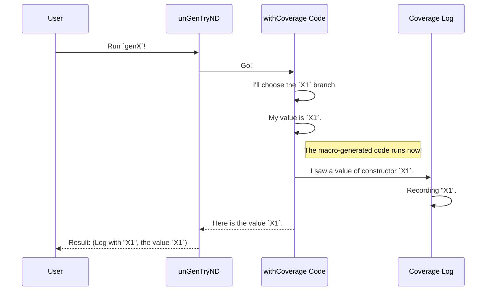

# Chapter 7: Model Coverage Analysis

In the previous chapter, we saw how `DepTyCheck` can be used for advanced tasks like generating entire, valid programs with [Primitive Imperative Language (PIL) Examples](06_primitive_imperative_language__pil__examples_.md). We've built some incredibly powerful data "recipes" (`Gen`).

But this raises a new question: are our recipes any good? Are they exploring all the interesting variations of our data? Or are they just making the same simple thing over and over again?

This is where **Model Coverage Analysis** comes in. It's a quality check for your generators. Think of it as a food critic who tastes a hundred dishes made from your recipe and reports back: "You've made lots of pies and cakes, but you haven't made a single cookie yet." This helps you find and fix the "blind spots" in your test data generation.

### The Problem: Are We Testing Everything?

Let's imagine a data type for different kinds of shapes.

```idris
data Shape = Circle Nat | Square Nat | Triangle Nat Nat Nat
```

And we write a generator for it. Maybe we get a little lazy and only write recipes for `Circle` and `Square`.

```idris
-- A generator that *forgets* to make Triangles
genIncompleteShape : Fuel -> Gen NonEmpty Shape
genIncompleteShape fl = oneOf [ [| Circle 10 |], [| Square 20 |] ]
```

If we use this generator to test a `drawShape` function, we'll never know if our function can correctly draw a `Triangle`! We need a tool to tell us, "Hey, you're not generating any `Triangle`s!"

### How to Get Your Report Card

`DepTyCheck` provides a simple, three-step process to get a coverage report for any generator.

1.  **Instrument the Generator:** Wrap your generator with `withCoverage`. This adds tracking to see what it produces.
2.  **Generate Data:** Run the generator many times and collect the results.
3.  **Analyze and Print:** Feed the results into a report card and print it.

Let's see this in action with a slightly more realistic example.

```idris
-- A simple data type
data X = X1 | X2 Nat | X3 String

-- A generator that *might* be incomplete
genX : Fuel -> Gen NonEmpty X
genX fl = withCoverage $ oneOf
  [ pure X1
  , [| X3 "hello" |]
  ]
```
Notice we've added `withCoverage`. This is a magic wrapper that tells `DepTyCheck` to keep an eye on what this generator produces. We've also intentionally left out the `X2` constructor.

Now, let's write our `main` function to run the analysis.

```idris
import Test.DepTyCheck.Gen.Coverage
import System.Random.Pure.StdGen -- For a random seed

main : IO ()
main = do
  -- Step 1: Create an empty "report card" for our generator
  let ci = initCoverageInfo genX

  -- Step 2: Run the generator 100 times and get the coverage data
  let vs = unGenTryND 100 someStdGen $ genX (limit 10)
  let rawCoverage = concatMap fst vs

  -- Step 3: Fill the report card with our data and print it
  let finalReport = registerCoverage rawCoverage ci
  putStrLn $ show finalReport
```

Let's break down this `main` block:
- `initCoverageInfo genX`: This function inspects `genX` and creates an empty report card. It knows that the `X` type has three constructors: `X1`, `X2`, and `X3`.
- `unGenTryND 100 ...`: This is a helper function that runs our generator 100 times. It returns a list of pairs: the raw coverage data and the value that was generated. We only care about the coverage data for now.
- `registerCoverage ...`: This function takes our empty report card and the raw data from our 100 runs. It tallies up the results and creates the final, filled-in report.
- `putStrLn $ show ...`: Finally, we print the report to the console.

#### The Output: A Clear Report

Running this program would print something like this (colors added for clarity):

```
X covered partially (100 times)
  - X1: covered (52 times)
  - X2: not covered
  - X3: covered (48 times)
```

The report tells us everything we need to know!
- The `X` type was "covered partially".
- We successfully generated `X1` and `X3` values.
- Crucially, it highlights in red that `X2` was **not covered**.

Now we know our generator has a blind spot! We can go back, add a case for `X2` to `genX`, and make our testing more robust.

### How It Works: The Magic of `withCoverage`

The whole system seems magical, but it's based on a clever combination of metaprogramming and a `Writer` monad.

1.  **`withCoverage` Adds Tags:** The `withCoverage` wrapper is a macro. When you compile your code, it looks at the type your generator produces (in our case, `X`). It then automatically inserts code that "tags" or "labels" each value with the name of its constructor.

    It effectively transforms your code from this:
    ```idris
    [| X3 "hello" |]
    ```
    Into something like this (conceptually):
    ```idris
    do val <- [| X3 "hello" |]
       label "X3" -- Add a tag!
       pure val
    ```

2.  **`unGenTryND` Listens for Tags:** When `unGenTryND` runs your generator, it does so inside a special context (a `WriterT ModelCoverage`) that "listens" for these tags. Each time `label` is called, the tag is recorded in a log.

3.  **Returning the Log:** After the generator produces a value, `unGenTryND` returns both the value *and* the log of all the tags it heard. This log is our `rawCoverage` data.

Let's visualize this process.



- **`initCoverageInfo` (The Inspector):** This function uses Idris's powerful reflection capabilities. It inspects the type definition of `X` at compile-time to build a checklist of all its constructors, creating the template for our report card.

- **`registerCoverage` (The Accountant):** This is a simple function that iterates through the raw coverage log (e.g., `["X1", "X3", "X1", "X1", ...]`) and the report card template, incrementing the counters for each constructor it sees.

The main data structures involved are defined in `src/Test/DepTyCheck/Gen/Coverage.idr`:

- `ModelCoverage`: This is the raw log, just a map from a label (like `"X1"`) to a count.
- `CoverageGenInfo`: This is the full report card. It stores a list of all known types and constructors and their coverage counts.

### Conclusion

You now have a powerful tool to ensure your test data is diverse and comprehensive. Model Coverage Analysis helps you answer the crucial question, "Am I testing what I think I'm testing?"

By following a simple three-step process:
1.  Wrap generators with `withCoverage`.
2.  Run them with `unGenTryND` to collect data.
3.  Use `initCoverageInfo` and `registerCoverage` to build and print a report.

You can gain deep insights into the behavior of your data generators and build more confidence in your tests.

We've seen that `DepTyCheck` often needs to "look inside" our type definitions, whether it's for `deriveGen` or `initCoverageInfo`. But how does it represent this information internally? In the next chapter, we'll pull back the curtain on this fundamental component.

Next: [Signature Representation](08_signature_representation_.md)

---

Generated by [AI Codebase Knowledge Builder](https://github.com/The-Pocket/Tutorial-Codebase-Knowledge)