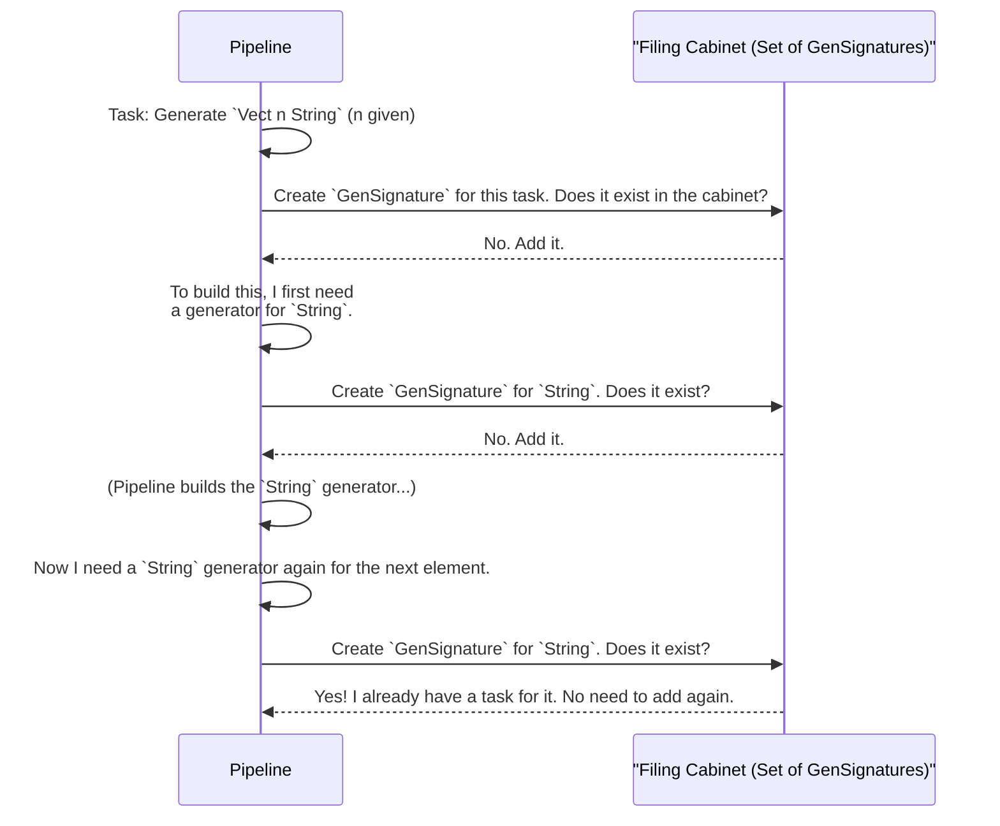

# Chapter 8: Signature Representation

In the last chapter, [Model Coverage Analysis](07_model_coverage_analysis_.md), we learned how to check if our data generators are producing a good variety of test cases. We saw that `DepTyCheck` has tools that can "look inside" a type to see all its possible constructors.

This raises an interesting question: how does `DepTyCheck` keep track of all these types and the generators it needs to build for them? When the [Derivation Pipeline](04_derivation_pipeline_.md) is working, it juggles dozens of sub-tasks, like "I need a generator for `Nat`," or "I need a generator for `SortedList` where the tail is already provided."

To manage this complex orchestra of requests, `DepTyCheck` needs a simple, standardized way to describe any generator. This is the job of the **`Signature` Representation**.

### The Problem: Too Many Kinds of Recipes

Imagine you're the manager of a busy kitchen. Chefs are constantly shouting requests at you:
*   "I need a recipe for a cake!"
*   "Give me the instructions for making a sauce, but I already have the tomatoes."
*   "Where's that recipe for bread?"

It would be chaos! To stay organized, you would create a standardized request form. No matter what the recipe is, the form has the same three fields:
1.  **Final Dish:** What are we making? (e.g., "Cake")
2.  **Ingredients Provided:** What do we already have? (e.g., "Flour, Sugar")
3.  **Ingredients to Make:** What do we need to prepare from scratch? (e.g., "Buttercream Frosting")

This is exactly what `Signature` representation does for `DepTyCheck`. It provides a canonical, standardized way to represent the "signature" of a generator function. Think of it as a **business card for a generator**. It extracts the essential information so the derivation engine can understand, compare, and manage requests.

### The Standardized Business Card: `GenSignature`

The core of this abstraction is a simple record called `GenSignature`. It's the data structure that holds the information from our standardized request form.

Let's look at its definition, found in `src/Deriving/DepTyCheck/Gen/Signature.idr`.

```idris
public export
record GenSignature where
  constructor MkGenSignature
  targetType : TypeInfo
  givenParams : SortedSet $ Fin targetType.args.length
```

This might look a little dense, so let's use our analogy to break it down:

*   `targetType`: This is the **Final Dish**. It's a description of the type we are trying to generate a value for (like `Person` or `SortedList`). `TypeInfo` is just a data structure that holds an "x-ray" of a type, including its name and arguments.
*   `givenParams`: These are the **Ingredients Provided**. It's a list of which arguments to the type's constructor are being given by the user, rather than being generated randomly.

From these two pieces of information, we can also figure out the **Ingredients to Make**—it's simply all the arguments that are *not* in `givenParams`.

Let's see an example. Suppose we want to generate a `Vect n String` (a list of strings of length `n`), but we want to *provide* the length `n` ourselves. The `GenSignature` for this request would look something like this:

*   `targetType`: Information about `Vect ?n ?elem`.
*   `givenParams`: A set containing the index of the `n` argument.

This simple, clean representation allows the derivation engine to easily see what it's being asked to do.

### From Business Card to Real Recipe: `canonicSig`

Having a business card is great for organizing, but at some point, you need to write the actual recipe. That's the job of the `canonicSig` function.

`canonicSig` takes a `GenSignature` (our standardized data structure) and from it, constructs the actual Idris **type** for the generator function.

```idris
-- from: src/Deriving/DepTyCheck/Gen/Signature.idr
export
canonicSig : GenSignature -> TTImp
canonicSig sig = -- ... metaprogramming magic ...
```

This function uses metaprogramming (`TTImp` is a metaprogramming type) to build the `Type` of the generator.

For example, if we have a `GenSignature` for creating a `Person` where the `name` is given:

*   `targetType`: `Person name age`
*   `givenParams`: `{name}`

The `canonicSig` function would produce the following type:

```idris
-- The type that canonicSig would generate
(name : String) -> Fuel -> Gen MaybeEmpty (age ** Person name age)
```

Let's analyze this generated type:
1.  `(name : String)`: The "given" parameter becomes an input to the function.
2.  `Fuel`: `deriveGen` generators always take a `Fuel` argument to prevent infinite loops.
3.  `Gen MaybeEmpty ...`: The return type is a [`Gen`: The Data Generator
](01__gen___the_data_generator_.md).
4.  `(age ** Person name age)`: The generator produces the "generated" parameters (`age`) along with the final value.

`canonicSig` is the bridge between `DepTyCheck`'s internal, organized world of `GenSignature`s and the real world of Idris types that you can compile and run.

### Under the Hood: The Derivation Pipeline's Filing Cabinet

Why is this standardization so important? Let's revisit the [Derivation Pipeline](04_derivation_pipeline_.md). This pipeline acts as a factory, building many different generator parts. `GenSignature` is the key to its inventory management system.

When `deriveGen` is asked to build a complex generator, it recursively discovers that it needs other, smaller generators. Each time it needs a new generator, it creates a `GenSignature` for it and checks its "filing cabinet" (a list of tasks).



By using a canonical `GenSignature` as a key, the pipeline can:
1.  **Track To-Do Items:** It knows exactly what generators it still needs to build.
2.  **Avoid Duplicate Work:** If two different parts of the derivation process ask for the exact same generator (e.g., `Gen String`), the `GenSignature` will be identical. The pipeline can see this and knows it only needs to build it once.
3.  **Manage User-Provided Generators:** If a user provides their own custom generator, the pipeline can create a `GenSignature` for it and know that this "task" is already complete.

This simple data structure is the central organizing principle that makes the entire derivation system coherent and efficient.

### `ExternalGenSignature`: Handling User Input

There's one more layer. When a *user* provides a generator, they might write arguments in a different order or use implicit arguments. The `ExternalGenSignature` is a slightly more detailed version of the business card that accounts for these user-facing details. The system uses it to understand the user's custom generator and then translates it into the clean, internal `GenSignature` for its own filing cabinet.

### Conclusion

You've now seen the quiet, organizational hero of the derivation engine. The **Signature Representation** is not something you'll often use directly, but it's fundamental to how `DepTyCheck` works.

-   It provides a **standardized format (`GenSignature`)** to represent any request for a generator.
-   This "business card" format contains the target type and a list of parameters the user will provide.
-   This allows the [Derivation Pipeline](04_derivation_pipeline_.md) to efficiently track, compare, and de-duplicate the work it needs to do.
-   The `canonicSig` function acts as a bridge, turning this internal representation into a real, usable Idris type.

Understanding this core abstraction helps demystify how `deriveGen` can juggle so many complex requirements at once. It's not magic; it's just very good paperwork!

So, the signature tells us *what* a generator's inputs and outputs are. But for complex types, how does the pipeline figure out *how* to build the body of the generator? In the next chapter, we'll dive into the analysis that inspects a type's constructors to find the recipe.

Next: [Deep Constructor Application Analysis](09_deep_constructor_application_analysis_.md)

---

Generated by [AI Codebase Knowledge Builder](https://github.com/The-Pocket/Tutorial-Codebase-Knowledge)