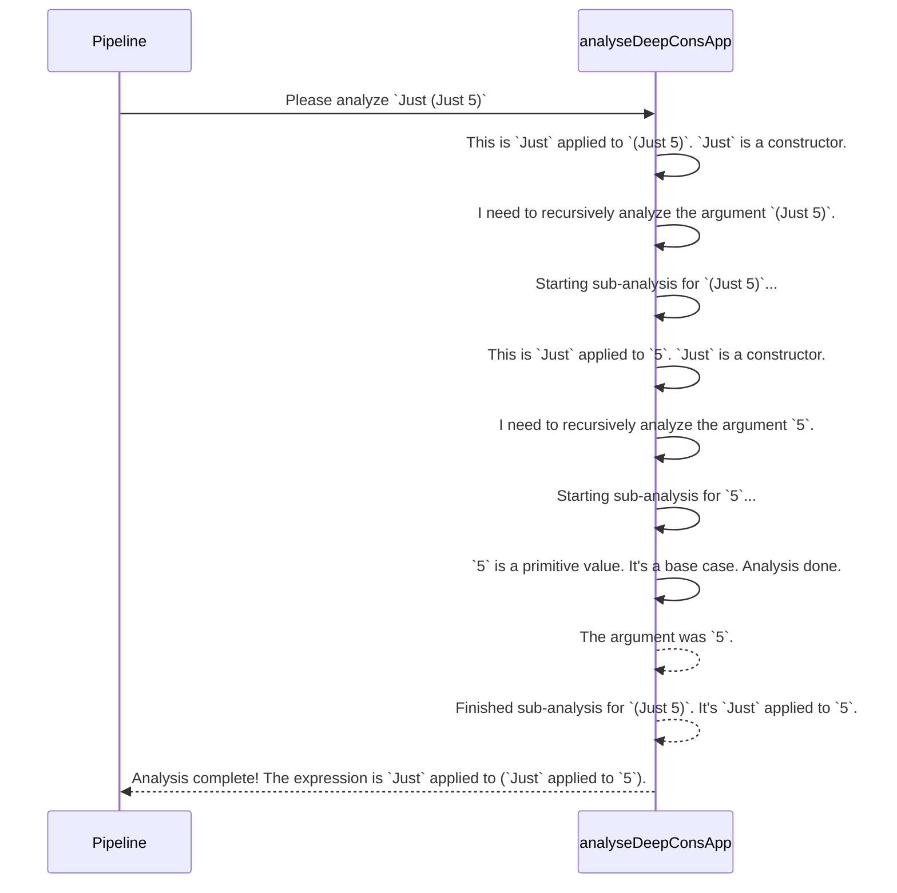

# Chapter 9: Deep Constructor Application Analysis

In the last chapter, we looked at the [Signature Representation](08_signature_representation_.md), the standardized "business card" `DepTyCheck` uses to describe and organize all the data generators it needs to build. These signatures are essential for the [Derivation Pipeline](04_derivation_pipeline_.md) to manage its work.

But there's a deeper level of analysis that happens. When [`deriveGen`: The Automatic Recipe Writer](02__derivegen___the_automatic_recipe_writer_.md) is building a generator for a dependently-typed structure, it often encounters complex proofs or constraints, like `IsSorted x xs`. How does it understand what this proof *means*? How does it figure out that this proof depends on the variables `x` and `xs`?

This is the job of the **Deep Constructor Application Analysis**. Think of it as a powerful microscope that the derivation engine uses to look deep inside a type expression and see how it's put together.

### The Problem: Deconstructing a Complex Type

Let's go back to our friend, the `SortedList` from the [Example Data Structures](03_example_data_structures_.md) chapter.

```idris
data SortedList : Type where
  Nil  : SortedList
  (::) : (x : Nat) -> (xs : SortedList) -> IsSorted x xs => SortedList
```

The most interesting part is the proof: `IsSorted x xs`. When `deriveGen` is trying to create a `(::)` cell, it sees this constraint. To build the generator correctly, it desperately needs to answer a few questions:
- What is this `IsSorted x xs` thing made of?
- Which of my ingredients (`x` and `xs`) are used inside this proof?
- Is this just a simple variable, or is it a complex structure built from other constructors?

The Deep Constructor Application Analysis is the tool that answers these questions. It tells the pipeline, "The proof `IsSorted x xs` is built using the `IsSorted` constructor and it directly depends on the variables `x` and `xs`." This information is critical for determining the correct order to generate things.

### The X-Ray Machine: `analyseDeepConsApp`

The heart of this analysis is a function called `analyseDeepConsApp`. You can think of it as an X-ray machine for Idris types.

- **Input:** You give it a type expression (like `IsSorted x xs`) and a list of "variables to look for" (like `x` and `xs`).
- **Output:** It gives you back a report detailing how that expression is constructed from known data constructors and which of your variables it uses.

Let's imagine we're building a LEGO model. `analyseDeepConsApp` is like taking the finished model and carefully disassembling it, piece by piece, to create a build-manual in reverse. It figures out which LEGO bricks (constructors) were used and where.

Let's walk through an example. Suppose `deriveGen` is analyzing the constructor for a unique-element list from Chapter 3:

```idris
(::) : (s : String) -> (ss : UniqStrList) -> NotIn s ss => UniqStrList
```
It needs to understand the proof `NotIn s ss`. It calls `analyseDeepConsApp` with the expression `NotIn s ss` and the variables it's trying to generate: `{s, ss}`.

The analysis works recursively:
1.  **Look at `NotIn s ss`:** It sees this is an application of a function `NotIn` to two arguments, `s` and `ss`.
2.  **Is `NotIn` a known constructor?** Yes, it's the constructor for a data type. Good.
3.  **Analyze the first argument, `s`:** It looks at `s`. Is this one of the variables we're looking for? Yes! It records: "Found `s`."
4.  **Analyze the second argument, `ss`:** It looks at `ss`. Is this one of the variables we're looking for? Yes! It records: "Found `ss`."

After the analysis, it reports back to the pipeline: "The expression `NotIn s ss` is a known data constructor applied to the variables `s` and `ss`." Now the pipeline knows that this proof depends on both `s` and `ss` and can plan the generation order accordingly.

### Under the Hood: The Recursive Disassembly

The actual function `analyseDeepConsApp` can be found in `src/Deriving/DepTyCheck/Util/DeepConsApp.idr`. While the real code is complex, its core logic is a beautiful recursive process.

Let's visualize how it disassembles a slightly more nested expression, like `Just (Just 5)`.



This recursive "peeling" allows the analysis to handle arbitrarily nested data structures, breaking them down into their fundamental building blocks.

The core of the logic can be simplified to something like this:

```idris
-- A very simplified idea of the process
analyseDeepConsApp : (expression : TTImp) -> m Result
analyseDeepConsApp expression = do

  -- Break `f a b` into `f` and its arguments `[a, b]`
  let (func, args) = unAppAny expression

  -- If func is a variable we're looking for, we're done.
  -- If func is a constructor...
  if isConstructor func
    then do
      -- Recursively call this function on all arguments.
      argResults <- for args analyseDeepConsApp

      -- Combine the results into a final report.
      pure $ combineResults argResults

    else -- It's a primitive or something we don't recognize.
      throwError "Not a constructor application."
```
The key is that `analyseDeepConsApp` calls itself on the arguments of an application. This is the "deep" part of the analysis—it doesn't just look at the top level, it digs all the way down.

### The Result: A Blueprint for Code Generation

So what does `analyseDeepConsApp` return? It returns a special record, `DeepConsAnalysisRes`, which contains two key pieces of information:

```idris
-- A simplified view of the result record
record DeepConsAnalysisRes where
  constructor MkResult
  -- 1. Which variables were used, and in what order
  appliedFreeNames : List Name
  -- 2. A template for rebuilding the expression
  bindExprFun : ... -> TTImp
```

1.  `appliedFreeNames`: This is a simple list of the names of the variables that were found inside the expression, in the order they appeared. For `NotIn s ss`, this would be `[s, ss]`.
2.  `bindExprFun`: This is the coolest part. It's a "template function" that knows how to rebuild the original expression's structure, but with placeholders. The [Derivation Pipeline](04_derivation_pipeline_.md) can later use this template to write the actual generator code, plugging in the real generated values into the placeholders.

This blueprint is exactly what `deriveGen` needs to write the `do` block code for generating the proof. It knows which values it needs to generate (`s` and `ss`) and has a template to plug them into once they're ready.

### Conclusion

You've now peeked into one of the most specialized and powerful tools in `DepTyCheck`'s internal toolkit. The **Deep Constructor Application Analysis** is a fundamental utility that makes automatic derivation for dependent types possible.

-   It acts like a **microscope or X-ray machine**, recursively disassembling complex type expressions.
-   It identifies how an expression is built from **data constructors** and which **variables** it depends on.
-   It provides a **blueprint (`DeepConsAnalysisRes`)** that the [Derivation Pipeline](04_derivation_pipeline_.md) uses to write the final generator code.

While you'll rarely call `analyseDeepConsApp` directly, understanding its role is key to appreciating how `DepTyCheck` can so intelligently handle the complexities of Idris's type system.

We now have a complete picture of how `DepTyCheck` builds its powerful generators. But how do we know that `DepTyCheck` itself is correct? How are all these complex internal components tested? In our final chapter, we'll take a look at the project's own test suite.

Next: [Testing and Validation Suite](10_testing_and_validation_suite_.md)

---

Generated by [AI Codebase Knowledge Builder](https://github.com/The-Pocket/Tutorial-Codebase-Knowledge)