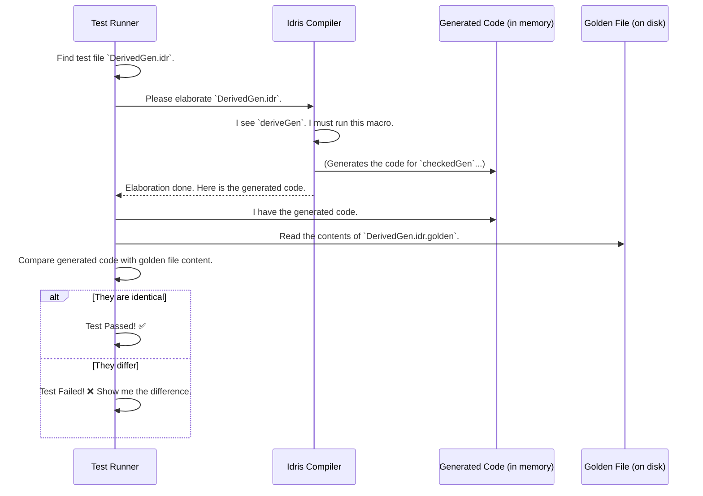

# Chapter 10: Testing and Validation Suite

In the previous chapter, we dove into the deepest corners of the derivation engine with [Deep Constructor Application Analysis](09_deep_constructor_application_analysis_.md). We've seen the incredible complexity and power that allows `DepTyCheck` to automatically generate recipes for even the most intricate dependent types.

But with great power comes the need for great confidence. How do we trust that all this machinery—the [Derivation Pipeline](04_derivation_pipeline_.md), the signature analysis, the code generation—works correctly? What prevents a new change from breaking something in a subtle way?

The answer is the project's own **Testing and Validation Suite**. This is the comprehensive safety net that catches bugs, ensures correctness, and documents the library's behavior. For a developer working on or with `DepTyCheck`, it is the single most important place to understand the library's capabilities and limitations.

Think of the test suite as three things in one:
1.  **A Quality Control Factory:** It runs unit tests on the core components to make sure they are solid.
2.  **A Rulebook of "Don'ts":** It has tests that confirm `deriveGen` fails gracefully and with helpful errors when you use it incorrectly.
3.  **A Showroom of "Dos":** It contains "golden" examples of perfectly generated code, ensuring that `deriveGen` produces exactly what we expect.

### A Map of the Testing World

The main entry point for the entire test suite lives in `tests/Tests.idr`. It acts as a table of contents, pointing to all the different test categories.

```idris
-- from: tests/Tests.idr
main : IO ()
main = goldenRunner $
  [ "The `Gen` monad" `atDir` "lib/gen-monad"
  , "Derivation: input validation" `atDir` "derivation/inputvalidation"
  , "Derivation: least effort (...) " `atDir` "derivation/least-effort/{...}"
  , "Derivation: core" `atDir` "derivation/core"
  -- ... and many more
  ]
```

This file sets up a "golden test runner" that explores different directories. Three of the most important directories for a developer are:
-   `lib/*`: Contains unit tests for the core library components, like the [`Gen`: The Data Generator
](01__gen___the_data_generator_.md) monad itself.
-   `derivation/inputvalidation`: The "Rulebook of Don'ts".
-   `derivation/least-effort` and `derivation/core`: The "Showroom of Dos".

For a developer, this is the best place to see the قوة (strength) of the library's "don'ts" (in `inputvalidation`) and its expected "dos" (in `least-effort`).

### The "Don'ts": Testing for Graceful Failures

A good tool doesn't just work; it tells you clearly when you're using it wrong. The `inputvalidation` tests are designed to ensure `DepTyCheck` provides helpful compile-time errors for incorrect usage.

Consider this example from `tests/derivation/inputvalidation/bad-args-in-target-type/ValidateInput.idr`.

```idris
data Y : Type -> Type -> Type where
  MkY : Y Int String

genY_Int : Fuel -> (a : Type) -> Gen MaybeEmpty $ Y a Int
genY_Int = deriveGen
```

Here, the user is asking `deriveGen` to create a generator for `Y a Int`. However, `deriveGen` expects the target type's arguments to be distinct variables (like `a` and `b`), not concrete types like `Int`. This is an invalid use of the API.

The point of this test is **to fail**. The test *passes* if the Idris compiler stops with a specific, helpful error message from `deriveGen`, like "Arguments of the target type must be variables." This guarantees that users of the library will be guided away from common pitfalls.

Here's another example of a "don't" from `tests/derivation/inputvalidation/bad-param-names/ValidateInput.idr`:

```idris
data Y : Type -> Type -> Type where
  MkY : Y Int String

-- The user doesn't give a name to the second argument.
genY_unnamed_argument : Fuel -> (a : Type) -> Type -> Gen MaybeEmpty $ Y a b
genY_unnamed_argument = deriveGen
```

Here, the second argument in the function signature `Type` is not given a name. `deriveGen` needs all its arguments to be named. This test ensures the compiler will stop and tell the user about the unnamed argument.

### The "Dos": Golden Testing for Correctness

How do we know `deriveGen` produces the *right* code? We use **golden testing**.

The idea is simple:
1.  We have a test case where we call `deriveGen`.
2.  We run the test, which executes `deriveGen` and captures the Idris code it generates.
3.  We compare this newly generated code against a pre-approved, "golden" version that is saved in a file (e.g., `MyTest.idr.golden`).
4.  If the generated code is identical to the golden version, the test passes. If it differs even by a single character, the test fails, alerting us that something has changed.

This is the ultimate regression test. It ensures the automatic recipe writer is consistently producing the exact recipe we expect.

Let's look at `tests/derivation/core/typealias con 002/DerivedGen.idr`.

```idris
module DerivedGen
-- ... imports ...

data X : Type where
  X0 : X
  X1 : Bool -> X
  X2 : ConstantUseTypeAlias True -> ConstantUseTypeAlias False -> X

checkedGen : Fuel -> Gen MaybeEmpty X
checkedGen = deriveGen
```
During the test run, the `checkedGen = deriveGen` line is elaborated. The `deriveGen` macro runs and produces a big chunk of Idris code, which is the full definition of the generator function. The test harness captures this code.

Then, it compares this captured code to a file named `DerivedGen.idr.golden` in the same directory. If they match, we are confident that `deriveGen` correctly handled the `TypeAlias` and produced the right generator.

### Under the Hood: The Golden Test Runner

The golden testing process is an elegant dance between the test runner and the Idris compiler's elaboration mechanism.



This automated "check-against-the-blueprint" approach is applied to hundreds of files in `derivation/core` and `derivation/least-effort`, forming a powerful shield that protects the project from regressions. Whenever a developer changes the derivation logic, they can run the tests. If a golden test fails, they either have to fix the new logic to match the golden file, or, if the change is intentional, they update the golden file to be the new blueprint.

### Conclusion: Your Journey's End

Congratulations! You have reached the end of your tour through `DepTyCheck`. We started with the humble [`Gen`: The Data Generator
](01__gen___the_data_generator_.md), the basic building block for creating random values. We then discovered the magic of [`deriveGen`: The Automatic Recipe Writer
](02__derivegen___the_automatic_recipe_writer_.md), which automates this process for us.

We journeyed through the internal factory, exploring the [Derivation Pipeline](04_derivation_pipeline_.md), the [Signature Representation](08_signature_representation_.md) that organizes its work, and the [Deep Constructor Application Analysis](09_deep_constructor_application_analysis_.md) that gives it its intelligence.

Finally, we've seen how this entire complex project is kept safe and correct by its **Testing and Validation Suite**. It's more than just a set of tests; it's a living document that proves the library works, teaches developers its boundaries, and provides confidence in its continued development.

You are now equipped with the knowledge to not only use `DepTyCheck` effectively but also to understand its design and contribute to its future. Happy testing

---

Generated by [AI Codebase Knowledge Builder](https://github.com/The-Pocket/Tutorial-Codebase-Knowledge)